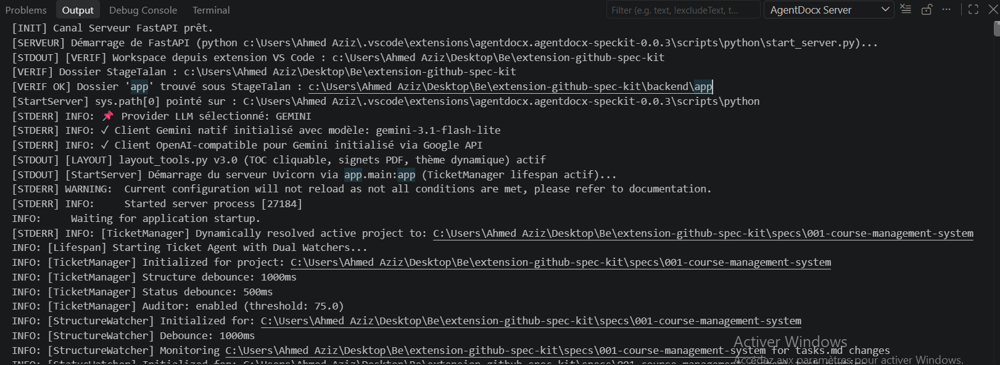

# 🚀 Spec Kit

**Spec Kit** est un pipeline multi-agents avancé conçu pour la génération, l'enrichissement et la validation automatisée de spécifications d'architecture logicielle. Il transforme des documents techniques bruts en livrables structurés et certifiés.

---

## 📌 Structure & Présentation Générale

Le projet est organisé de manière modulaire pour séparer l'orchestration IA, l'interface de suivi et les mécanismes d'automatisation.

### 📂 Arborescence du Projet

- **`/backend`** : ⚙️ Pipeline d'enrichissement et d'évaluation. Propulsé par **FastAPI** et **LangGraph**, il orchestre la chaîne d'agents et gère la logique métier.
- **`/frontend`** : 🖥️ Dashboard **React** permettant le suivi en temps réel des exécutions, la visualisation des KPIs et le téléversement de nouveaux documents.
- **`/scripts`** : 🛠️ Watchers de fichiers et scripts d'automatisation qui font le pont entre le système de fichiers et le pipeline.
- **`/specs`** : 📄 Dossier source des spécifications Markdown à traiter.
  - Contient des **exemples de fichiers** (`spec.md`, `requirements.md`, etc.) prêts à être traités.
  - Le **watcher surveille ce dossier** en temps réel pour déclencher le pipeline automatiquement.
  - Les **livrables générés** (JSON, PDF, diagrammes, évaluations) sont stockés dans `/outputs/` organisé par projet.
- **`/outputs`** : 📦 Dossier centralisé des livrables, organisé par projet :
  - `data/` : Données structurées JSON.
  - `markdowns/` : Fichiers enrichis.
  - `diagrams/` : Schémas générés.
  - `evaluations/` : Métriques de qualité des agents.
  - `pdf/` : Documents finaux versionnés.

---

## 🖥️ Interface Frontend

Le Frontend est une application React moderne utilisant **Material-UI** et **DataGrid** pour offrir une expérience de monitoring fluide et intuitive.

### 🔍 Fonctionnalités Clés
- **Suivi Temps Réel** : Visualisation instantanée de l'état d'avancement des agents.
- **Analyse de Performance** : Affichage des KPIs de qualité pour chaque étape du pipeline.
- **Gestion Documentaire** : Interface d'upload simplifiée pour initier de nouveaux processus.

### 📸 Aperçus
| 📑 Page Documents | ➕ Ajouter un Document |
| :---: | :---: |
|  |  |
| *Suivi des exécutions, status et viewer PDF* | *Formulaire d'upload et zone Drag & Drop (.md)* |

> 📖 Pour une documentation technique complète sur le frontend, consultez le fichier [`frontend/README.md`](frontend/README.md).

---

## 🗄️ Traçabilité & Versioning BDD (PostgreSQL)

Le système s'appuie sur une base de données PostgreSQL pour garantir l'immuabilité des versions et la traçabilité complète de chaque modification.

### 📊 Modèle de Données
- **`projects`** : L'entité parente regroupant tous les artefacts et exécutions d'un projet spécifique.
- **`artifacts`** : Registre des fichiers sources surveillés dans `specs/`, incluant une empreinte **SHA-256** pour détecter précisément chaque modification.
- **`pipeline_runs`** : Journalisation exhaustive de chaque exécution, stockant les métriques **JSONB** détaillées pour chacun des 6 agents du pipeline.
- **`doc_versions`** : Registre immuable gérant le versioning dynamique des documents et le lien vers les fichiers PDF certifiés.

---

## 🔌 Extension VS Code SpecKit (Nouveau)

> **⚠️ En cours de développement** — Non publiée sur le Marketplace pour le moment.  
> **Branche dédiée** : [`extension`](https://github.com/ahmed200346/Extension_GithubSpecKit/tree/extension) pour le code complet, tests et documentation détaillée.

L'extension VS Code **AgentDocx SpecKit** remplace le dossier `scripts/` et offre une expérience intégrée **dans une seule fenêtre VS Code** :
- **Deux canaux de logs dans la vue Output** (menu `View` → `Output` → dropdown pour basculer) :  
  - **AgentDocx Server** — logs FastAPI, progression agents (Parsing → Summary → Glossary → Diagram → DocWriter → Layout), KPIs  
  - **AgentDocx Watcher** — logs watchdog, détection fichiers, file d'attente
- **Démarrage automatique** au chargement de l'extension (F5 ou installation .vsix)
- **Progression temps réel** visible dans le frontend (DocVersion créée dès le début, statut `pending` → `completed`)
- **Commandes palette** (`Ctrl+Shift+P`) : `start_server`, `stopServer`, `startWatcher`, `stopWatcher`, `triggerPipeline`

> 📸 **Captures de l'extension** :  
> 1. **AgentDocx Watcher** — logs watchdog, détection fichiers, file d'attente  
>      
> 2. **AgentDocx Server** — logs FastAPI, progression agents (Parsing → Summary → Glossary → Diagram → DocWriter → Layout), KPIs  
>    

### 📦 Installation de l'Extension (via .vsix)

> L'extension n'est pas encore publiée sur le Marketplace VS Code. Installez-la manuellement via le fichier `.vsix` :

1. Téléchargez le fichier `agentdocx-speckit-0.0.2.vsix` depuis la section **Releases** du dépôt ou depuis le dossier racine du repo (branche `extension`).
2. Dans VS Code : `Ctrl+Shift+P` → **Extensions: Install from VSIX...**
3. Sélectionnez le fichier `.vsix` téléchargé.
4. Redémarrez VS Code si nécessaire.

> 📸 **Installation via .vsix** :  
>   
> *(Capture : icône Extensions → "..." → "Install from VSIX..." → sélectionner le fichier .vsix)*

> 📸 **Captures de l'extension (onglets Output)** :  
> 1. **AgentDocx Watcher** — logs watchdog, détection fichiers, file d'attente  
>      
> 2. **AgentDocx Server** — logs FastAPI, progression agents (Parsing → Summary → Glossary → Diagram → DocWriter → Layout), KPIs  
>    

> **ℹ️ Note importante** : Contrairement à l'ancien mode (F5 ouvrait une seconde fenêtre "Extension Development Host"), l'extension s'exécute maintenant **dans la même fenêtre VS Code**. Les logs apparaissent dans le panneau **Output** (`View > Output`) avec un dropdown pour basculer entre **AgentDocx Server** et **AgentDocx Watcher**.

---

### 🏗️ Construction & Publication de l'Extension (pour développeurs)

> Pour générer le fichier `.vsix` à partir des sources (branche `extension`) :

```bash
# 1. Installer l'outil de packaging VS Code (une seule fois)
npm install -g @vscode/vsce

# 2. Cloner la branche extension
git clone -b extension https://github.com/ahmed200346/Extension_GithubSpecKit.git
cd Extension_GithubSpecKit

# 3. Installer les dépendances et compiler
npm install
npm run compile

# 4. Générer le fichier .vsix
vsce package
# → Génère agentdocx-speckit-0.0.2.vsix à la racine
```

> **Pour publier sur le Marketplace** (nécessite un Personal Access Token Azure DevOps) :
```bash
vsce publish -p <VOTRE_PAT>
# ou
vsce publish  # mode interactif
```

> 📖 Pour créer un PAT : https://dev.azure.com/ → User Settings → Personal Access Tokens → New Token
> Scopes : **Marketplace > Manage (Publish, Manage)**

---

---

## 🚀 Quick Start (Guide de Lancement)

Suivez ces étapes pour mettre en place l'environnement Spec Kit sur votre machine.

### ⚠️ Prérequis Base de Données
Avant de démarrer les services, assurez-vous impérativement que :
- **PostgreSQL** est lancé en arrière-plan.
- OU que **pgAdmin4** est ouvert avec une connexion active à la base de données du projet.

---

### 🛠️ Méthode 1 : Scripts Standalone (Version Actuelle — 4 Terminaux)

> **Approche classique** avec scripts Python standalone. Idéale pour développement sans l'extension.

#### Prérequis Base de Données
- PostgreSQL lancé (ou pgAdmin4 connecté)

#### Procédure de Lancement

**Étape 0 : Environnement Virtuel Python & Dépendances**
```bash
# Créer l'environnement virtuel
python -m venv env

# Activer l'environnement
# Sur Windows : env\Scripts\activate
# Sur Linux/Mac : source env/bin/activate

# Installer les dépendances
pip install -r requirements.txt
```

**Étape 1 : Démarrer le Backend FastAPI** (Terminal 1)
```bash
cd backend
uvicorn app.main:app --reload --port 8000
```

**Étape 2 : Démarrer l'interface Frontend React** (Terminal 2)
```bash
cd frontend
npm install
npm start
```
> 💡 Si erreurs (dépendances, Node.js, `cross-env`, ports) → voir `configFrontEnd.pdf` à la racine.

**Étape 3 : Lancer le Watcher Temps Réel** (Terminal 3)
```bash
python scripts/python/spec_watcher.py
```

**Étape 4 : Exécuter Spec Kit via Claude Code** (Terminal 4)
```bash
ollama launch claude
```
*Utilisez les commandes Spec Kit (ex: `/speckit-specify`, `/doc-pipeline`) pour générer vos spécifications.*

---

### 🛠️ Méthode 2 : Extension VS Code (Installation .vsix — Recommandé)

> **Remplace** entièrement le dossier `scripts/` par une extension VS Code intégrée.
> **Installation** : Voir la section [📦 Installation de l'Extension (via .vsix)](#-installation-de-lextension-via-vsix).

#### Architecture
- **Dossiers Utilisés** : `/backend` et `/frontend`.
- **Remplacement** : L'extension gère tout ce qui était auparavant dans `/scripts` (plus besoin de lancer manuellement le watcher).
- **Interface** : Tout est centralisé dans une seule fenêtre VS Code (canaux `AgentDocx Server` et `AgentDocx Watcher` dans l'onglet Output).

#### Procédure de Lancement

**Étape 0 : Environnement Python & Dépendances**
L'extension nécessite les dépendances du projet installées à la racine :
```bash
# Créer l'environnement virtuel
python -m venv env
# Activer l'environnement (Windows: env\Scripts\activate | Linux/Mac: source env/bin/activate)

# Installer les dépendances globales depuis la racine (même niveau que frontend et backend)
pip install -r requirements.txt
```

**Étape 1 : Frontend React** (Terminal 1)
```bash
cd frontend
npm install
npm start
```

**Étape 2 : Activation de l'Extension**
L'extension est installée via le fichier `.vsix` (disponible dans les **Releases** ou sur la branche `extension`). Elle démarre **automatiquement** le serveur et le watcher au chargement de VS Code.
- Vérifiez les logs dans : `View` $\rightarrow$ `Output` $\rightarrow$ sélectionnez `AgentDocx Server` ou `AgentDocx Watcher`.

**Étape 3 : Claude Code** (Terminal 2)
```bash
ollama launch claude
```
*Commandes disponibles : `/speckit-specify`, `/doc-pipeline`, `/speckit-plan`, etc.*

---

## 🔄 Résumé : Quelle méthode choisir ?

| Critère | Méthode 1 (Scripts) | Méthode 2 (Extension .vsix) |
|---------|---------------------|---------------------------|
| **Statut** | Production | Recommandé (via .vsix) |
| **Terminaux** | 4 | 2 (Frontend + Claude) + Extension |
| **Logs** | Unifiés dans terminaux | Séparés : `AgentDocx Watcher` / `AgentDocx Server` |
| **Progression v2+** | Visible seulement à la fin | Temps réel (DocVersion `pending` → `completed`) |
| **Installation** | Standard (Python) | VSIX + Root requirements |

> Pour les détails complets sur l'extension : voir branche [`extension`](https://github.com/ahmed200346/Extension_GithubSpecKit/tree/extension) et documentation dans `agentdocx-speckit/README.md`.

---

### 📚 Ressources Complémentaires
- `configFrontEnd.pdf` — Dépannage Frontend
- `scripts/README.md` — Documentation scripts Python
- `agentdocx-speckit/README.md` — Doc extension (branche `extension`)
- `configFrontEnd.pdf` — Configuration Frontend détaillée

---

*Dernière mise à jour : 2026-07-31 — Spec Kit v0.0.2 (Extension en développement)*
