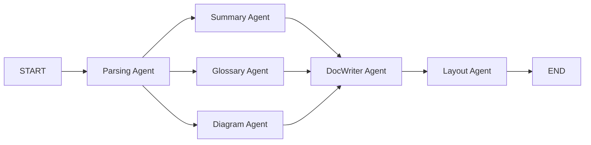
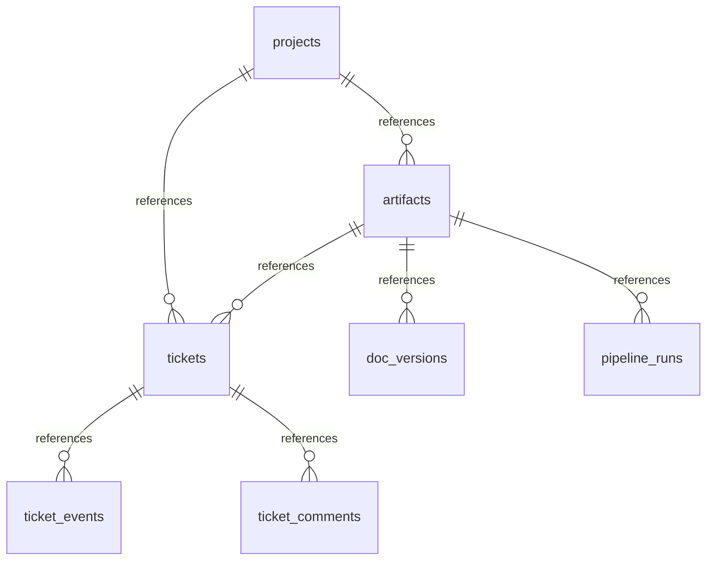

# ⚙️ Backend Architecture — Spec-Kit

<p align="center">
  
  
  
  
  
</p>

<p align="center">
  <b>Moteur agentic</b> • <b>Pipeline LangGraph</b> • <b>Ticket Agent temps réel</b><br/>
  <i>Transforme des specs Markdown brutes en livrables certifiés avec sync Kanban autonome</i>
</p>

> [!NOTE]
> **Où se trouve ce backend dans le repo ?** Branche `main` (`RepoSigma/Extension_GithubSpecKit/backend/`) — pipeline complet. L'extension VS Code est dans la branche `extension` (`BrancheExtenion/Extension_GithubSpecKit/agentdocx-speckit/`). Voir `README.md` racine → `🌿 Branches du repo` pour cloner les deux ou les fusionner en `main`.

---

<details>
<summary>📑 Table des matières</summary>

- [Architecture Overview](#️-architecture-overview)
- [LLM Provider Layer](#1-llm-provider-layer-appcore)
- [Service Layer](#2-service-layer-appservices)
- [Utility Tools](#️-utility-tools-layer-apputils)
- [Pipeline Orchestration](#3-pipeline-orchestration-appgraph)
- [Ticket Agent](#4-ticket-agent--universal-ticket-agent-apphandlersticket_agent)
- [API Endpoints](#-api-endpoints)
- [Directory Structure](#-directory-structure)
- [State & Persistence](#-state--persistence)

</details>

---

## 🏗️ Architecture Overview

Le backend suit une architecture en couches pour garantir modularité, indépendance des providers et flux de données structuré.

```mermaid
graph TD
    A[📄 specs/{project}/tasks.md<br/>+ .task_runtime/current-task.json] --> B[👁️ DualWatcherManager]
    B --> C[🎫 SyncService<br/>source:watcher]
    C --> D[(🗄️ PostgreSQL<br/>tickets / ticket_events)]
    D --> E[📊 Kanban Board<br/>polling task-state]
    F[📥 POST /ingest] --> D
    G[🤖 LLM via llm_client.py<br/>ollama | gemini | nvidia] --> H[🔄 LangGraph Pipeline<br/>Parsing → Enrichment → DocWriter → Layout]
    H --> D
```

**Principes :**
- **Strategy/Facade** pour les LLM (un seul `get_llm_client()` pour tout le code)
- **Logic vs Execution** : Services (intelligence) vs Utils (exécution technique)
- **File-as-source-of-truth** pour le Ticket Agent : `specs/{project}/.task_runtime/current-task.json`

---

### 1. LLM Provider Layer (`app/core/`)

Implémente le pattern **Strategy/Facade** pour 3 providers via une interface unique.

| Fichier | Rôle |
|---|---|
| **`llm_client.py`** | Orchestrateur central. Charge le provider selon `LLM_PROVIDER` (`.env`) et expose `get_llm_client()`, `get_llm_model()`, `verify_llm_connection()` |
| **`client_ollama.py`** | Provider local `ollama` (`OLLAMA_BASE_URL`, `OLLAMA_MODEL` ex `gemma4:31b-cloud`) |
| **`client_gemini.py`** | Provider `gemini` (`GEMINI_API_KEY`, `GEMINI_MODEL=gemini-3.1-flash-lite`) + wrapper OpenAI-compatible |
| **`client_nvidia.py`** | Provider `nvidia` (`NVIDIA_API_KEY`, `NVIDIA_MODEL=meta/llama-3.3-70b-instruct`) |
| **`config.py`** | `settings` (pydantic) : `DATABASE_URL`, `TARGET_PROJECT_PATH`, `ENABLE_AUDITOR`, `LLM_REQUEST_TIMEOUT=600`, etc. |
| **`llm_utils.py`**, **`metrics.py`** | Helpers transverses |

> Tous les services appellent `get_llm_client()` — le code reste agnostique du provider réel.

---

### 2. Service Layer (`app/services/`)

Séparation **Logique (Services)** vs **Exécution (Utils)**. Fichiers réels dans `backend/app/services/` :

| Service | Fichier | Rôle |
|---|---|---|
| **ParserService** | `parser_service.py` | Analyse initiale, catégorisation, hash fichier |
| **SummaryService** | `summary_service.py` | Génère l'executive summary |
| **GlossaryService** | `glossary_service.py` | Extraction des termes techniques |
| **DiagramService** | `diagram_service.py` | Génère Mermaid/PlantUML |
| **DocWriterService** | `doc_writer_service.py` | Synthèse Markdown finale |
| **LayoutService** | `layout_service.py` | Rendu PDF final |
| **Evaluation** | `evaluation_service.py` | Évalue chaque sortie vs templates (`parsing_eval`, `summary_eval`, ...) |
| **DBService** | `db_service.py` | CRUD `projects`, `artifacts`, `doc_versions`, `pipeline_runs` |
| **TaskService** | `task_service.py` | Logique métier des tâches |
| **TicketIngestion** | `ticket_ingestion.py` | ⭐ Parse `specs/{project}/tasks.md` → `tickets`, `update_ticket_status()` avec `TicketEvent` (`source:"initial_ingestion"|"watcher"|"audit"`) |

---

### 🛠️ Utility Tools Layer (`app/utils/`)

Implémentation concrète pour les services. Chaque agent s'appuie sur des outils spécialisés.

| Agent | Utility Tool | Rôle Technique |
|---|---|---|
| **Parsing** | `markdown_parser.py` | Décompose le Markdown en sections logiques + calcul du hash |
| **Summary** | `summary_pruner.py` | Post-traitement, déduplication |
| **Glossary** | `glossary_tools.py` | Récolte des termes, ancres internes |
| **Diagram** | `diagram_tools.py` | Rendu Mermaid → PDF |
| **Doc Writer** | `doc_writer_tools.py` | Injection Markdown de summaries/diagrams |
| **Layout** | `layout_tools.py` v3.0 | Publication PDF (TOC cliquable, signets, thème) |

#### Transverse Tools

- **`path_builder.py`** : Autorité centrale du filesystem. Expose `BASE_DIR` et construit `specs/{project}/.task_runtime/current-task.json`, `outputs/`, `storage/pdfs`.
- **`responses.py`** : Standardise les réponses FastAPI pour le frontend.

---

### 3. Pipeline Orchestration (`app/graph/`)

Flux géré par **LangGraph** comme state machine.

- **`workflow.py`** : Topologie du graphe
- **`state.py`** : `GraphState` (mémoire partagée : `structured_json`, `summary_output`, `diagram_output`, `parsing_eval`, ...)
- **`nodes.py`** : Glue entre le graphe et les services



---

### 4. Ticket Agent — Universal Ticket Agent (`app/agents/ticket_agent/`)

> [!IMPORTANT]
> Seul composant autorisé à faire `todo → in_progress → done`. Isolation **par projet** : `specs/{project}/.task_runtime/current-task.json` (aucun dossier racine).

#### 4.1 DualWatcherManager (`watcher.py`)

| Watcher | Surveille | Debounce | Déclenche |
|---|---|---|---|
| **StructureWatcher** | `specs/{project}/tasks.md` | 1000ms | Hash SHA256 → `structure_change` → frontend `Ingest` disponible. Crée `specs/{project}/.task_runtime/` si absent |
| **StatusWatcher** | `specs/{project}/.task_runtime/current-task.json` | 500ms | Filtre `current-task.json` → `SyncService.sync_current_task()` → `TicketEvent` `source:"watcher"` |

`DualWatcherManager` expose `set_structure_callback` / `set_status_callback` au `TicketManager`. Utilise `watchfiles.awatch` + écriture atomique (`tmp` + `rename`).

#### 4.2 TicketManager (`manager.py`) — Orchestrateur

- **Résolution dynamique** `_resolve_dynamic_project_path()` :
  ```
  1) TARGET_PROJECT_PATH (.env) si défini
  2) scan PROJECTS_ROOT/**/.task_runtime/current-task.json le plus récent
  3) scan specs/*/tasks.md
  4) fallback BASE_DIR
  ```
- **Lifespan** : `ticket_agent_lifespan` dans `app/main.py` → `FastAPI(lifespan=ticket_agent_lifespan)` → `manager.start()` lance les deux watchers + `initial sync`
- **Callback** : `_handle_status_change` déclenche `Auditor.auto_audit_on_done()` si `action` contient `→ done` et `ENABLE_AUDITOR=True`

#### 4.3 SyncService (`sync_service.py`)

- **Lecture** : `specs/{project}/.task_runtime/current-task.json` en `utf-8-sig` (gère BOM Windows), parse `task_id`, `status`, `tasks` map
- **Bulk sync** : Itère la FULL `tasks` map → `ticket_ingestion.update_ticket_status(ticket_id, status, author="agent", source="watcher")` → `TicketEvent` traçable
- **Diagnostics** : `get_diagnostics()` → `GET /api/v1/ticket-agent/status`

#### 4.4 Auditor (`auditor.py`)

- Config : `ENABLE_AUDITOR=True`, `AUDITOR_THRESHOLD=75.0`
- Sur `→ done` : charge `spec.md`, `tasks.md`, `data-model.md`, `git diff`, appelle LLM pour score conformité. Si `< 75` → revert `done → in_progress` + événement `audit`

#### 4.4.1 Calcul et exposition des métriques

Le calcul est réalisé par `app/core/ticket_metrics.py`, puis le rapport est enregistré par l'Auditor dans les métadonnées de l'événement d'audit. Le Ticket Agent ne demande donc pas au LLM d'inventer un score dans `current-task.json` : ce fichier transporte uniquement l'état de la tâche et la map complète des statuts.

Le score global est une moyenne pondérée des quatre composantes :

| Métrique | Poids | Signification |
|---|---:|---|
| **Requirement Coverage** | 40 % | Mesure dans quelle proportion les critères d'acceptation de `tasks.md` sont satisfaits. Chaque critère est classé `FULLY_MET`, `PARTIALLY_MET` ou `NOT_MET`; un critère partiel compte pour 50 %. |
| **Code Quality** | 25 % | Vérifie notamment la gestion des erreurs, la validation des entrées, le typage, les pratiques de sécurité, les tests, la journalisation et la documentation. |
| **Architecture** | 20 % | Évalue l'adhérence aux couches et conventions du projet : services, repositories, routes/API, modèles/schémas, middleware et utilitaires. |
| **Traceability** | 15 % | Vérifie le lien entre la tâche, les critères, les fichiers modifiés, les commits et la documentation. |

Formule :

```text
Conformity Score =
  Requirement Coverage × 0.40
  + Code Quality × 0.25
  + Architecture × 0.20
  + Traceability × 0.15
```

Chaque composante est exprimée sur 100. Le verdict est ensuite déterminé par le score : `EXEMPLARY` à partir de 90, `COMPLIANT` à partir de 75, `NEEDS_IMPROVEMENT` à partir de 60, puis `NON_COMPLIANT` en dessous de 60. Avec le seuil par défaut de 75, un score inférieur entraîne le retour de la tâche vers `in_progress`.

#### 4.4.2 Cycle de calcul et stockage

1. L'agent écrit `current-task.json` avec la tâche à `done`.
2. `StatusWatcher` appelle `SyncService.sync_current_task()` et met à jour le ticket.
3. Si `ENABLE_AUDITOR=True`, `Auditor.auto_audit_on_done()` collecte les critères, le diff Git, les fichiers modifiés et les documents de spécification.
4. `build_conformity_report()` calcule le score global, le verdict, les quatre composantes, les preuves et les recommandations.
5. Le rapport est stocké dans `TicketEvent.event_metadata` avec le contexte `audit_type: "conformity_check"`.
6. `GET /api/v1/ticket-agent/metrics?project_name=...` agrège les résultats du projet : progression globale, moyenne des scores, nombre de tâches auditées, répartition des verdicts et métriques par tâche.
7. Le frontend appelle cet endpoint et `GET /api/v1/tickets/{ticket_id}/metrics`, puis affiche le résultat dans l'onglet **Metrics**.

Champs affichés pour une tâche : `conformity_score`, `verdict`, `requirement_coverage`, `code_quality`, `architecture`, `traceability` et `last_audit_at`. Tant qu'une tâche n'est pas auditée ou que l'Auditor est désactivé, ces valeurs peuvent être `N/A`.

#### 4.5 Universal Contract (`prompts/universal-contract.md`)

Contrat maître : le LLM écrit **avant** (`in_progress`) et **après** (`done`) chaque tâche dans `specs/{project}/.task_runtime/current-task.json` avec FULL `tasks` map, écriture atomique. Adapters : `CLAUDE.md`, `AGENTS.md`, `.cursorrules`, `.windsurfrules`, `copilot-instructions`.

---

## 🔌 API Endpoints

| Méthode | Route | Module | Rôle |
|---|---|---|---|
| `POST` | `/api/v1/ingest` | `pipeline.py` | Parse `tasks.md` → crée tickets `todo` (`source:"initial_ingestion"`), ne change jamais un statut existant |
| `GET` | `/api/v1/pipeline/task-state/{project}` | `pipeline.py` | Lit **uniquement** `specs/{project}/.task_runtime/current-task.json` + merge DB (JSON prioritaire) → `current_task` (string) + `current_task_index` (int) |
| `POST` | `/api/v1/ticket-agent/write-current-task` | `tickets.py` | Écrit atomiquement `specs/{project}/.task_runtime/current-task.json` (StatusWatcher sync ensuite) |
| `GET` | `/api/v1/ticket-agent/status` | `manager.py` | Diagnostics `DualWatcherManager` + `SyncService` |
| `GET` | `/api/v1/ticket-agent/metrics` | `tickets.py` | Métriques conformité par projet |
| `POST` | `/api/v1/sync-current-task` | `tickets.py` | Force `sync_current_task()` manuel |
| `WS` | `/ws/tickets/{project}` | `pipeline.py` | WebSocket temps réel (polling fallback 15s côté frontend) |

---

## 📂 Directory Structure

| Répertoire | Contenu réel | Rôle |
|---|---|---|
| `app/api/` | `v1/endpoints/tickets.py`, `pipeline.py` | Endpoints FastAPI |
| `app/core/` | `llm_client.py`, `client_ollama.py`, `client_gemini.py`, `client_nvidia.py`, `config.py` | Providers LLM (Strategy/Facade) |
| `app/agents/ticket_agent/` | `manager.py`, `watcher.py`, `sync_service.py`, `auditor.py` | **Ticket Agent** Dual Watchers + Auditor |
| `app/graph/` | `workflow.py`, `state.py`, `nodes.py` | LangGraph state machine |
| `app/services/` | `parser_service.py`, `summary_service.py`, `glossary_service.py`, `diagram_service.py`, `doc_writer_service.py`, `layout_service.py`, `evaluation_service.py`, `db_service.py`, `task_service.py`, `ticket_ingestion.py` | Logique métier |
| `app/schemas/` | Pydantic models | Validation I/O |
| `app/resources/` | `sdd_templates.json`, `summary_spec.json`, `glossary_spec.json`, `diagram_spec.json`, `doc_writer_spec.json`, `layout_spec.json` | Contraintes de guidage |
| `app/utils/` | `markdown_parser.py`, `diagram_tools.py`, `layout_tools.py`, `path_builder.py`, `responses.py` | Outils d'exécution |
| `app/models.py` | `Project`, `Artifact`, `DocVersion`, `PipelineRun`, `Ticket`, `TicketEvent`, `TicketComment` | ORM PostgreSQL |

---

## 💾 State & Persistence

- **PostgreSQL `StageTal`** : `projects` → `artifacts` → `doc_versions` / `pipeline_runs` pour le pipeline + **`tickets`** → **`ticket_events`** (`source:"initial_ingestion"|"watcher"|"audit"`, `author_type:"human"|"agent"`) + **`ticket_comments`** pour le Ticket Agent. Chaque transition `todo → in_progress → done` via `StatusWatcher` crée un `TicketEvent` traçable avec `payload: {from, to, source}`.
- **Disk (source de vérité Ticket Agent)** : `specs/{project}/.task_runtime/current-task.json` — écriture atomique (`tmp` + `rename`), FULL `tasks` map, `utf-8-sig`.



---

> [!TIP]
> **Extension** `agentdocx-speckit` lance ce backend via `scripts/python/start_server.py` → `app.main:app` avec `ticket_agent_lifespan`. Voir `specs/{project}/.task_runtime/current-task.json` pour le flux temps réel.
