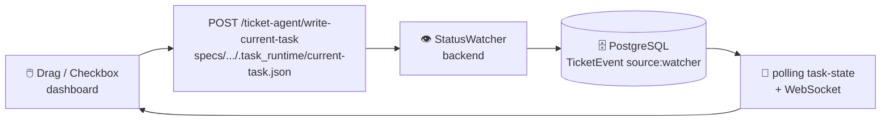

# 🖥️ Spec Kit Frontend — Dashboard & Kanban

<p align="center">
  
  
  
  
</p>

<p align="center">
  <b>Tour de contrôle temps réel</b> • <b>Pipeline + Kanban autonome</b><br/>
  <i>Monitoring des specs, KPIs qualité et synchronisation Ticket Agent <code>todo → in_progress → done</code></i>
</p>

---

<details>
<summary>📑 Table des matières</summary>

- [Présentation](#-présentation-du-frontend)
- [Architecture des Composants](#-architecture-des-composants-srcscenes)
- [Kanban Ticket Board](#-kanban-ticket-board-srcscenesdashboard)
- [State Management](#️-state-management-redux-toolkit)
- [Intégration API](#️-intégration-api-backend)
- [Installation](#-installation--lancement-quick-start)

</details>

---

## 📌 Présentation du Frontend

Application Web moderne pour le pilotage complet du pipeline Spec Kit.

| Stack | Version | Rôle |
|---|---|---|
| **React.js** | 18 | Framework UI |
| **Material UI (MUI)** | v5 | Design system, DataGrid, Cards |
| **Redux Toolkit** | — | State `kanbanSlice` (tickets, taskState, progress) |
| **React Router** | v6 | Navigation `documents` / `dashboard` / `add_document` |
| **@hello-pangea/dnd** | — | Drag & Drop Kanban |
| **WebSocket hook** | `src/hooks/useWebSocket.js` | Temps réel avec fallback polling |

> **Plus de détails architecture globale →** [`README.md` racine](../README.md) et [`backend/README.md`](../backend/README.md) pour le pipeline et le Ticket Agent côté serveur.

---

## 🧩 Architecture des Composants (`src/scenes/`)

### 📑 Page "DOCUMENTS" (`src/scenes/documents/index.jsx`)

Cœur du monitoring pipeline.

- **DataGrid Dynamique** : Liste `PipelineRun` par `Artifact` (`parsing → writing → completed → failed`)
- **Polling Temps Réel** : `POLL_INTERVAL = 3000ms` pour rafraîchir les statuts
- **KpiPopup** : Modale décomposant les 6 évaluations JSONB : `parsing_eval`, `summary_eval`, `glossary_eval`, `diagram_eval`, `writer_eval`, `layout_eval`
- **Viewer PDF** : Bouton `Viewer` → `GET /api/v1/pipeline/pdf/{docVersionId}`

### ➕ Page "ADD DOCUMENT" (`src/scenes/addDocument/index.jsx`)

Injection de nouvelles specs.

- **Formulaire** : `project_name` + zone **Drag & Drop** (`.md` uniquement)
- **Envoi** : `POST /api/v1/pipeline/upload` (multipart `form-data`)

### 🎫 Kanban Board — Ticket Agent (`src/scenes/dashboard/index.jsx` + `kanbanSlice.js`)

> [!IMPORTANT]
> Seule source de vérité : `specs/{project}/.task_runtime/current-task.json` écrit par le LLM. Le frontend **ne change jamais** un statut directement en DB — il écrit `current-task.json` et le backend `StatusWatcher` sync.

| Élément | Détail |
|---|---|
| **Colonnes** | `To Do` / `In Progress` / `Done` (filtrées depuis `tickets` par `status`) |
| **Cartes** | `TicketCard` (MUI `Paper` draggable) avec `StatusChip`, `CheckboxIcon`, `assignee`, `position` |
| **Drag & Drop** | `@hello-pangea/dnd` (`DragDropContext` + `Droppable` + `Draggable`) → `reorderTickets` + `writeCurrentTask` |
| **Checkbox** | Click → `writeCurrentTask({taskId, status, projectName, tasksMap})` → `POST /ticket-agent/write-current-task` → `StatusWatcher` → DB `source:"watcher"` |
| **Header Kanban** | `Task {current_task_index} / {total_tasks} Done` + barre progression via `GET /pipeline/task-state/{project}` |
| **State** | `kanbanSlice.js` : `tickets`, `todoTickets`, `inProgressTickets`, `doneTickets`, `taskState: {current_task, current_task_index, task_status}`, `progress`, `projectMetrics` |



#### State Management (Redux Toolkit)

- **`src/store/index.js`** + **`src/scenes/dashboard/kanbanSlice.js`** : `createAsyncThunk` pour `fetchTickets`, `fetchTaskState`, `fetchProgress`, `fetchProjectMetrics`, `writeCurrentTask`, `updateTicketStatus`
- **`src/apiClient.js`** : `apiRequest()` (axios-like) centralise `http://localhost:8000/api/v1`
- **`src/hooks/useWebSocket.js`** : tente `ws://localhost:8000/ws/tickets/{project}` (si `403`, fallback polling 5s)

---

## ⚙️ Intégration API Backend

Base URL : `http://localhost:8000/api/v1`

| Endpoint | Méthode | Utilisé par |
|---|---|---|
| `/tickets?project_name=` | `GET` | `fetchTickets` → colonnes Kanban |
| `/tickets/{id}/status` | `PATCH` | `updateTicketStatus` (legacy, préférer `write-current-task`) |
| `/ticket-agent/write-current-task` | `POST` | `writeCurrentTask` (voie recommandée → StatusWatcher) |
| `/pipeline/task-state/{project}` | `GET` | `fetchTaskState` → header `Task X/Y` |
| `/progress?project_name=` | `GET` | `fetchProgress` → barre progression |
| `/ticket-agent/metrics?project_name=` | `GET` | `fetchProjectMetrics` → KPIs conformité |
| `/pipeline/upload` | `POST` | Add Document |
| `/pipeline/documents` | `GET` | Page Documents |
| `/pipeline/pdf/{docVersionId}` | `GET` | Viewer PDF |

> Pour l'architecture backend complète (LLM providers, LangGraph, Ticket Agent Dual Watchers) → [`backend/README.md`](../backend/README.md)

---

## 🚀 Installation & Lancement Quick Start

### 🛠️ Étapes

1. **Accéder au répertoire :**
   ```bash
   cd frontend
   ```

2. **Installation des dépendances :**
   ```bash
   npm install
   ```
   *Si conflits de versions :*
   ```bash
   npm install --legacy-peer-deps
   ```

3. **Lancement :**
   ```bash
   npm start
   ```
   → `http://localhost:5000` (ou `AgentDocx: Start Frontend` depuis l'extension)

### ⚠️ Dépannage

| Problème | Solution |
|---|---|
| Port `5000` occupé | `npx kill-port 5000` ou `PORT=3000 npm start` |
| `cross-env` sous Windows | `npm install --save-dev cross-env` |
| Node.js v24 incompatibilité | Passer à Node 18/20 via `nvm` |
| `ajv` errors | `npm install ajv@8 --legacy-peer-deps` |
| Kanban bloqué en `todo` | Vérifier que le LLM a bien écrit `specs/{project}/.task_runtime/current-task.json` (voir `prompts/universal-contract.md`) |

> 📖 Guide détaillé pas-à-pas → `../configFrontEnd.pdf` à la racine
> 
> 🧩 Pour l'extension → [`agentdocx-speckit/README.md`](../agentdocx-speckit/README.md)
> 
> ⚙️ Pour le moteur → [`backend/README.md`](../backend/README.md)

---

<p align="center">
  <i>Frontend Spec Kit — Dashboard pipeline + Kanban Ticket Agent temps réel</i>
</p>
