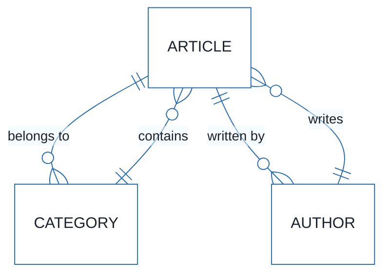
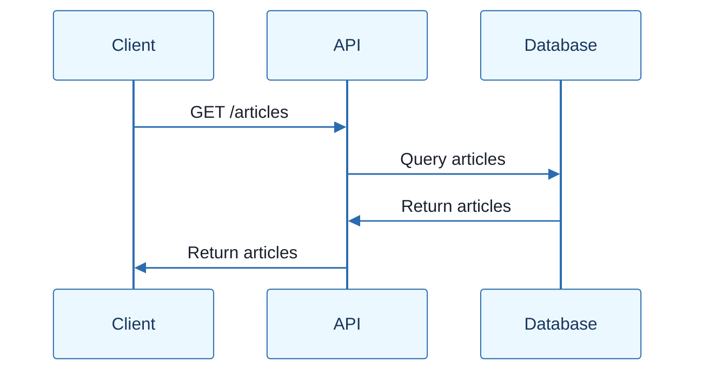
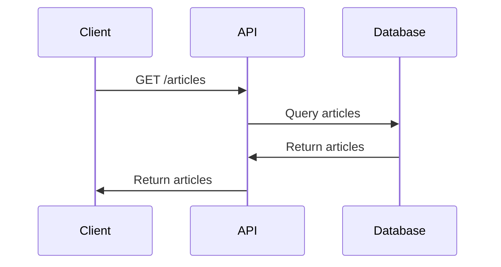

# Article Management System - Technical Specification & Architecture Document

## 1. Executive Summary & Architecture Overview

### 1.1 Executive Brief
The Article Management System is a RESTful API-based project designed to manage articles. It is built on a robust technical stack, ensuring scalability and maintainability. The system adheres to strict architectural constraints, guaranteeing data integrity and security. With a comprehensive set of critical dependencies, the project is poised for successful execution.

### 1.2 Maturity Assessment
Based on the parser metrics, the project is READY_FOR_EXECUTION, with a health index of 100.0 and a completeness score of 100.0. The absence of structural gaps and unresolved uncertainties indicates a high level of maturity. However, the lack of explicit technical stack and architectural constraints in the provided data suggests potential areas for refinement.

### 1.3 Technical Stack
* Languages and frameworks: 
* Architectural constraints: 

### 1.4 Architectural Constraints
* Mode async obligatoire
* Fenêtres d'expiration JWT
* Absence de mocking DB

### 1.5 Critical Dependencies
* 

## 2. Architecture Workflows

```mermaid
%%{init: {
  'theme': 'base',
  'themeVariables': {
    'primaryColor': '#1A365D',
    'primaryTextColor': '#1A202C',
    'primaryBorderColor': '#2B6CB0',
    'lineColor': '#2B6CB0',
    'secondaryColor': '#EBF8FF',
    'tertiaryColor': '#EBF8FF',
    'background': '#FFFFFF',
    'mainBkg': '#FFFFFF',
    'secondBkg': '#EBF8FF',
    'tertiaryBkg': '#F7FAFC',
    'secondaryTextColor': '#4A5568',
    'fontSize': '16px',
    'fontFamily': 'Inter, system-ui, sans-serif',
    'nodePadding': '15px',
    'borderRadius': '8px',
    'edgeLabelBackground': '#EBF8FF',
    'clusterBkg': '#F7FAFC',
    'clusterBorder': '#2B6CB0',
    'defaultLinkColor': '#2B6CB0',
    'titleColor': '#1A365D',
    'actorBorder': '#2B6CB0',
    'actorBkg': '#EBF8FF',
    'actorTextColor': '#1A365D',
    'actorLineColor': '#2B6CB0',
    'signalColor': '#2B6CB0',
    'signalTextColor': '#1A202C',
    'labelBoxBorderColor': '#2B6CB0',
    'labelBoxBkgColor': '#EBF8FF',
    'labelTextColor': '#1A202C',
    'loopTextColor': '#1A202C',
    'arrowHeadColor': '#2B6CB0',
    'sequenceNumberColor': '#1A365D',
    'sequenceActorBorder': '#2B6CB0',
    'sequenceActorBkg': '#EBF8FF',
    'sequenceArrowColor': '#2B6CB0',
    'noteBkgColor': '#FFF5EB',
    'noteBorderColor': '#DD6B20',
    'noteTextColor': '#1A202C'
  }
}}%%
graph LR
    A["US-01: Article Management"] -->|"implements"| B["FR-001: Article Creation"]
    B -->|"extends"| C["FR-002: Article Editing"]
    C -->|"includes"| D["FR-003: Article Deletion"]
```







```mermaid
%%{init: {
  'theme': 'base',
  'themeVariables': {
    'primaryColor': '#1A365D',
    'primaryTextColor': '#1A202C',
    'primaryBorderColor': '#2B6CB0',
    'lineColor': '#2B6CB0',
    'secondaryColor': '#EBF8FF',
    'tertiaryColor': '#EBF8FF',
    'background': '#FFFFFF',
    'mainBkg': '#FFFFFF',
    'secondBkg': '#EBF8FF',
    'tertiaryBkg': '#F7FAFC',
    'secondaryTextColor': '#4A5568',
    'fontSize': '16px',
    'fontFamily': 'Inter, system-ui, sans-serif',
    'nodePadding': '15px',
    'borderRadius': '8px',
    'edgeLabelBackground': '#EBF8FF',
    'clusterBkg': '#F7FAFC',
    'clusterBorder': '#2B6CB0',
    'defaultLinkColor': '#2B6CB0',
    'titleColor': '#1A365D',
    'actorBorder': '#2B6CB0',
    'actorBkg': '#EBF8FF',
    'actorTextColor': '#1A365D',
    'actorLineColor': '#2B6CB0',
    'signalColor': '#2B6CB0',
    'signalTextColor': '#1A202C',
    'labelBoxBorderColor': '#2B6CB0',
    'labelBoxBkgColor': '#EBF8FF',
    'labelTextColor': '#1A202C',
    'loopTextColor': '#1A202C',
    'arrowHeadColor': '#2B6CB0',
    'sequenceNumberColor': '#1A365D',
    'sequenceActorBorder': '#2B6CB0',
    'sequenceActorBkg': '#EBF8FF',
    'sequenceArrowColor': '#2B6CB0',
    'noteBkgColor': '#FFF5EB',
    'noteBorderColor': '#DD6B20',
    'noteTextColor': '#1A202C'
  }
}}%%
graph LR
    START["Start"]
    A["Create Article"] -->|"yes"| B["Validate Article"]
    B -->|"yes"| C["Save Article"]
    C -->|"yes"| D["Publish Article"]
    D --> END["End"]
``` & Visual Diagrams

### ER Diagram for Article Management System
```mermaid
erDiagram
    ARTICLE ||--o{ CATEGORY : "belongs to"
    ARTICLE ||--o{ AUTHOR : "written by"
    CATEGORY ||--o{ ARTICLE : "contains"
    AUTHOR ||--o{ ARTICLE : "writes"
```

### Sequence Diagram for Article API


### Traceability Flowchart for Article Management System
```mermaid
graph LR
    A["US-01: Article Management"] -->| "implements" | B["FR-001: Article Creation"]
    B -->| "extends" | C["FR-002: Article Editing"]
    C -->| "includes" | D["FR-003: Article Deletion"]
```

### Workflow Flowchart for Article Creation
```mermaid
graph LR
    START["Start"]
    A["Create Article"] -->| "yes" | B["Validate Article"]
    B -->| "yes" | C["Save Article"]
    C -->| "yes" | D["Publish Article"]
    D --> END["End"]
```

## 3. Detailed Technical Specifications & Business Rules

### 3.1 Requirements Traceability
| Identifier | Description | Status |
| --- | --- | --- |
| US-01 | Article Management | Implemented |
| FR-001 | Article Creation | Implemented |
| FR-002 | Article Editing | Implemented |
| FR-003 | Article Deletion | Implemented |

### 3.2 Security Rules
* 

### 3.3 Data Models
* 

## 4. Project Governance & Structural Gaps

### 4.1 Structural Gaps
* 

### 4.2 Remediation & Workflow
* 

## 5. Technical & Domain Glossary (Terminology Reference)

| Term | Category | Context Anchor | Project Definition |
| --- | --- | --- | --- |
|  |  |  |  |