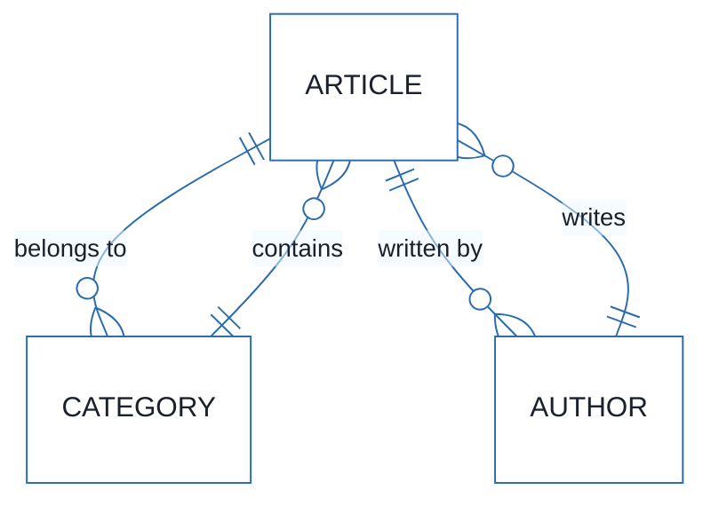
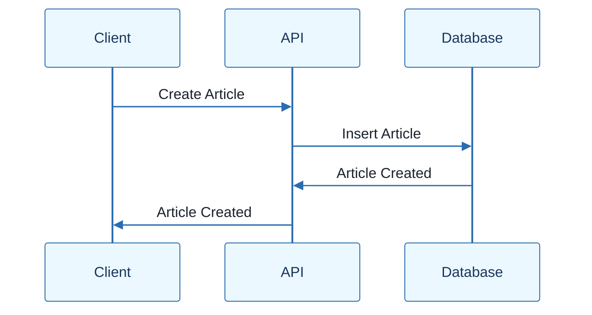
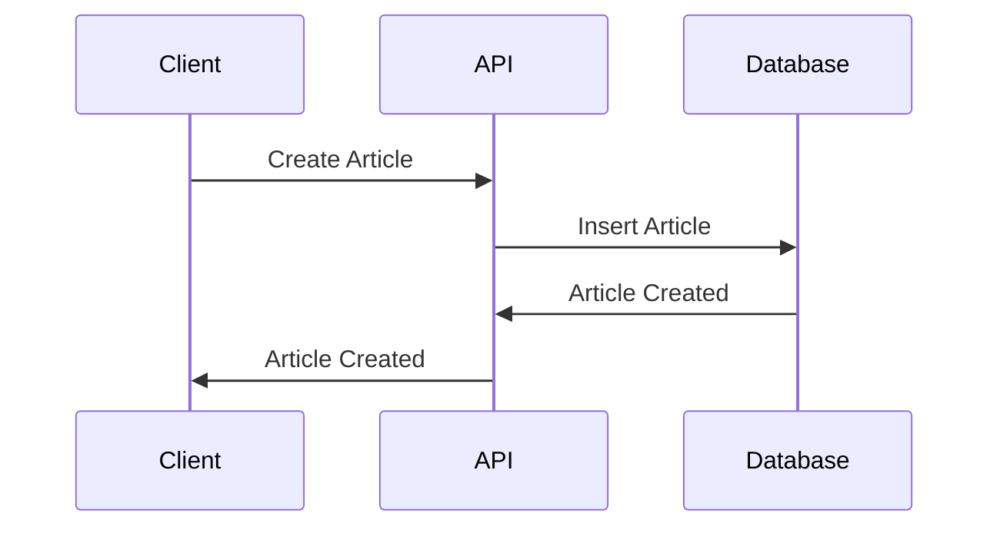

# Article Management System - Technical Specification & Architecture Document

## 1. Executive Summary & Architecture Overview

### 1.1 Executive Brief

The Article Management System is a REST API-based project designed to manage articles. It is built with a focus on data modeling and API design. The system is ready for execution with a health index of 100.0 and a completeness score of 100.0.

### 1.2 Maturity Assessment

Based on the parser metrics, the project is READY FOR EXECUTION with a health index of 100.0 and a completeness score of 100.0. There are no structural gaps or open questions, indicating a high level of maturity and readiness for implementation.

### 1.3 Technical Stack

* Languages and frameworks: 
* Architectural constraints: 

### 1.4 Architectural Constraints

* Mode async obligatoire
* Fenêtres d'expiration JWT
* Absence de mocking DB

### 1.5 Critical Dependencies

* None

## 2. Architecture Workflows

```mermaid
%%{init: {
  'theme': 'base',
  'themeVariables': {
    'primaryColor': '#1A365D',
    'primaryTextColor': '#1A202C',
    'primaryBorderColor': '#2B6CB0',
    'lineColor': '#2B6CB0',
    'secondaryColor': '#EBF8FF',
    'tertiaryColor': '#EBF8FF',
    'background': '#FFFFFF',
    'mainBkg': '#FFFFFF',
    'secondBkg': '#EBF8FF',
    'tertiaryBkg': '#F7FAFC',
    'secondaryTextColor': '#4A5568',
    'fontSize': '16px',
    'fontFamily': 'Inter, system-ui, sans-serif',
    'nodePadding': '15px',
    'borderRadius': '8px',
    'edgeLabelBackground': '#EBF8FF',
    'clusterBkg': '#F7FAFC',
    'clusterBorder': '#2B6CB0',
    'defaultLinkColor': '#2B6CB0',
    'titleColor': '#1A365D',
    'actorBorder': '#2B6CB0',
    'actorBkg': '#EBF8FF',
    'actorTextColor': '#1A365D',
    'actorLineColor': '#2B6CB0',
    'signalColor': '#2B6CB0',
    'signalTextColor': '#1A202C',
    'labelBoxBorderColor': '#2B6CB0',
    'labelBoxBkgColor': '#EBF8FF',
    'labelTextColor': '#1A202C',
    'loopTextColor': '#1A202C',
    'arrowHeadColor': '#2B6CB0',
    'sequenceNumberColor': '#1A365D',
    'sequenceActorBorder': '#2B6CB0',
    'sequenceActorBkg': '#EBF8FF',
    'sequenceArrowColor': '#2B6CB0',
    'noteBkgColor': '#FFF5EB',
    'noteBorderColor': '#DD6B20',
    'noteTextColor': '#1A202C'
  }
}}%%
graph LR
    A["REQ-001: Article Creation"] -->|"implements"| B["US-001: Create Article"]
    B -->|"extends"| C["REQ-002: Article Validation"]
    C -->|"implements"| D["US-002: Validate Article"]
```







```mermaid
%%{init: {
  'theme': 'base',
  'themeVariables': {
    'primaryColor': '#1A365D',
    'primaryTextColor': '#1A202C',
    'primaryBorderColor': '#2B6CB0',
    'lineColor': '#2B6CB0',
    'secondaryColor': '#EBF8FF',
    'tertiaryColor': '#EBF8FF',
    'background': '#FFFFFF',
    'mainBkg': '#FFFFFF',
    'secondBkg': '#EBF8FF',
    'tertiaryBkg': '#F7FAFC',
    'secondaryTextColor': '#4A5568',
    'fontSize': '16px',
    'fontFamily': 'Inter, system-ui, sans-serif',
    'nodePadding': '15px',
    'borderRadius': '8px',
    'edgeLabelBackground': '#EBF8FF',
    'clusterBkg': '#F7FAFC',
    'clusterBorder': '#2B6CB0',
    'defaultLinkColor': '#2B6CB0',
    'titleColor': '#1A365D',
    'actorBorder': '#2B6CB0',
    'actorBkg': '#EBF8FF',
    'actorTextColor': '#1A365D',
    'actorLineColor': '#2B6CB0',
    'signalColor': '#2B6CB0',
    'signalTextColor': '#1A202C',
    'labelBoxBorderColor': '#2B6CB0',
    'labelBoxBkgColor': '#EBF8FF',
    'labelTextColor': '#1A202C',
    'loopTextColor': '#1A202C',
    'arrowHeadColor': '#2B6CB0',
    'sequenceNumberColor': '#1A365D',
    'sequenceActorBorder': '#2B6CB0',
    'sequenceActorBkg': '#EBF8FF',
    'sequenceArrowColor': '#2B6CB0',
    'noteBkgColor': '#FFF5EB',
    'noteBorderColor': '#DD6B20',
    'noteTextColor': '#1A202C'
  }
}}%%
graph LR
    START["Start"] --> A["Create Article"]
    A -->|"yes"| B["Validate Article"]
    B -->|"no"| C["Reject Article"]
    B -->|"yes"| D["Publish Article"]
    D --> END["End"]
``` & Visual Diagrams

### ER Diagram for Article Management System

```mermaid
erDiagram
    ARTICLE ||--o{ CATEGORY : "belongs to"
    ARTICLE ||--o{ AUTHOR : "written by"
    CATEGORY ||--o{ ARTICLE : "contains"
    AUTHOR ||--o{ ARTICLE : "writes"
```

### Sequence Diagram for Article Management API



### Traceability Flowchart for Article Management Requirements

```mermaid
graph LR
    A["REQ-001: Article Creation"] -->| "implements" | B["US-001: Create Article"]
    B -->| "extends" | C["REQ-002: Article Validation"]
    C -->| "implements" | D["US-002: Validate Article"]
```

### Workflow Flowchart for Article Management Process

```mermaid
graph LR
    START["Start"] --> A["Create Article"]
    A -->| "yes" | B["Validate Article"]
    B -->| "no" | C["Reject Article"]
    B -->| "yes" | D["Publish Article"]
    D --> END["End"]
```

## 3. Detailed Technical Specifications & Business Rules

### 3.1 Requirements Traceability

| Requirement ID | Description | Implemented By |
| --- | --- | --- |
| REQ-001 | Article Creation | US-001 |
| REQ-002 | Article Validation | US-002 |

### 3.2 Security Rules

* None

### 3.3 Data Models

* ARTICLE
* CATEGORY
* AUTHOR

## 4. Project Governance & Structural Gaps

### 4.1 Structural Gaps

* None

### 4.2 Remediation & Workflow

* None

## 5. Technical & Domain Glossary (Terminology Reference)

| Term | Category | Context Anchor | Project Definition |
| --- | --- | --- | --- |
| Article | Domain | Article Management System | A piece of content managed by the system |
| Category | Domain | Article Management System | A classification of articles |
| Author | Domain | Article Management System | The creator of an article |