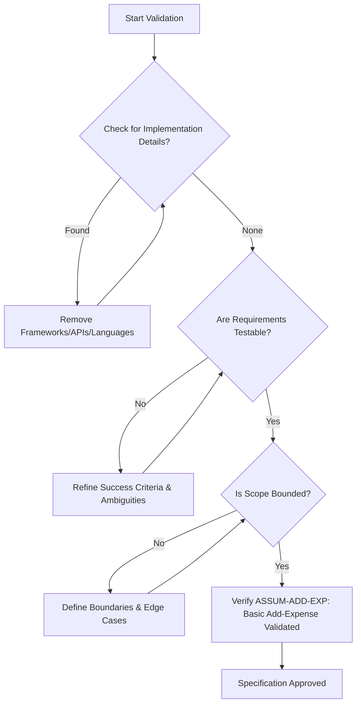
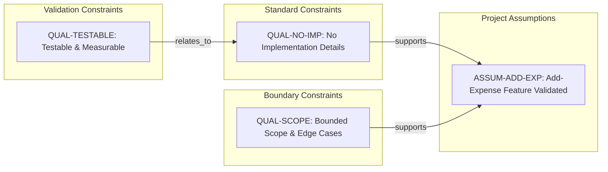

# Expense Tracker CLI - Technical Specification & Architecture Document

## 1. Executive Summary & Architecture Overview

### 1.1 Executive Brief
The project is an Expense Tracker CLI currently in the quality validation phase. The provided input is a metadata checklist designed to enforce a technology-agnostic specification standard, ensuring that all functional requirements for the 'add-expense' feature are testable, measurable, and devoid of implementation leakages.

### 1.2 Maturity Assessment
The current state is categorized as **NEEDS REFINEMENT**. While the quality checklist itself is complete (100% completeness score), the project lacks the actual functional specifications, scope definitions, and operational requirements. The presence of high-severity structural gaps regarding the missing 'spec.md' means there is no executable architectural logic to implement yet.

### 1.3 Technical Stack
*   *No languages, frameworks, or SDKs specified (Technology-agnostic phase).*

### 1.4 Architectural Constraints
*   Zero implementation details (languages, frameworks, APIs) allowed within the specification.
*   All requirements must be strictly testable and unambiguous.
*   Success criteria must be measurable and technology-agnostic.
*   Strict scope bounding with mandatory identification of edge cases.

### 1.5 Critical Dependencies
*   Availability of the primary `spec.md` document for functional extraction.
*   Validation of the 'add-expense' feature requirements as the baseline operational unit.

## 2. Architecture Workflows & Visual Diagrams

### 2.1 Specification Validation Workflow

### 2.2 Quality Constraint Traceability

## 3. Detailed Technical Specifications & Business Rules

### 3.1 Requirements Traceability
| Identifier | Type | Description | Source Section | Category/Status |
| :--- | :--- | :--- | :--- | :--- |
| QUAL-NO-IMP | Constraint | The specification must contain no implementation details such as languages, frameworks, or APIs. | Content Quality | standard |
| QUAL-TESTABLE | Constraint | Requirements must be testable, unambiguous, and success criteria must be measurable. | Requirement Completeness | validation |
| ASSUM-ADD-EXP | Assumption | All initial requirements for the basic add-expense feature have been captured and validated. | Notes | validated |
| QUAL-SCOPE | Constraint | Scope must be clearly bounded and edge cases identified. | Requirement Completeness | boundary |

### 3.2 Security Rules
*   *No security rules defined in the provided source data.*

### 3.3 Data Models
*   *No data models defined in the provided source data.*

## 4. Project Governance & Structural Gaps

### 4.1 Structural Gaps
| Missing Section | Priority | Remediation Advice |
| :--- | :--- | :--- |
| Functional Requirements | HIGH | This document is a checklist. Please provide the 'spec.md' file to extract the actual functional requirements. |
| Scope & Out-of-Scope | HIGH | The checklist mentions scope must be bounded, but the bounds are not defined here. Provide the main specification document. |
| Open Questions & Uncertainties | MEDIUM | The checklist confirms no markers remain, but does not list the historical open questions. |

### 4.2 Remediation & Workflow
The project must transition from the "Quality Checklist" phase to the "Functional Specification" phase by integrating the `spec.md` content. The workflow requires the resolution of all HIGH priority gaps before the architecture can be finalized.

## 5. Technical & Domain Glossary (Terminology Reference)

| Term | Category | Context Anchor | Project Definition |
| :--- | :--- | :--- | :--- |
| Feature | BUSINESS_DOMAIN | Feature Readiness | A distinct piece of functionality that must satisfy measurable outcomes and specific acceptance criteria to be considered ready for implementation. |