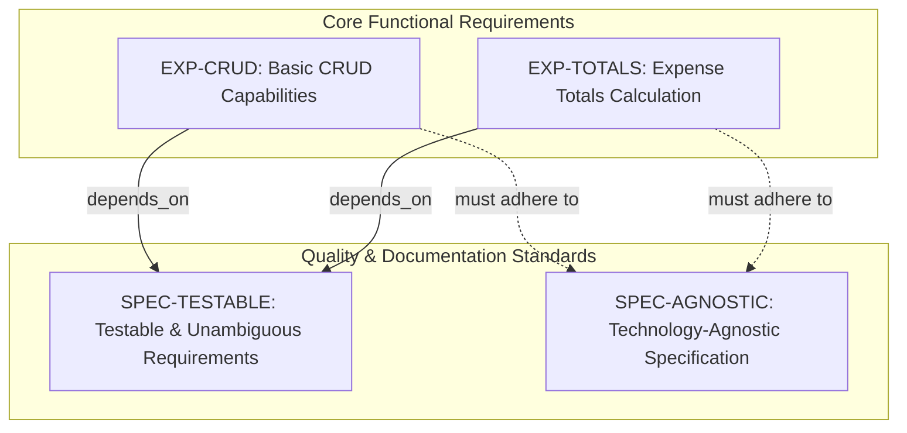
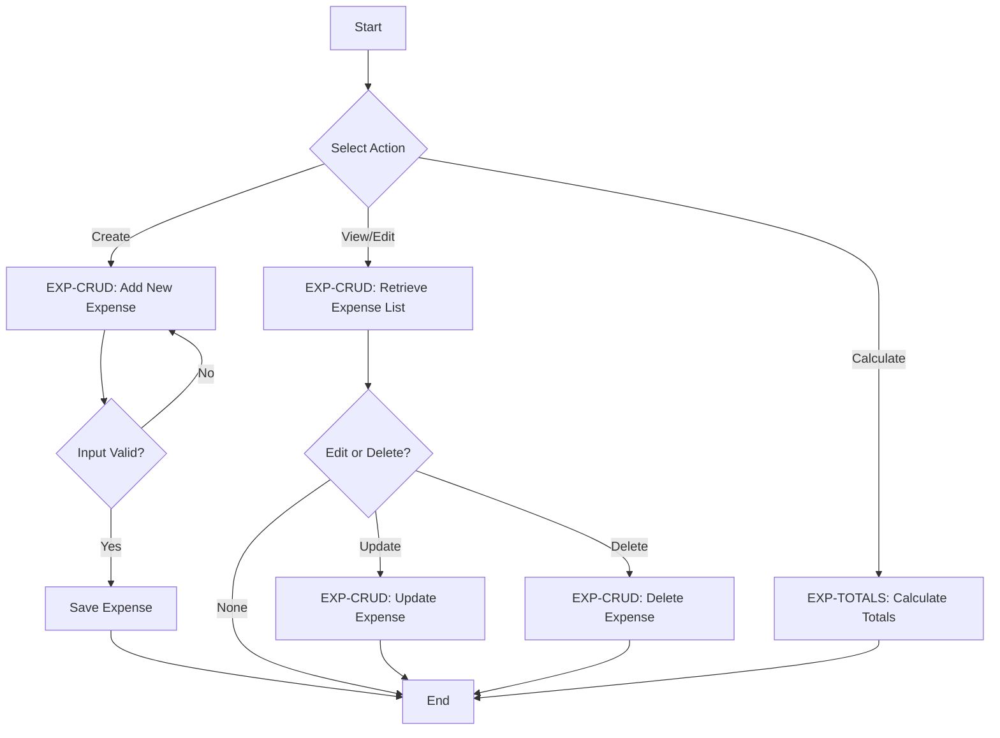
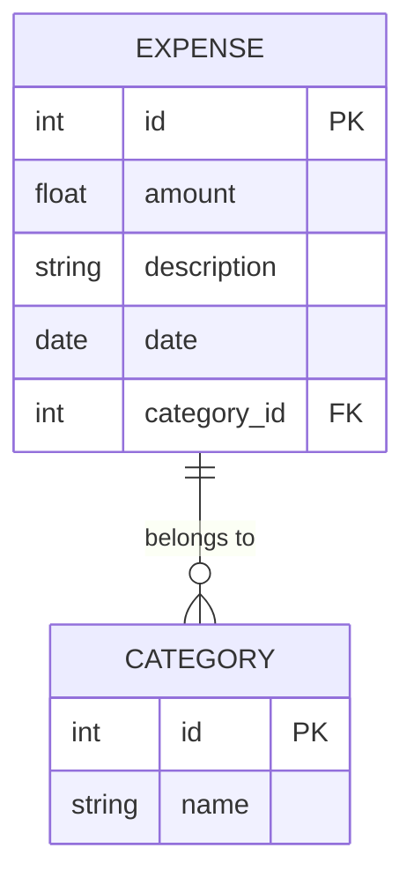

# Expense Tracker CLI - Technical Specification & Architecture Document

## 1. Executive Summary & Architecture Overview

### 1.1 Executive Brief
The Expense Tracker CLI is a lightweight utility focused on managing financial expenditures through core CRUD operations and automated total calculations. The project is currently defined as a technology-agnostic specification, prioritizing business value and measurable success criteria over specific implementation details to ensure a portable and testable baseline.

### 1.2 Maturity Assessment
The project exhibits a high degree of specification quality with a perfect completeness score for the audit checklist. While there is a medium-severity gap regarding the explicit listing of scope boundaries and a low-severity absence of documented open questions, the overall structural integrity is sound. The project is READY for execution.

### 1.3 Technical Stack
*   **Languages and Frameworks**: Not specified (Technology-agnostic baseline)
*   **Databases**: Not specified
*   **SDKs/APIs**: Not specified

### 1.4 Architectural Constraints
*   **Technology-agnostic specification**: No implementation details regarding languages, frameworks, or APIs allowed in the core requirements.
*   **Measurable success criteria**: Every requirement must be testable and unambiguous.
*   **Strict boundary**: Project scope is explicitly bounded to basic CRUD and totals calculation.

### 1.5 Critical Dependencies
*   Functional requirement `EXP-CRUD` depends on `SPEC-TESTABLE` quality gate.
*   Functional requirement `EXP-TOTALS` depends on `SPEC-TESTABLE` quality gate.
*   Verification of measurable success criteria prior to implementation phase.

## 2. Architecture Workflows & Visual Diagrams

### 2.1 Expense Tracker Requirements Traceability
Maps core functional requirements to their quality constraints and validation gates.

### 2.2 Expense Management Workflow
A conceptual workflow for managing expenses, incorporating the CRUD and Totals requirements with decision logic.

### 2.3 Expense Data Model
Conceptual data model based on the CRUD and Totals requirements for the Expense Tracker.

## 3. Detailed Technical Specifications & Business Rules

### 3.1 Requirements Traceability
| ID | Requirement Description | Source Section | Scope/Category |
| :--- | :--- | :--- | :--- |
| `EXP-CRUD` | The system must provide basic CRUD (Create, Read, Update, Delete) capabilities for expenses. | Notes | core |
| `EXP-TOTALS` | The system must be able to calculate and display expense totals. | Notes | core |
| `SPEC-AGNOSTIC` | The specification must remain technology-agnostic, containing no implementation details regarding languages, frameworks, or APIs. | Content Quality | documentation_standard |
| `SPEC-TESTABLE` | All requirements must be testable and unambiguous with measurable success criteria. | Requirement Completeness | quality_gate |

### 3.2 Security Rules
*   No specific security rules defined in the current technology-agnostic baseline.

### 3.3 Data Models
*   **Expense Entity**: Contains ID, amount, description, date, and a reference to a category.
*   **Category Entity**: Contains ID and name.

## 4. Project Governance & Structural Gaps

### 4.1 Structural Gaps
| Missing Section | Priority | Remediation Advice |
| :--- | :--- | :--- |
| Scope & Out-of-Scope | MEDIUM | The checklist confirms scope is 'bounded', but the actual boundaries are not listed in this audit file. |
| Open Questions & Uncertainties | LOW | The checklist indicates no markers remain, suggesting this section is empty or resolved. |

### 4.2 Remediation & Workflow
1.  **Define Boundaries**: Explicitly document the "Out-of-Scope" features to prevent scope creep.
2.  **Final Validation**: Confirm that the "bounded" scope mentioned in the audit is reflected in the final functional requirements.

## 5. Technical & Domain Glossary (Terminology Reference)

| Term | Category | Context Anchor | Project Definition |
| :--- | :--- | :--- | :--- |
| CRUD | TECHNICAL_STACK | `EXP-CRUD` | The four foundational persistent storage mutation primitives applied to financial expenditure records. |
| Feature | BUSINESS_DOMAIN | Feature Readiness | A discrete unit of deliverable functionality that must satisfy measurable success criteria and mapped user scenarios. |