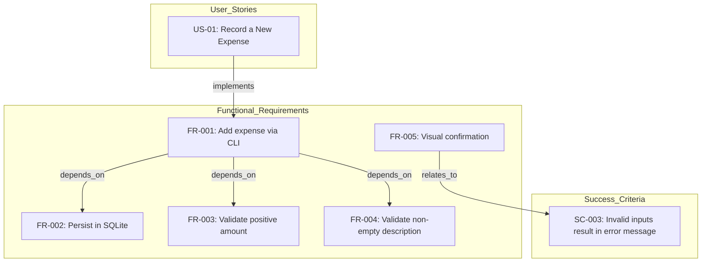
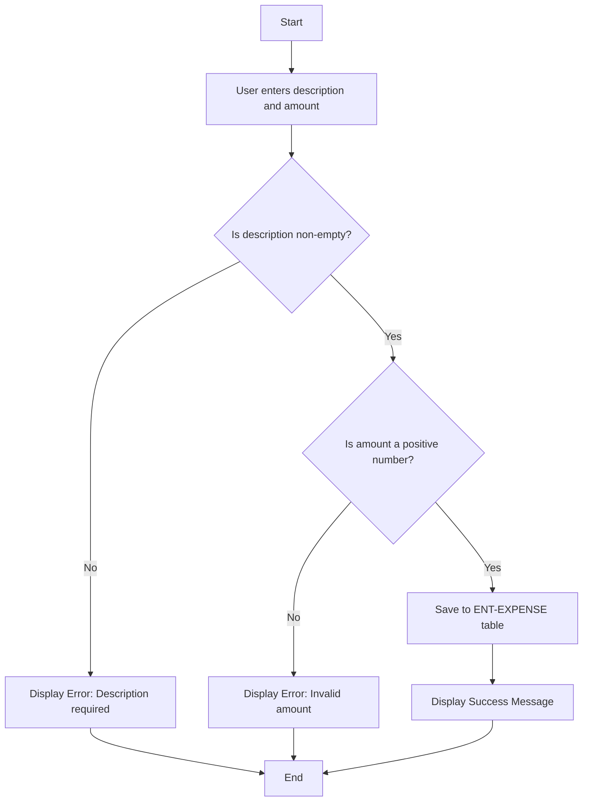
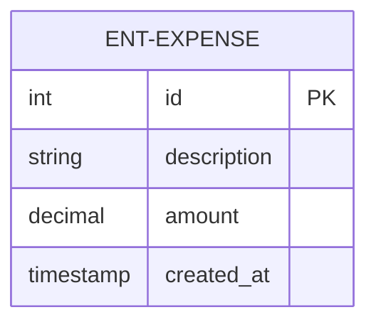
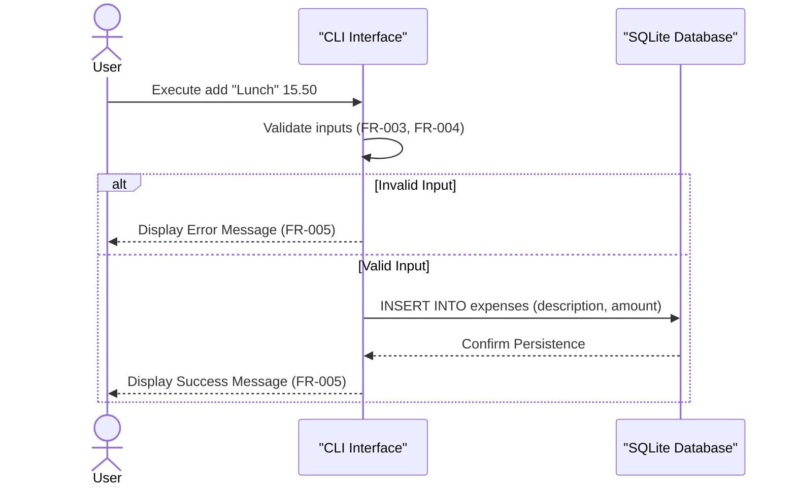

# Expense Tracker CLI - Technical Specification & Architecture Document

## 1. Executive Summary & Architecture Overview

### 1.1 Executive Brief
The Expense Tracker CLI is a Python-based utility designed to record financial expenditures into a local SQLite database. It provides a streamlined command-line interface for capturing expense descriptions and amounts, ensuring data persistence and basic input validation to maintain financial record integrity.

### 1.2 Maturity Assessment
The specification is highly stable and structurally sound, with a high health index and complete functional mapping for the core feature. While a medium-severity gap exists regarding the absence of an 'Open Questions' section, the current requirements are sufficiently atomic and unambiguous for implementation. Status: READY.

### 1.3 Technical Stack
* Python 3.10+
* SQLite

### 1.4 Architectural Constraints
* Amount must be a valid positive number (>= 0.00).
* Description must be a non-empty string.
* Financial precision must be maintained using decimal types.
* Execution-to-confirmation latency must be under 10 seconds.
* 100% of invalid inputs must trigger user-facing error messages instead of system crashes.
* Scope limited strictly to 'adding' expenses; listing, deleting, and summarizing are explicitly out of scope.

### 1.5 Critical Dependencies
* Python 3.10+ runtime environment.
* SQLite database engine for local persistence.
* Automatic creation of SQLite database file in project root or designated data folder.
* Strict data mapping between CLI input and the 'expenses' table (id, description, amount, created_at).

## 2. Architecture Workflows & Visual Diagrams

### 2.1 Requirements Traceability Matrix

### 2.2 Expense Recording Workflow

### 2.3 Expense Data Model

### 2.4 Expense Addition Sequence

## 3. Detailed Technical Specifications & Business Rules

### 3.1 Requirements Traceability
| ID | Type | Description | Relation/Dependency |
| :--- | :--- | :--- | :--- |
| US-01 | User Story | As a user, I want to record a spending event by providing a description and an amount via the command line so that I can track my expenses. | Implements FR-001 |
| FR-001 | Functional Req | System MUST allow users to add a new expense by providing a description and an amount via the CLI. | Depends on FR-002, FR-003, FR-004 |
| FR-002 | Functional Req | System MUST persist every successfully added expense in a SQLite database. | Contains ENT-EXPENSE |
| FR-003 | Functional Req | System MUST validate that the amount is a valid positive number. | - |
| FR-004 | Functional Req | System MUST validate that the description is not empty. | - |
| FR-005 | Functional Req | System MUST provide immediate visual confirmation (success or error) to the user after an attempt to add an expense. | Relates to SC-003 |
| ENT-EXPENSE | Entity | Expense: Represents a single financial expenditure (id, description, amount, created_at). | - |
| SC-001 | Success Criterion | Users can successfully add a valid expense in under 10 seconds from command execution to confirmation. | - |
| SC-002 | Success Criterion | 100% of validated and "successfully added" expenses are retrievable from the SQLite database. | - |
| SC-003 | Success Criterion | 100% of invalid inputs result in a user-facing error message rather than a system crash. | - |
| ASSUMP-ENV | Assumption | The user has Python 3.10+ installed and is running the application in a standard terminal/shell. | - |
| CONS-SCOPE | Constraint | Only "adding" expenses is covered; listing, deleting, or summarizing is out of scope. | - |

### 3.2 Security Rules
* **Input Validation**: All CLI inputs must be sanitized to prevent SQL injection in the SQLite database.
* **Error Handling**: System must catch all exceptions during database I/O to prevent stack trace exposure to the end-user (SC-003).

### 3.3 Data Models
**Table: `expenses` (ENT-EXPENSE)**
| Column | Type | Constraint | Description |
| :--- | :--- | :--- | :--- |
| `id` | INTEGER | PRIMARY KEY | Unique identifier for the expense. |
| `description` | TEXT | NOT NULL | Brief text description of the expenditure. |
| `amount` | DECIMAL | NOT NULL | Numeric cost (must be >= 0.00). |
| `created_at` | TIMESTAMP | DEFAULT CURRENT_TIMESTAMP | Date and time of record creation. |

## 4. Project Governance & Structural Gaps

### 4.1 Structural Gaps
| Gap ID | Missing Section | Priority | Remediation Advice |
| :--- | :--- | :--- | :--- |
| GAP-01 | Open Questions & Uncertainties | MEDIUM | Add a section to identify potential ambiguities in the CLI interface or database schema. |

### 4.2 Remediation & Workflow
The identified gap (GAP-01) should be addressed in the next iteration of the specification by conducting a technical review of the CLI argument parsing strategy (e.g., `argparse` vs `click`) to determine if further constraints are needed.

## 5. Technical & Domain Glossary (Terminology Reference)

| Term | Category | Context Anchor | Project Definition |
| :--- | :--- | :--- | :--- |
| Data Types | TECHNICAL_STACK | ASSUMP-ENV | Decimal formats used to maintain financial precision for monetary values. |
| Environment | TECHNICAL_STACK | ASSUMP-ENV | A standard terminal or shell where the runtime is installed. |
| Expense | BUSINESS_DOMAIN | ENT-EXPENSE | A single financial expenditure containing a unique identifier, text description, cost, and recording timestamp. |
| Fixed-Point Numeric Constraint | TECHNICAL_STACK | ASSUMP-ENV | The requirement to use decimals instead of floating point to avoid rounding errors in currency calculations. |
| Large Numbers | TECHNICAL_STACK | Edge Cases | High-magnitude numeric values that must be processed without precision loss. |
| Negative Amounts | BUSINESS_DOMAIN | Edge Cases | Values below zero which are treated as invalid inputs for the current version. |
| Persistence | TECHNICAL_STACK | FR-002 | The mechanism of storing validated records into a local SQLite file located in the root or data folder. |
| Python 3.10 | TECHNICAL_STACK | ASSUMP-ENV | The minimum required runtime version for executing the application. |
| Scope | BUSINESS_DOMAIN | CONS-SCOPE | The boundary limiting functionality exclusively to the creation of records, excluding retrieval or modification. |
| Special Characters | TECHNICAL_STACK | Edge Cases | Non-alphanumeric symbols or quotes within text inputs that must not cause system failure. |
| Zero Amount | BUSINESS_DOMAIN | Edge Cases | A numeric value of 0.00 which is considered a valid input provided the text description is present. |