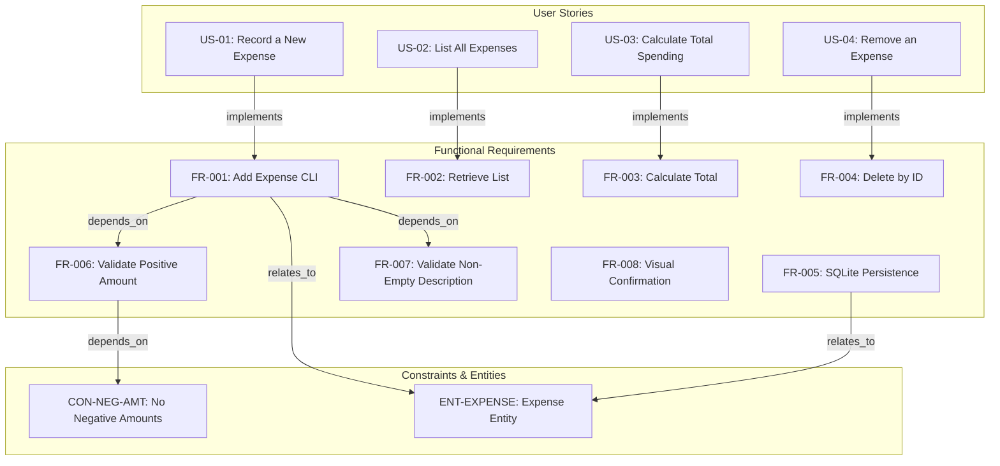
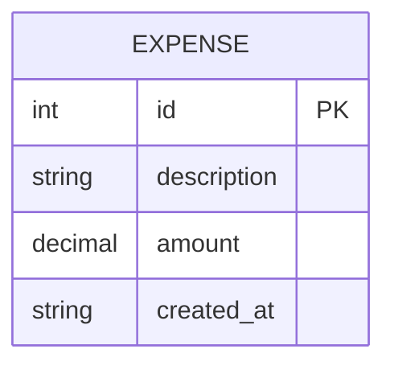
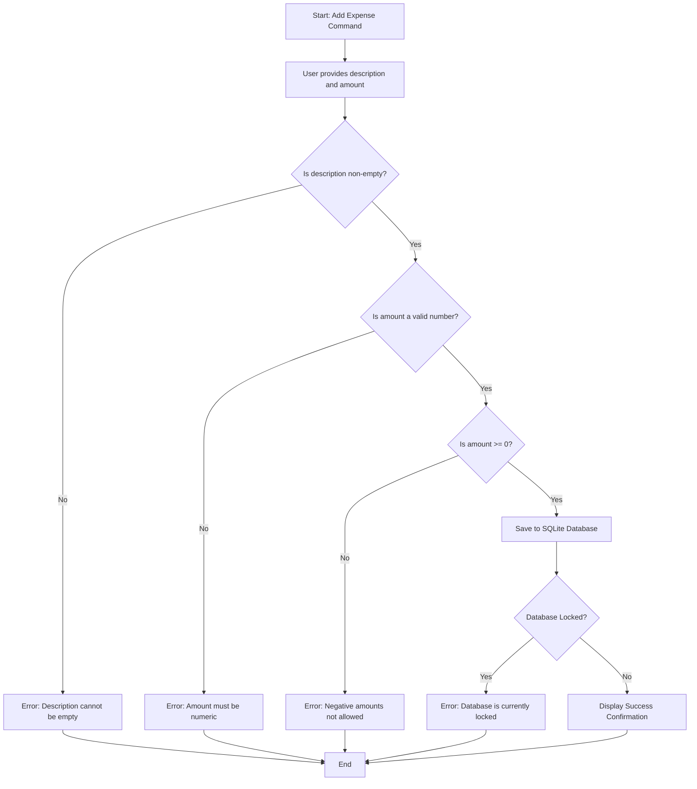
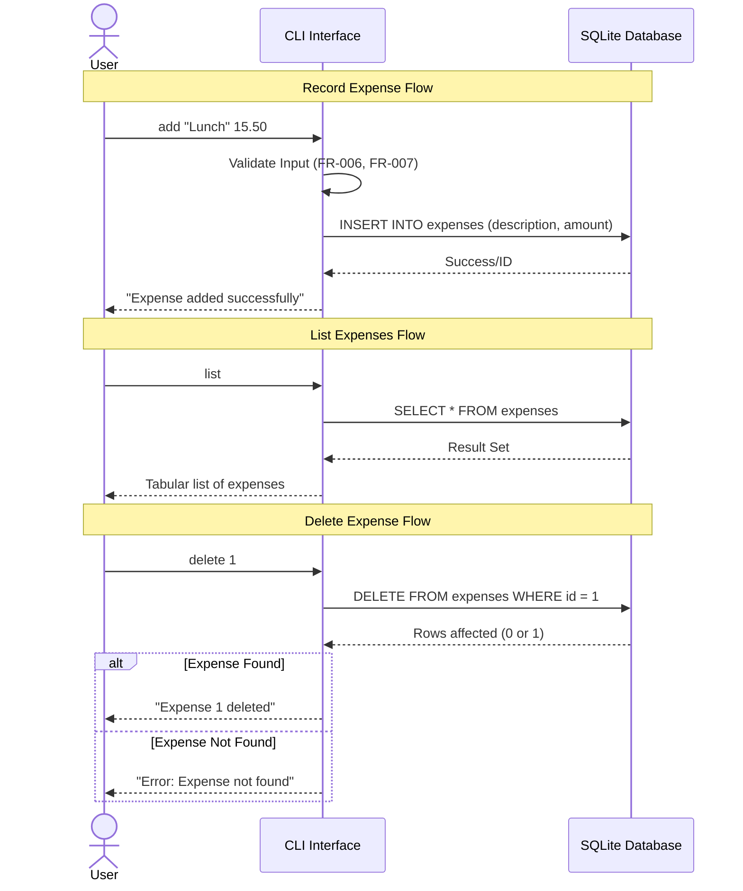

# Expense Tracker CLI - Technical Specification & Architecture Document

## 1. Executive Summary & Architecture Overview

### 1.1 Executive Brief
The Expense Tracker CLI is a specialized financial recording tool designed for terminal-based expenditure management. It utilizes a SQLite persistence layer to provide CRUD operations for expenses, featuring strict input validation for financial data and automated total expenditure aggregation. The system targets Python 3.10+ environments with a focus on data integrity and mathematical precision.

### 1.2 Maturity Assessment
The specification is highly robust and structurally sound, featuring detailed acceptance criteria and a clear mapping of functional requirements to entities. While there are minor omissions regarding high-level business goals and documented uncertainties, these do not impede technical implementation. The project is READY for execution.

### 1.3 Technical Stack
* Python 3.10+
* SQLite

### 1.4 Architectural Constraints
* Amount validation: must be a positive number (>= 0).
* Negative amounts must be treated as invalid inputs.
* Description must be a non-empty string.
* Financial precision: Decimals must be used to prevent precision loss for large numbers.
* Calculation accuracy: Total spending must be accurate to 2 decimal places.
* Performance: Valid expense addition must be completed in under 10 seconds.
* Stability: 100% of invalid inputs must trigger error messages instead of system crashes.
* Persistence: 100% of validated expenses must be retrievable from SQLite.

### 1.5 Critical Dependencies
* Python 3.10+ runtime environment.
* SQLite database engine for local persistence.
* Strict foreign key-like dependence of CRUD operations on the Expense entity (ID, description, amount, created_at).
* Local filesystem write permissions for automatic SQLite database file creation in project root.
* Decimal-based numeric processing for financial calculations.

## 2. Architecture Workflows & Visual Diagrams

### 2.1 Requirements Traceability Matrix

### 2.2 Expense Data Model

### 2.3 Expense Addition Workflow

### 2.4 Expense Management Sequence

## 3. Detailed Technical Specifications & Business Rules

### 3.1 Requirements Traceability
| ID | Type | Description | Source / Relation |
| :--- | :--- | :--- | :--- |
| **US-01** | User Story | Record a New Expense via CLI | Implements FR-001 |
| **US-02** | User Story | List All Expenses | Implements FR-002 |
| **US-03** | User Story | Calculate Total Spending | Implements FR-003 |
| **US-04** | User Story | Remove an Expense by ID | Implements FR-004 |
| **FR-001** | Functional | Allow adding new expense (description, amount) | Relates to ENT-EXPENSE, depends on FR-006, FR-007 |
| **FR-002** | Functional | Retrieve complete list of stored expenses | - |
| **FR-003** | Functional | Calculate and display total sum of expenses | - |
| **FR-004** | Functional | Delete specific expense record by unique ID | - |
| **FR-005** | Functional | Persist added/deleted expenses in SQLite | Relates to ENT-EXPENSE |
| **FR-006** | Functional | Validate amount is a positive number (>= 0) | Depends on CON-NEG-AMT |
| **FR-007** | Functional | Validate description is not empty | - |
| **FR-008** | Functional | Provide immediate visual confirmation (success/error) | - |
| **ENT-EXPENSE** | Entity | Expense: id (PK), description, amount, created_at | - |
| **CON-NEG-AMT** | Constraint | Negative amounts must be treated as invalid | - |
| **NFR-PRECISION** | Non-Func | Handle large numeric values using Decimals | - |
| **SC-001** | Success Crit | Add valid expense in under 10 seconds | - |
| **ASSUM-PY310** | Assumption | User has Python 3.10+ installed | - |

### 3.2 Security Rules
* **Input Sanitization**: Descriptions containing quotes, emoji, or special characters must be handled without crashing the CLI.
* **Data Integrity**: SQLite AUTOINCREMENT must be used to ensure robust ID generation and prevent collisions.
* **Error Handling**: Database locking states must be handled gracefully with user notifications rather than system crashes.

### 3.3 Data Models
**Entity: Expense (ENT-EXPENSE)**
* `id`: Integer (Primary Key) - Unique identifier.
* `description`: Text - Brief text description of the expense.
* `amount`: Decimal - Numeric cost of the expense.
* `created_at`: Timestamp/Text - Record of when the expense was created.

## 4. Project Governance & Structural Gaps

### 4.1 Structural Gaps
| Gap | Priority | Remediation Advice |
| :--- | :--- | :--- |
| Goals & Objectives | MEDIUM | Add a section explaining the high-level business goal and intended impact of the CLI tool. |
| Open Questions & Uncertainties | LOW | Include a section for potential technical doubts or future design decisions. |

### 4.2 Remediation & Workflow
The identified gaps are primarily documentation-level and do not block the technical implementation of the CRUD logic. Remediation should occur during the transition from "Draft" to "Final" specification status.

## 5. Technical & Domain Glossary (Terminology Reference)

| Term | Category | Context Anchor | Project Definition |
| :--- | :--- | :--- | :--- |
| CRUD | TECHNICAL_STACK | Functional Requirements | The four foundational persistent storage mutation primitives limited to addition, retrieval, and removal for this version. |
| Data Types | TECHNICAL_STACK | ENT-EXPENSE | The specific storage formats used for identifiers, text, and financial values to maintain structural integrity. |
| Database Locking | TECHNICAL_STACK | Edge Cases | A concurrency state where the SQLite file is inaccessible, requiring a graceful user notification. |
| Environment | TECHNICAL_STACK | ASSUM-PY310 | The operational context consisting of a standard terminal shell with the required runtime version. |
| Expense | BUSINESS_DOMAIN | ENT-EXPENSE | A single financial expenditure event containing a label, cost, and timestamp. |
| Fixed-Point Numeric Constraint | TECHNICAL_STACK | NFR-PRECISION | The requirement to maintain exactly 2 decimal places for financial accuracy using high-precision types. |
| ID | TECHNICAL_STACK | FR-004 | A unique integer primary key used for targeting specific records for removal or listing. |
| Large Numbers | TECHNICAL_STACK | NFR-PRECISION | Numeric values reaching millions that must be processed without floating-point precision loss. |
| Negative Amounts | BUSINESS_DOMAIN | CON-NEG-AMT | Financial inputs below zero which are strictly forbidden during record creation. |
| Persistence | TECHNICAL_STACK | FR-005 | The mechanism ensuring data survives application termination via a local SQLite file. |
| Python 3.10 | TECHNICAL_STACK | ASSUM-PY310 | The minimum required interpreter version for executing the system logic. |
| Scope | BUSINESS_DOMAIN | Functional Requirements | The boundary of delivered features, specifically excluding categories, date filters, and record modifications. |
| Special Characters | TECHNICAL_STACK | Edge Cases | Non-alphanumeric inputs like emojis or quotes that must be handled by the CLI without failure. |
| Timezone | TECHNICAL_STACK | ENT-EXPENSE | The local temporal reference used for recording the creation timestamp of entries. |
| Updated | TECHNICAL_STACK | Feature Specification: Expense Tracker CLI | The date of the last modification to the technical specification document. |
| Zero Amount | BUSINESS_DOMAIN | Edge Cases | A financial value of 0.00, accepted for tracking free items. |