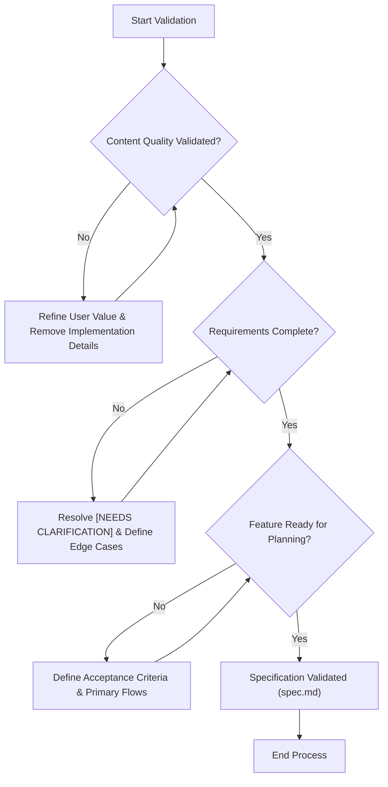
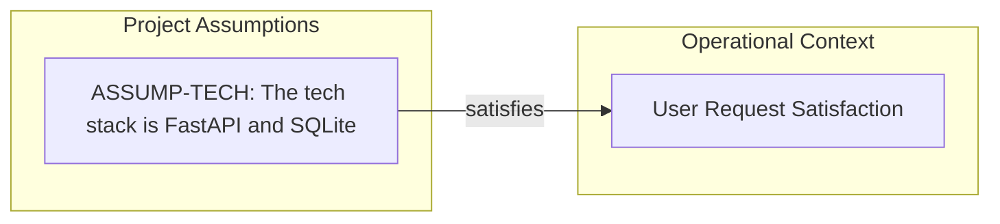

# URL Shortener API - Technical Specification & Architecture Document

## 1. Executive Summary & Architecture Overview

### 1.1 Executive Brief
The project is a URL Shortener API designed to transform long URLs into shortened versions. While the current input is a quality validation checklist rather than a full functional specification, it identifies a target architecture based on FastAPI and SQLite. The core value proposition focuses on user-centric business needs and measurable success criteria, though the detailed requirements remain encapsulated in an external 'spec.md' file.

### 1.2 Maturity Assessment
The project state is **BLOCKED**. Although the checklist indicates a 100% completion score for the validation process, the actual architectural graph is empty (1 node, 0 edges) because the provided document is a governance checklist and not the technical specification itself. Critical structural gaps exist in Goals, Functional Requirements, Non-Functional Requirements, and Scope, rendering the project unexecutable until the 'spec.md' source is ingested.

### 1.3 Technical Stack
* FastAPI
* SQLite

### 1.4 Architectural Constraints
* Technology-agnostic success criteria.
* Strict separation between business requirements and implementation details.

### 1.5 Critical Dependencies
* Availability of the external 'spec.md' document for functional requirement extraction.
* Integration between FastAPI runtime and SQLite database.

## 2. Architecture Workflows & Visual Diagrams

### 2.1 Specification Validation Workflow
Models the quality assurance process for the URL Shortener API specification based on the provided checklist criteria.

### 2.2 Project Assumptions Mapping
Traceability map for the technical assumptions identified in the quality checklist.

## 3. Detailed Technical Specifications & Business Rules

### 3.1 Requirements Traceability
| Identifier | Type | Description | Source Section |
| :--- | :--- | :--- | :--- |
| ASSUMP-TECH | Assumption | The tech stack is FastAPI and SQLite | Notes |

### 3.2 Security Rules
*No security rules defined in the provided source data.*

### 3.3 Data Models
*No data models defined in the provided source data.*

## 4. Project Governance & Structural Gaps

### 4.1 Structural Gaps
| Missing Section | Priority | Remediation Advice |
| :--- | :--- | :--- |
| Goals & Objectives | HIGH | Le document est une checklist; veuillez fournir le fichier 'spec.md' mentionné pour extraire les objectifs. |
| Functional Requirements | HIGH | Le document confirme que les exigences existent mais ne les liste pas. Fournir le document de spécifications source. |
| Non-Functional Requirements | HIGH | Le document confirme la complétude mais n'énonce pas les exigences non-fonctionnelles. |
| Scope & Out-of-Scope | HIGH | Fournir la définition du périmètre contenue dans le document de spécifications. |
| Open Questions & Uncertainties | MEDIUM | Bien que la checklist indique qu'il n'y a plus de marqueurs [NEEDS CLARIFICATION], les questions ouvertes initiales ne sont pas listées ici. |

### 4.2 Remediation & Workflow
The project must transition from a "Validation" state to an "Implementation" state by ingesting the `spec.md` file. The current documentation serves as a quality gate; once the functional source is provided, the Requirements Traceability (Section 3.1) must be expanded to include all functional and non-functional requirements.

## 5. Technical & Domain Glossary (Terminology Reference)

| Term | Category | Context Anchor | Project Definition |
| :--- | :--- | :--- | :--- |
| API | TECHNICAL_STACK | Content Quality | The primary technical interface facilitating requests and responses for the link redirection system. |
| Feature | BUSINESS_DOMAIN | Feature Readiness | A distinct unit of functional capability that must satisfy specific measurable outcomes and acceptance criteria. |