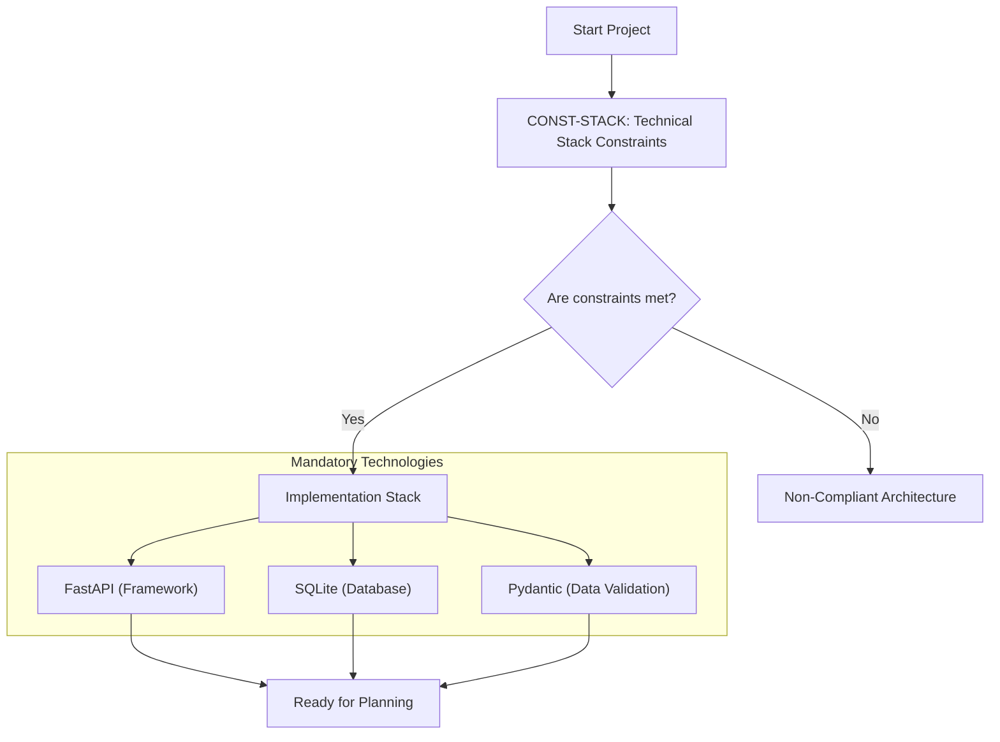

# URL Shortener API - Technical Specification & Architecture Document

## 1. Executive Summary & Architecture Overview

### 1.1 Executive Brief
The project consists of a URL Shortener API. The current documentation is a meta-specification quality checklist designed to validate the readiness of a separate core specification (spec.md). It defines a lightweight architectural pattern utilizing a Python-based runtime and a local relational database for fast, stateless URL redirection and management.

### 1.2 Maturity Assessment
The project is currently **BLOCKED**. Although the checklist indicates a 100% completeness score for the validation process itself, the actual architectural substance is missing. There are critical structural gaps regarding Goals, Functional Requirements, and Scope boundaries because the provided document is a quality gate and not the specification. Implementation cannot proceed until the core spec.md is ingested.

### 1.3 Technical Stack
* FastAPI
* SQLite
* Pydantic

### 1.4 Architectural Constraints
* Strict implementation using FastAPI framework.
* Data persistence limited to SQLite.
* Data validation and serialization via Pydantic.

### 1.5 Critical Dependencies
* Core specification document (spec.md) for functional requirements.
* FastAPI runtime environment.
* SQLite database engine.

## 2. Architecture Workflows & Visual Diagrams

### 2.1 Technical Constraint Architecture
**Description**: Visual representation of the mandatory technical stack constraints for the URL Shortener API.

## 3. Detailed Technical Specifications & Business Rules

### 3.1 Requirements Traceability
| Identifier | Requirement Description | Source Section | Status |
| :--- | :--- | :--- | :--- |
| CONST-STACK | The system must be implemented using FastAPI, SQLite, and Pydantic. | Notes | Validated |

### 3.2 Security Rules
*No security rules defined in the provided source data.*

### 3.3 Data Models
*No data models defined in the provided source data.*

## 4. Project Governance & Structural Gaps

### 4.1 Structural Gaps
| Missing Section | Priority | Remediation Advice |
| :--- | :--- | :--- |
| Goals & Objectives | HIGH | The document is a checklist; the actual goals are likely in spec.md. Ingest the core spec document. |
| Functional Requirements | HIGH | No functional requirements are defined here, only the validation that they exist elsewhere. |
| Scope & Out-of-Scope | HIGH | Scope boundaries are not defined in this checklist. |
| Open Questions & Uncertainties | MEDIUM | The checklist confirms no [NEEDS CLARIFICATION] markers remain, but does not list specific open questions. |

### 4.2 Remediation & Workflow
The immediate priority is the ingestion of the `spec.md` file. The current document serves only as a quality gate. Once the core specification is provided, the Requirements Traceability (Section 3.1) and Data Models (Section 3.3) must be expanded to include all functional and non-functional requirements.

## 5. Technical & Domain Glossary (Terminology Reference)

| Term | Category | Context Anchor | Project Definition |
| :--- | :--- | :--- | :--- |
| API | TECHNICAL_STACK | Content Quality | The programmatic interface layer facilitating network-based communication between the client and the backend services. |
| Feature | BUSINESS_DOMAIN | Feature Readiness | A discrete unit of functional value that must satisfy measurable outcomes and clear acceptance criteria. |