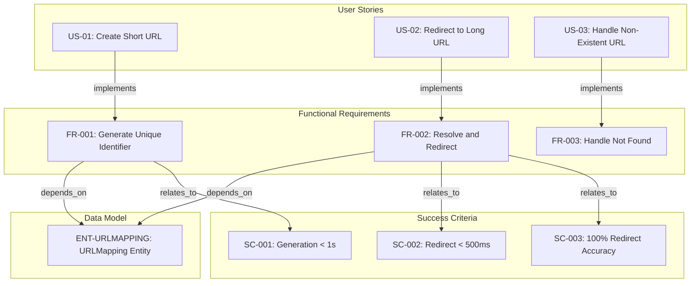
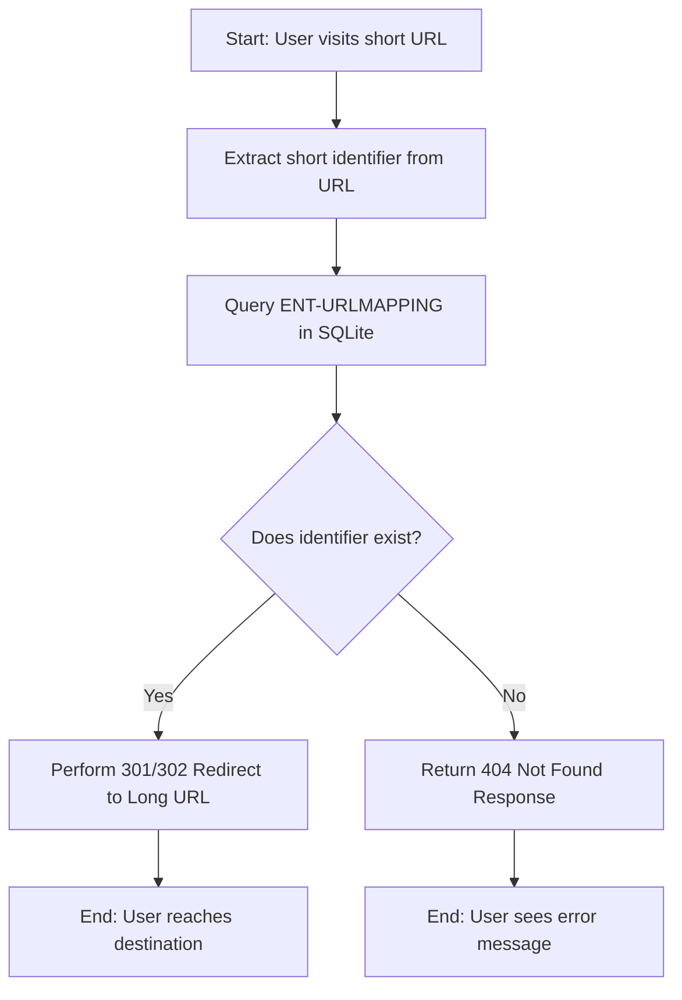
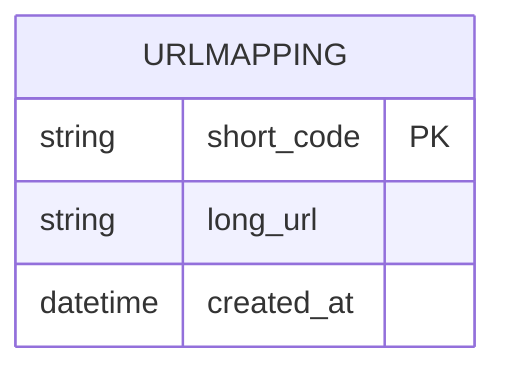

# URL Shortener API - Technical Specification & Architecture Document

## 1. Executive Summary & Architecture Overview

### 1.1 Executive Brief
A minimalist URL Shortener API designed for high-performance redirection. Built with FastAPI and SQLite, the system maps long absolute URLs to unique short identifiers. The core value lies in efficient generation and resolution of these mappings without authentication, targeting sub-second response times for both creation and redirection.

### 1.2 Maturity Assessment
The specification provides a complete functional baseline with a 100% completeness score, yet it remains in REFINEMENT status. While the core logic is well-defined, the structural gap regarding 'Scope & Out-of-Scope' and three unresolved uncertainties concerning duplicate URLs and malformed inputs prevent a final production-ready state.

### 1.3 Technical Stack
* **Framework**: FastAPI
* **Database**: SQLite

### 1.4 Architectural Constraints
* Short URL generation latency < 1 second.
* Redirection overhead < 500ms.
* 100% redirection accuracy for valid short links.
* Input URLs must be absolute (including protocol http/https).
* Zero user authentication or account management required.
* Permanent link persistence (no expiration).

### 1.5 Critical Dependencies
* SQLite database engine for `ENT-URLMAPPING` persistence.
* Strict referential integrity between short identifiers and long URL destinations in `ENT-URLMAPPING`.
* FastAPI runtime for request handling and redirection logic.

## 2. Architecture Workflows & Visual Diagrams

### 2.1 Requirements Traceability Matrix


### 2.2 URL Redirection Workflow


### 2.3 URL Shortener Data Model


### 2.4 URL Creation Sequence
```mermaid
sequenceDiagram
    actor User
    participant API as FastAPI App
    participant DB as SQLite Database

    User ->> API: POST /shorten (long_url)
    API ->> API: Validate URL format
    
    alt URL is Invalid
        API -->> User: 400 Bad Request (Invalid URL)
    else URL is Valid
        API ->> API: Generate unique short_code
        API ->> DB: Save (short_code, long_url)
        DB -->> API: Confirm Save
        API -->> User: 201 Created (short_url)
```

## 3. Detailed Technical Specifications & Business Rules

### 3.1 Requirements Traceability
| ID | Type | Description | Linked To |
| :--- | :--- | :--- | :--- |
| **US-01** | User Story | As a user, I want to provide a long URL and receive a shortened version so that I can share it more easily. | FR-001 |
| **US-02** | User Story | As a user, I want to visit a shortened URL and be automatically redirected to the original long URL. | FR-002 |
| **US-03** | User Story | As a user, I want to see a clear error message when I visit a short URL that does not exist. | FR-003 |
| **FR-001** | Functional Req | System MUST generate a unique short identifier for a provided long URL. | ENT-URLMAPPING, SC-001 |
| **FR-002** | Functional Req | System MUST resolve a short identifier to its original long URL and perform a redirect. | ENT-URLMAPPING, SC-002, SC-003 |
| **FR-003** | Functional Req | System MUST handle requests for non-existent identifiers by returning a "Not Found" response. | N/A |
| **ENT-URLMAPPING** | Entity | A record that associates a unique short code with a destination long URL. | FR-001, FR-002 |
| **SC-001** | Success Criterion | Short URL generation completes in under 1 second. | FR-001 |
| **SC-002** | Success Criterion | Redirection to the destination occurs without perceptible delay (under 500ms overhead). | FR-002 |
| **SC-003** | Success Criterion | 100% of valid short links correctly redirect to their intended destination. | FR-002 |
| **CONS-TECH** | Constraint | The system is intended to be implemented using FastAPI and SQLite. | N/A |
| **ASM-PERMANENT** | Assumption | Short links are permanent and do not expire. | N/A |
| **ASM-NO-AUTH** | Assumption | No user authentication or account management is required for this version. | N/A |

### 3.2 Security Rules
* **Input Validation**: All incoming long URLs must be validated for correct format (absolute URL with protocol) to prevent injection or malformed data storage.
* **Access Control**: No authentication is required; the API is public by design.

### 3.3 Data Models
* **Entity**: `URLMapping` (`ENT-URLMAPPING`)
    * `short_code` (String, Primary Key): Unique identifier for the short link.
    * `long_url` (String): The original destination address.
    * `created_at` (DateTime): Timestamp of record creation.

## 4. Project Governance & Structural Gaps

### 4.1 Structural Gaps
| Gap ID | Missing Section | Priority | Remediation Advice |
| :--- | :--- | :--- | :--- |
| GAP-01 | Scope & Out-of-Scope | MEDIUM | Define explicitly what the API will not do (e.g., custom aliases, analytics) to prevent scope creep. |

### 4.2 Remediation & Workflow
The following open questions must be resolved to move the document from REFINEMENT to FINAL status:
1. **Duplicate Handling**: Determine if the same long URL should return the same short code or generate a new one.
2. **URL Length**: Define the maximum character limit for long URLs to prevent database overflow.
3. **Malformed Inputs**: Define the specific error response and validation logic for malformed URL inputs during the creation process.

## 5. Technical & Domain Glossary (Terminology Reference)

| Term | Category | Context Anchor | Project Definition |
| :--- | :--- | :--- | :--- |
| API | TECHNICAL_STACK | CONS-TECH | The programmatic interface developed with FastAPI to handle requests for link compression and resolution. |
| URLMapping | BUSINESS_DOMAIN | ENT-URLMAPPING | A data record that associates a unique short code with a destination long address. |