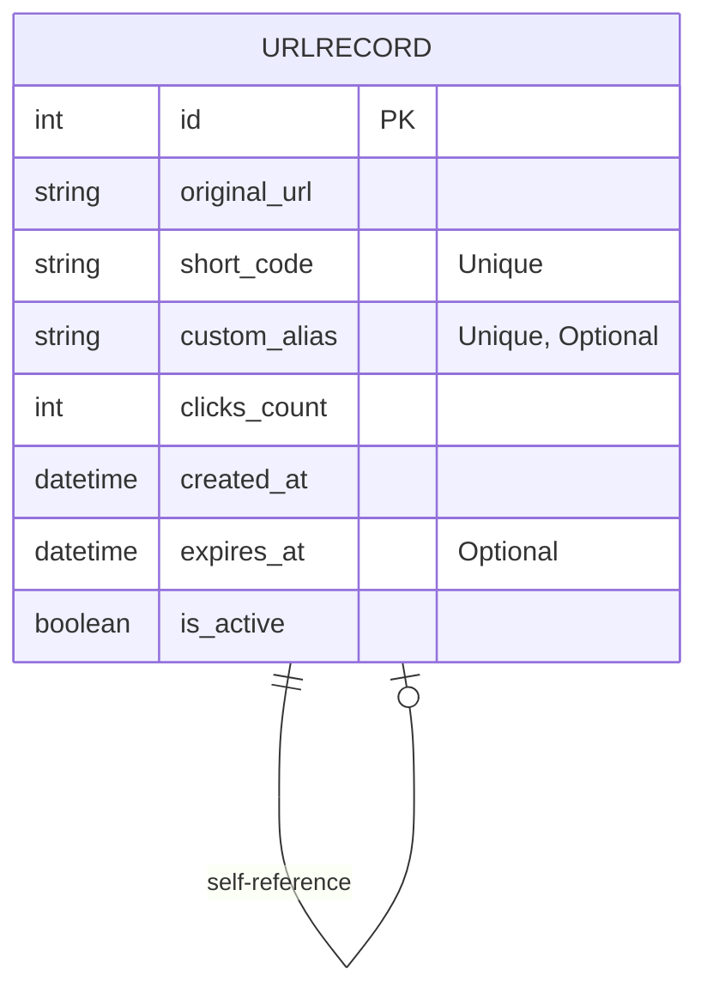
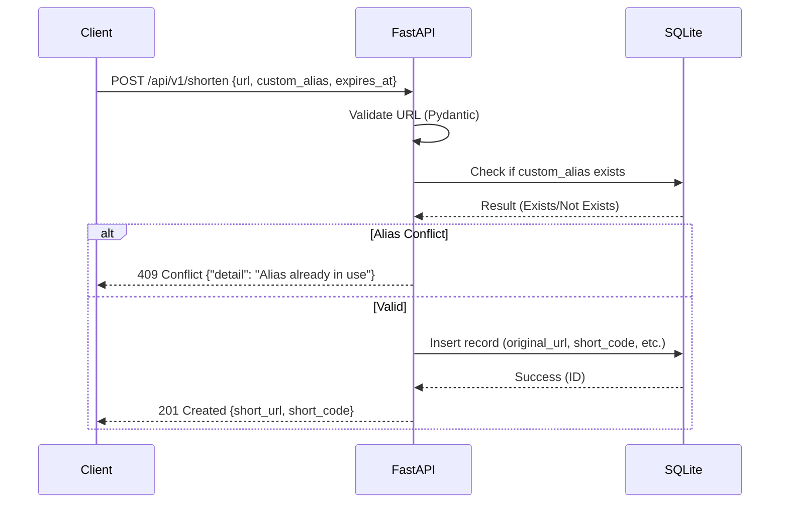
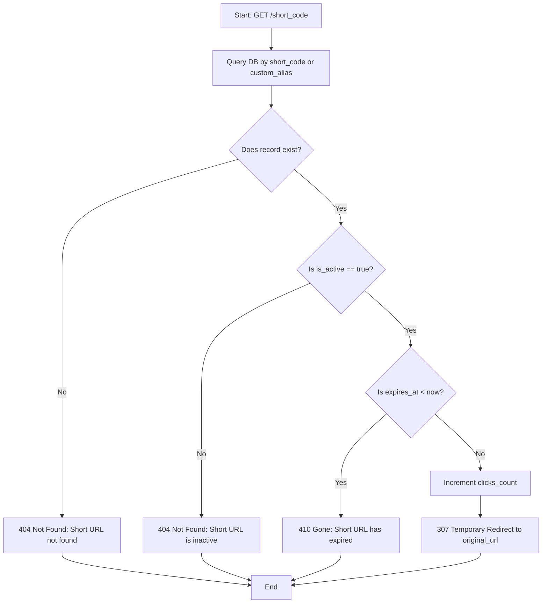
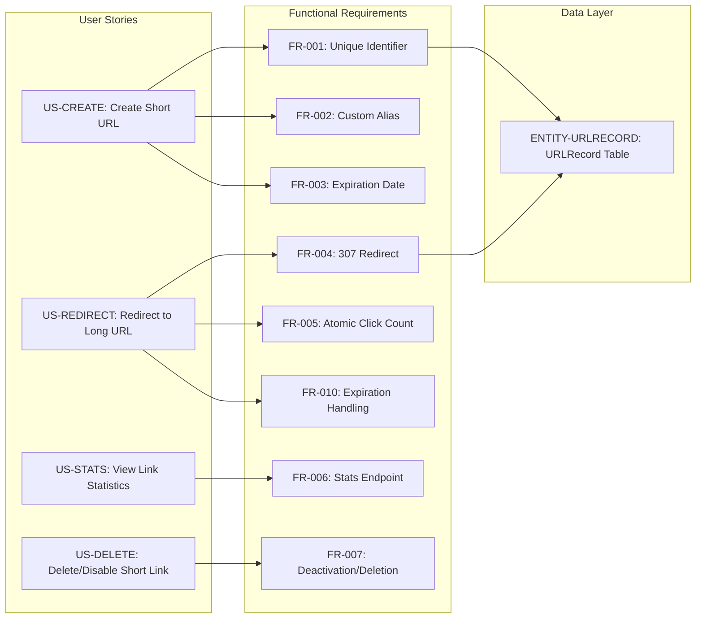

# URL Shortener API - Technical Specification & Architecture Document

## 1. Executive Summary & Architecture Overview

### 1.1 Executive Brief
Technical specification for a URL Shortener API designed for high-performance redirection and tracking. The system leverages FastAPI and SQLite to map long URLs to unique short identifiers or custom aliases, implementing atomic click tracking, expiration logic, and strict schema validation via Pydantic. The core value is delivered through a set of REST endpoints for creation, redirection, statistics retrieval, and link deletion.

### 1.2 Maturity Assessment
The specification is logically sound and highly detailed regarding API contracts and data modeling, justifying a status of READY. While there are minor gaps regarding the explicit definition of out-of-scope analytics and the specific Base62 algorithm implementation, these are low-impact implementation details that do not block the core execution flow.

### 1.3 Technical Stack
* **Framework**: FastAPI
* **Database**: SQLite
* **Validation**: Pydantic
* **Encoding**: Base62 (for `short_code` generation)

### 1.4 Architectural Constraints
* **Performance**: Short URL generation must complete in under 1 second.
* **Performance**: Redirection overhead (DB lookup + response) must be under 500ms.
* **URL Validation**: Strict enforcement of `http` or `https` schemas.
* **Data Integrity**: Atomic increment of `clicks_count` to prevent race conditions.
* **Redirect Protocol**: Mandatory use of `307 Temporary Redirect`.
* **Error Handling**: Structured JSON responses with a `detail` field for HTTP 400, 404, 409, and 422.
* **Expiration Logic**: Expired links must return `410 Gone` or `404 Not Found`.
* **Input Bounds**: Rejection of past expiration dates with `400 Bad Request`.

### 1.5 Critical Dependencies
* **SQLite**: Essential for `URLRecord` persistence.
* **Pydantic**: Critical for absolute URL protocol validation.
* **Base62 Algorithm**: Required for secure and collision-resistant `short_code` generation.
* **Referential Integrity**: Redirect and Stats operations depend on the existence of valid `URLRecord` identifiers.

## 2. Architecture Workflows & Visual Diagrams

### 2.1 URL Shortener Data Model

### 2.2 Short URL Creation Sequence

### 2.3 URL Redirection Logic Flow

### 2.4 Requirements Traceability Matrix

## 3. Detailed Technical Specifications & Business Rules

### 3.1 Requirements Traceability
| ID | Type | Description | Related User Story | Related Entity |
| :--- | :--- | :--- | :--- | :--- |
| **US-CREATE** | User Story | Create short URL with optional alias and expiration | N/A | N/A |
| **US-REDIRECT** | User Story | Automatic redirection to original URL | N/A | N/A |
| **US-NOTFOUND** | User Story | Error handling for non-existent URLs | N/A | N/A |
| **US-STATS** | User Story | Retrieve click counts for a short URL | N/A | N/A |
| **US-DELETE** | User Story | Deactivate or delete a short URL | N/A | N/A |
| **FR-001** | Requirement | Generate unique short identifier for long URL | US-CREATE | ENTITY-URLRECORD |
| **FR-002** | Requirement | Support unique optional `custom_alias` | US-CREATE | ENTITY-URLRECORD |
| **FR-003** | Requirement | Support optional `expires_at` date/time | US-CREATE | ENTITY-URLRECORD |
| **FR-004** | Requirement | Perform 307 Temporary Redirect for active links | US-REDIRECT | ENTITY-URLRECORD |
| **FR-005** | Requirement | Atomically increment `clicks_count` on redirect | US-REDIRECT | ENTITY-URLRECORD |
| **FR-006** | Requirement | Provide stats endpoint `GET /api/v1/stats/{short_code}` | US-STATS | ENTITY-URLRECORD |
| **FR-007** | Requirement | Deactivate/Delete via `DELETE /api/v1/urls/{short_code}` | US-DELETE | ENTITY-URLRECORD |
| **FR-008** | Requirement | Strict Pydantic validation for http/https schema | US-CREATE | N/A |
| **FR-009** | Requirement | Structured JSON errors `{"detail": "..."}` (400, 404, 409, 422) | N/A | N/A |
| **FR-010** | Requirement | Return 410 Gone or 404 Not Found if expired | US-REDIRECT | ENTITY-URLRECORD |
| **ENTITY-URLRECORD** | Entity | SQLite mapping of long URL to short identifier | N/A | N/A |
| **SC-001** | Success Crit. | Generation completes in < 1 second | FR-001 | ENTITY-URLRECORD |
| **SC-002** | Success Crit. | Redirection overhead < 500ms | FR-004 | ENTITY-URLRECORD |
| **ASSUMPTION-TECH** | Assumption | Implementation via FastAPI and SQLite | N/A | N/A |

### 3.2 Security Rules
* **Input Validation**: All incoming URLs must be validated via Pydantic to ensure they are absolute and use only `http` or `https` protocols.
* **Conflict Handling**: Requests for existing `custom_alias` must be rejected with a `409 Conflict` to prevent unauthorized overwriting of links.
* **Resource Availability**: Expired or inactive links must not leak the original destination URL, returning `410 Gone` or `404 Not Found`.

### 3.3 Data Models
**Entity: URLRecord (SQLite)**
| Field | Type | Constraints | Description |
| :--- | :--- | :--- | :--- |
| `id` | Integer/UUID | Primary Key | Unique internal identifier |
| `original_url` | TEXT | Not Null | The target long destination URL |
| `short_code` | VARCHAR | Unique, Not Null | System-generated short identifier |
| `custom_alias` | VARCHAR | Unique, Optional | User-provided short identifier |
| `clicks_count` | INTEGER | Default 0 | Total successful redirections |
| `created_at` | DATETIME | Not Null | Timestamp of record creation |
| `expires_at` | DATETIME | Optional | Expiration timestamp |
| `is_active` | BOOLEAN | Default True | Flag for manual deactivation |

## 4. Project Governance & Structural Gaps

### 4.1 Structural Gaps
| Gap | Priority | Remediation Advice |
| :--- | :--- | :--- |
| **Scope & Out-of-Scope** | MEDIUM | Define explicit boundaries, e.g., whether analytics are limited to click counts or include geo/browser data. |
| **Open Questions** | LOW | Add a section for unresolved technical choices, such as the specific Base62 algorithm. |

### 4.2 Remediation & Workflow
The identified gaps are primarily related to implementation details. The remediation workflow involves updating the specification to include a "Scope" section before the final development sprint to ensure no "scope creep" occurs regarding the analytics engine.

## 5. Technical & Domain Glossary (Terminology Reference)

| Term | Category | Context Anchor | Project Definition |
| :--- | :--- | :--- | :--- |
| API | TECHNICAL_STACK | ASSUMPTION-TECH | The interface layer responsible for exposing endpoints such as shorten, stats, and urls to clients. |
| DB | TECHNICAL_STACK | Short URL Creation Flow | The persistence mechanism where mapping records and click metrics are stored. |
| FastAPI | TECHNICAL_STACK | ASSUMPTION-TECH | The high-performance web framework utilized for the service layer. |
| ID | TECHNICAL_STACK | ENTITY-URLRECORD | The unique primary key for each record, stored as an integer or a 128-bit globally unique identifier. |
| JSON | TECHNICAL_STACK | FR-009 | The standard data interchange format used for structured error responses containing a detail field. |
| Pydantic | TECHNICAL_STACK | FR-008 | The library used for strict input validation and schema enforcement for incoming requests. |
| SQLite | TECHNICAL_STACK | ASSUMPTION-TECH | The lightweight relational database engine employed for persistent storage. |
| TEXT | TECHNICAL_STACK | ENTITY-URLRECORD | The database column type used to store the target long destination strings. |
| URLRecord | BUSINESS_DOMAIN | ENTITY-URLRECORD | A domain entity mapping a long destination to a short identifier with associated expiration and activity metadata. |
| UUID | TECHNICAL_STACK | ENTITY-URLRECORD | An alternative primary key format ensuring uniqueness across distributed systems. |