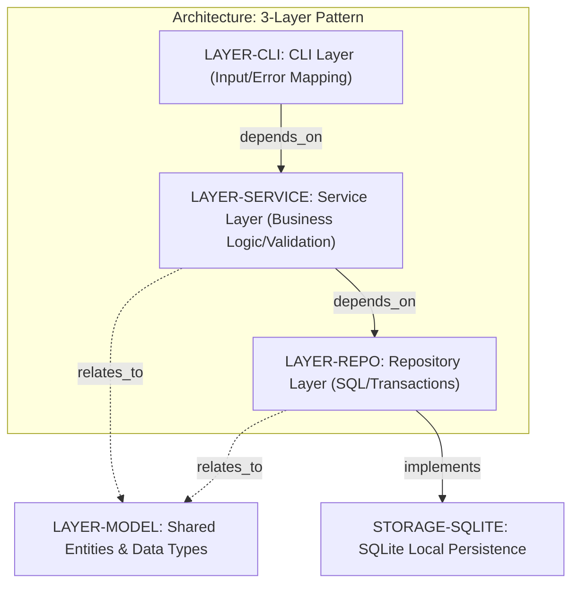
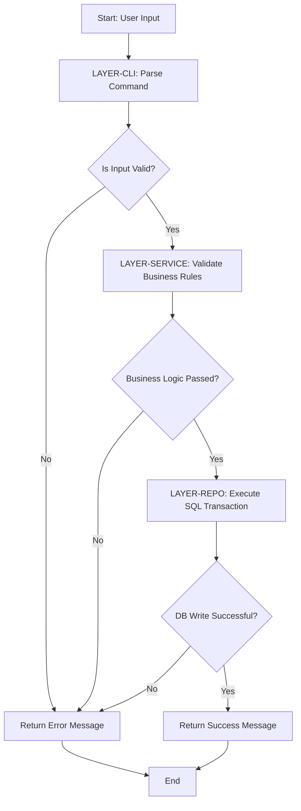
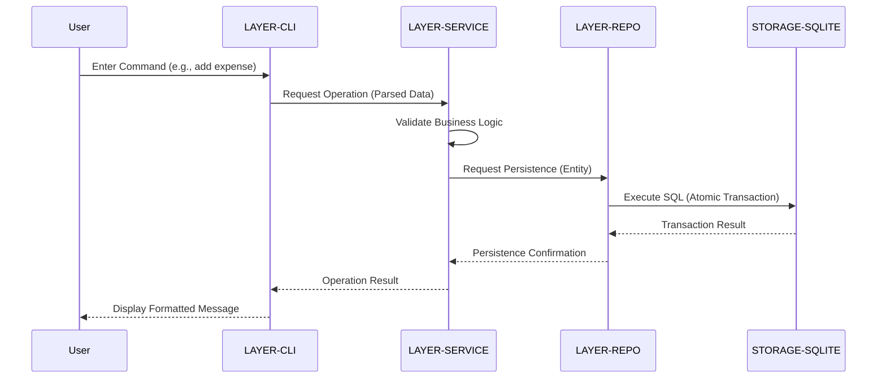

# Enhanced Expense Tracker - Technical Specification & Architecture Document

## 1. Executive Summary & Architecture Overview

### 1.1 Executive Brief
The Enhanced Expense Tracker is a local CLI application developed in Python 3.10+ utilizing a strict 3-layer architecture (CLI, Service, Repository) to ensure data integrity. It employs SQLite for local persistence and implements categorized expense tracking and date-based filtering. The system is designed for a single-user local environment with a focus on atomic database transactions and high testability via a TDD approach.

### 1.2 Maturity Assessment
The project exhibits a strong architectural foundation with a clear separation of concerns; however, it is currently in a state of REFINEMENT. While the structural skeleton is complete, high-severity gaps exist regarding the absence of concrete data schemas and explicit API method signatures for the Service and Repository layers, which are critical for implementation.

### 1.3 Technical Stack
* **Language**: Python 3.10+
* **Testing Framework**: pytest
* **Database**: SQLite
* **Platform**: Local Terminal / Shell (Windows, Linux, macOS)

### 1.4 Architectural Constraints
* **Strict Layered Architecture**: Mandatory dependency flow: CLI $\rightarrow$ Service $\rightarrow$ Repository.
* **Performance**: Listing and filtering $\le$ 1,000 records must execute in < 1 second.
* **Data Integrity**: All database write operations must be atomic (commit/rollback).
* **TDD Mandate**: `pytest` suites for all Repository and Service methods required prior to implementation.

### 1.5 Critical Dependencies
* SQLite local database engine.
* `pytest` testing framework.
* Strict dependency chain: `LAYER-CLI` depends on `LAYER-SERVICE`, and `LAYER-SERVICE` depends on `LAYER-REPO`.
* Relational mapping: `LAYER-SERVICE` and `LAYER-REPO` both depend on shared entities in `LAYER-MODEL`.
* Atomic transaction management within the Repository layer.

## 2. Architecture Workflows & Visual Diagrams

### 2.1 Architectural Layers
Visual representation of the strict 3-layer architecture and the dependency flow from the CLI to the persistence layer.

### 2.2 Expense Tracking Request Workflow
Operational flow of an expense tracking request, demonstrating the interaction between layers and the required decision logic for validation.

### 2.3 System Interaction Sequence
Sequence of calls between the CLI, Service, and Repository layers for a typical expense operation.

## 3. Detailed Technical Specifications & Business Rules

### 3.1 Requirements Traceability

| Identifier | Component | Description | Source Section |
| :--- | :--- | :--- | :--- |
| ARCH-3LAYER | Architecture | Strict 3-layer architecture: CLI $\rightarrow$ Service $\rightarrow$ Repository | Summary |
| STACK-PY310 | Tech Stack | Python 3.10+ | Technical Context |
| STORAGE-SQLITE | Storage | SQLite for local persistence (Atomic write operations) | Technical Context |
| TOOL-PYTEST | Tooling | pytest for Unit and Integration tests | Technical Context |
| LAYER-CLI | Entity | CLI Layer: Input parsing and error mapping (`src/cli/main.py`) | Source Code |
| LAYER-SERVICE | Entity | Service Layer: Business logic, validation, orchestration (`src/services/expense_service.py`) | Source Code |
| LAYER-REPO | Entity | Repository Layer: SQL execution and transaction management (`src/repository/expense_repository.py`) | Source Code |
| LAYER-MODEL | Entity | Shared entities and data types (`src/models/expense.py`) | Source Code |

### 3.2 Security Rules
* **Access Control**: Single-user local tool; file-system level permissions apply to the SQLite database file.
* **Data Integrity**: Mandatory use of atomic transactions (commit/rollback) to prevent partial data writes.

### 3.3 Data Models
* **Expense Entity**: Defined in `LAYER-MODEL`. Specific attributes are pending ingestion from `data-model.md`.

## 4. Project Governance & Structural Gaps

### 4.1 Structural Gaps

| Gap | Priority | Remediation Advice |
| :--- | :--- | :--- |
| Data Models & Schemas | HIGH | The plan mentions a `data-model.md` output for Phase 1; this must be ingested to define the Expense entity attributes. |
| API Contracts & Flow | HIGH | Specific method signatures for the Service and Repository layers are missing (referred to as `contracts/` output in Phase 1). |
| Security & Identity | LOW | Since it's a single-user local CLI tool, security might be minimal, but any file access permissions or data encryption needs should be noted. |
| Open Questions | LOW | No uncertainties were declared; verify if any edge cases in date-filtering are unresolved. |

### 4.2 Remediation & Workflow
The project will follow a TDD (Test Driven Development) workflow. `pytest` suites for the Repository and Service layers must be completed and passing before the implementation of the business logic.

## 5. Technical & Domain Glossary (Terminology Reference)

| Term | Category | Context Anchor | Project Definition |
| :--- | :--- | :--- | :--- |
| Branch | TECHNICAL_STACK | Implementation Plan | The specific git version control pointer `002-expense-tracker-enhanced` used for this feature set. |
| CRUD | TECHNICAL_STACK | Constitution Check | The four foundational persistent storage mutation primitives requiring pre-implementation test suites. |
| Constraints | TECHNICAL_STACK | Technical Context | Mandatory operational requirements, specifically the necessity for atomic database write operations via commit/rollback mechanisms. |
| Data Integrity | BUSINESS_DOMAIN | Constitution Check | The assurance of accuracy and consistency across the 3-layer architecture through transactions and service-level validation. |
| Date | BUSINESS_DOMAIN | Implementation Plan | The temporal marker `2026-07-25` associated with the documentation version. |
| Exhaustive Specification | BUSINESS_DOMAIN | Constitution Check | The complete set of feature requirements located in `spec.md` serving as the primary foundation for development. |
| GATE | BUSINESS_DOMAIN | Constitution Check | A quality control milestone that must be marked as passed to verify compliance with the system constitution. |
| Modular Architecture | TECHNICAL_STACK | Constitution Check | The mandated separation of concerns dividing the system into CLI, Service, and Repository segments. |
| Option | TECHNICAL_STACK | Source Code | The chosen structural configuration '1' designating a standalone single project setup. |
| Performance Goals | TECHNICAL_STACK | Technical Context | The operational limit requiring listing and filtering of 1,000 records in under 1 second. |
| Primary Dependencies | TECHNICAL_STACK | Technical Context | The core external library `pytest` used for verifying system behavior. |
| Project Type | TECHNICAL_STACK | Technical Context | The classification of the application as a Command Line Interface tool. |
| Python 3.10 | TECHNICAL_STACK | STACK-PY310 | The minimum required runtime environment version for the application logic. |
| SQL | TECHNICAL_STACK | LAYER-REPO | The structured query language used within the repository layer for data persistence interaction. |
| Spec | BUSINESS_DOMAIN | Implementation Plan | The referenced `spec.md` file containing the functional requirements. |
| Storage | TECHNICAL_STACK | STORAGE-SQLITE | The local persistence mechanism implemented via SQLite. |
| Strict | TECHNICAL_STACK | ARCH-3LAYER | The non-negotiable adherence to the defined 3-layer dependency flow. |
| Structure Decision | TECHNICAL_STACK | Source Code | The final architectural selection for the physical file organization of the standalone tool. |
| TDD | TECHNICAL_STACK | Constitution Check | The methodology requiring `pytest` suites to be written for all methods before the logic is implemented. |
| Target Platform | TECHNICAL_STACK | Technical Context | The supported execution environments including Windows, Linux, and macOS shell terminals. |
| Testing | TECHNICAL_STACK | TOOL-PYTEST | The process of executing unit and integration suites using the `pytest` framework. |
| YAGNI | BUSINESS_DOMAIN | Constitution Check | The design principle ensuring that only requested enhancements from the specification are implemented without speculative additions. |