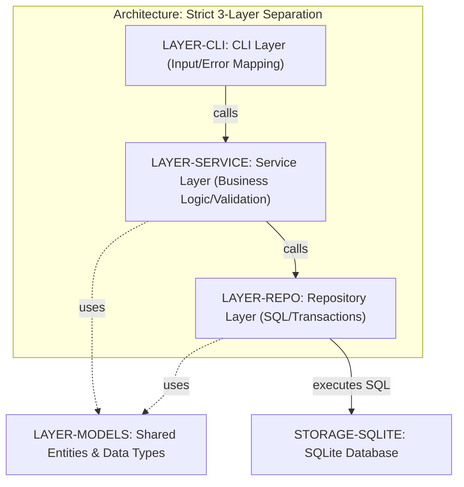
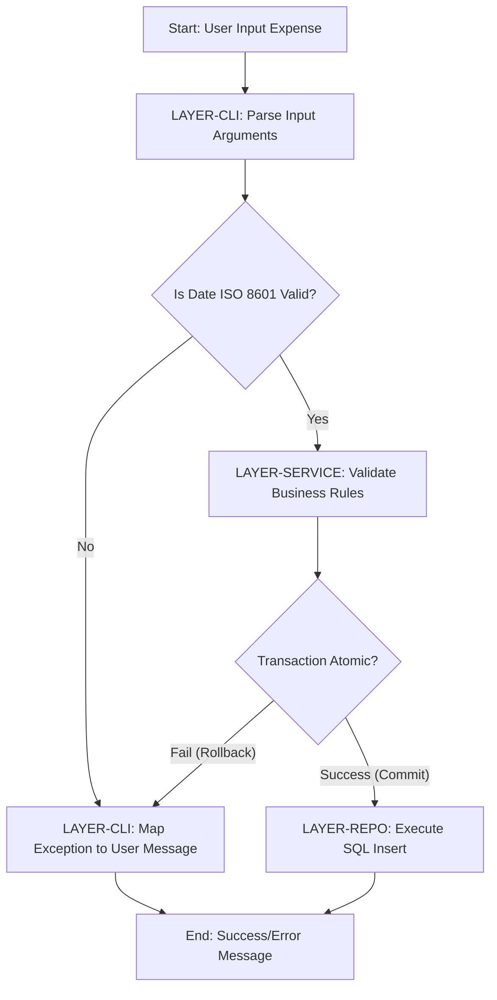
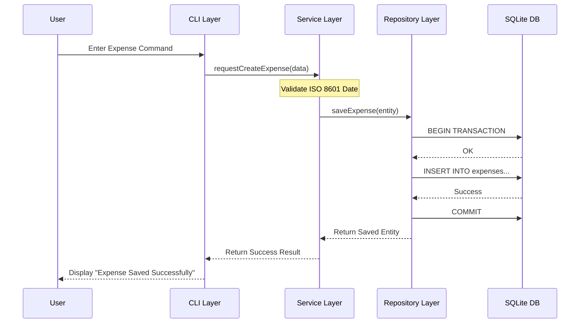

# Enhanced Expense Tracker - Technical Specification & Architecture Document

## 1. Executive Summary & Architecture Overview

### 1.1 Executive Brief
The Enhanced Expense Tracker is a single-user local CLI tool built with Python 3.10+ using a strict 3-layer architecture (CLI -> Service -> Repository). It leverages SQLite for local persistence to provide categorized expense tracking and date-based filtering, ensuring data integrity through atomic transactions and rigorous layer isolation.

### 1.2 Maturity Assessment
The project is currently **BLOCKED**. While the structural blueprint is complete, the absence of detailed Data Models and API Contracts (High Severity gaps) prevents the definition of entity attributes and method signatures. Additionally, critical technical uncertainties regarding ISO 8601 validation and transaction atomicity remain unresolved.

### 1.3 Technical Stack
* Python 3.10+
* pytest
* SQLite

### 1.4 Architectural Constraints
* **Strict 3-layer separation**: CLI -> Service -> Repository.
* **Zero SQL leakage**: No SQL allowed in Service or CLI layers.
* **Zero UI leakage**: No CLI logic allowed in Service or Repository layers.
* **Atomic database writes**: Mandatory commit/rollback for all write operations.
* **Performance threshold**: Listing/filtering < 1 second for up to 1,000 records.
* **TDD Mandate**: Pytest suites required for all Repository and Service methods prior to implementation.

### 1.5 Critical Dependencies
* `sqlite3` (Python standard library) for local data persistence.
* `Pytest` for unit and integration test gating.
* **Strict dependency chain**: `LAYER-CLI` depends_on `LAYER-SERVICE` depends_on `LAYER-REPO`.
* **Relational mapping**: `LAYER-SERVICE` and `LAYER-REPO` both relate_to `LAYER-MODELS`.
* **ISO 8601 compliance** for date validation inputs.

## 2. Architecture Workflows & Visual Diagrams

### 2.1 System Architecture: 3-Layer Topology
Visual representation of the strict 3-layer architecture (CLI -> Service -> Repository) and the shared models layer.

### 2.2 Expense Processing Workflow
Logic flow for processing an expense entry, incorporating the mandated decision diamonds and error handling paths.

### 2.3 Component Interaction Sequence
Sequence of calls from the CLI through the Service layer to the Repository for a typical expense operation.

## 3. Detailed Technical Specifications & Business Rules

### 3.1 Requirements Traceability

| Identifier | Requirement / Component | Description | Source Section |
| :--- | :--- | :--- | :--- |
| ARCH-3LAYER | 3-Layer Architecture | Strict separation: CLI -> Service -> Repository | Technical Context |
| STACK-PY310 | Python Runtime | Python 3.10+ | Technical Context |
| STORAGE-SQLITE | Persistence Layer | SQLite for local persistence with atomic writes | Technical Context |
| TEST-PYTEST | Testing Framework | Pytest for unit and integration tests | Technical Context |
| LAYER-CLI | CLI Layer | Input parsing and error mapping (`src/cli/main.py`) | Source Code |
| LAYER-SERVICE | Service Layer | Business logic, validation, orchestration (`src/services/expense_service.py`) | Source Code |
| LAYER-REPO | Repository Layer | SQL execution and transaction management (`src/repository/expense_repository.py`) | Source Code |
| LAYER-MODELS | Models Layer | Shared entities and data types (`src/models/expense.py`) | Source Code |

### 3.2 Security Rules
* **Access Control**: Single-user local tool; security is minimal.
* **Data Integrity**: Enforced via atomic transactions (commit/rollback) in the Repository layer to prevent partial data writes.

### 3.3 Data Models
* **Expense Entity**: Defined in `LAYER-MODELS`. Detailed attributes are currently pending the ingestion of `data-model.md`.

## 4. Project Governance & Structural Gaps

### 4.1 Structural Gaps

| Gap | Priority | Remediation Advice |
| :--- | :--- | :--- |
| Data Models & Schemas | HIGH | Ingest `data-model.md` to define the 'expense' entity attributes. |
| API Contracts & Flow | HIGH | Define method signatures for Service and Repository layers from `contracts/` output. |
| Open Questions | MEDIUM | Create a dedicated tracking section for the resolution of ISO 8601 and transaction atomicity uncertainties. |
| Security & Identity | LOW | Evaluate file permissions or data encryption if sensitive data is stored. |

### 4.2 Remediation & Workflow
1. **Phase 1 Ingestion**: Prioritize the integration of `data-model.md` and `contracts/` to unblock development.
2. **Research Resolution**: Resolve the three [NEEDS CLARIFICATION] items regarding `sqlite3` transactions, ISO 8601 validation, and exception mapping.
3. **TDD Cycle**: Implement `pytest` suites for Repository and Service layers before writing functional code.

## 5. Technical & Domain Glossary (Terminology Reference)

| Term | Category | Context Anchor | Project Definition |
| :--- | :--- | :--- | :--- |
| Branch | TECHNICAL_STACK | Implementation Plan: Enhanced Expense Tracker | The specific git version control identifier `002-expense-tracker-enhanced` used for this feature set. |
| CRUD | TECHNICAL_STACK | Constitution Check | The four foundational persistent storage mutation primitives requiring prior verification via automated suites. |
| Constraints | TECHNICAL_STACK | Technical Context | Mandatory architectural boundaries prohibiting SQL in orchestration layers and preventing logic leakage across the three tiers. |
| Data Integrity | BUSINESS_DOMAIN | Constitution Check | The state of consistency and accuracy achieved through atomic transactions and service-tier verification. |
| DatabaseLockedError | TECHNICAL_STACK | Technical Context | A low-level persistence exception that must be mapped to a readable user message at the entry point. |
| Date | BUSINESS_DOMAIN | Implementation Plan: Enhanced Expense Tracker | A temporal marker used for filtering records, requiring strict adherence to the ISO 8601 standard. |
| EntityNotFoundError | TECHNICAL_STACK | Technical Context | A specific service-tier exception triggered when a requested record does not exist in the persistent store. |
| Exhaustive Specification | BUSINESS_DOMAIN | Constitution Check | The complete set of feature requirements derived from spec.md that serves as the implementation foundation. |
| GATE | TECHNICAL_STACK | Constitution Check | A binary validation checkpoint indicating whether the design adheres to the core system constitution. |
| Modular Architecture | TECHNICAL_STACK | Constitution Check | The organizational strategy enforcing a strict separation between the user interface, business logic, and data access. |
| Option | TECHNICAL_STACK | Source Code (repository root) | A specific structural choice, specifically the single project variant, selected for this standalone tool. |
| Performance Goals | TECHNICAL_STACK | Technical Context | The target execution speed requiring retrieval of one thousand entries in under one second. |
| Primary Dependencies | TECHNICAL_STACK | Technical Context | The core external libraries, specifically pytest, required for the system to operate and be verified. |
| Project Type | TECHNICAL_STACK | Technical Context | The application format defined as a command line interface. |
| Python 3.10 | TECHNICAL_STACK | STACK-PY310 | The minimum required runtime environment version for the codebase. |
| SQL | TECHNICAL_STACK | ARCH-3LAYER | The query language restricted exclusively to the repository layer to prevent leakages. |
| Spec | BUSINESS_DOMAIN | Implementation Plan: Enhanced Expense Tracker | The reference document containing the detailed functional requirements for the feature. |
| Storage | TECHNICAL_STACK | STORAGE-SQLITE | The local persistence mechanism implemented via SQLite. |
| Strict | TECHNICAL_STACK | ARCH-3LAYER | The enforcement level of the 3-layer architecture where no cross-layer bypass is permitted. |
| Structure Decision | TECHNICAL_STACK | Source Code (repository root) | The finalized layout choice for organizing the source files into a single project. |
| TDD | TECHNICAL_STACK | Constitution Check | The methodology requiring test suites to be written before the actual implementation of methods. |
| Target Platform | TECHNICAL_STACK | Technical Context | The intended runtime environments including Windows, Linux, and macOS shells. |
| Testing | TECHNICAL_STACK | TEST-PYTEST | The quality assurance process utilizing unit and integration suites via the designated framework. |
| ValidationError | TECHNICAL_STACK | Technical Context | A service-tier exception raised when input data fails business rule checks. |
| YAGNI | BUSINESS_DOMAIN | Constitution Check | The design principle of avoiding the implementation of functionality until it is explicitly required. |