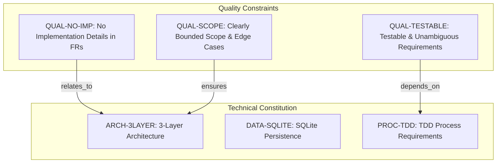

# Enhanced Expense Tracker - Technical Specification & Architecture Document

## 1. Executive Summary & Architecture Overview

### 1.1 Executive Brief
The Enhanced Expense Tracker is a financial management system built on a strict 3-layer architecture. The project utilizes SQLite for data persistence and mandates a Test-Driven Development (TDD) workflow. The current documentation serves as a quality validation gate, ensuring functional requirements remain technology-agnostic while adhering to a predefined project Constitution.

### 1.2 Maturity Assessment
The project is currently in a state of REFINEMENT. While the quality checklist indicates that functional requirements are verified and technology-agnostic, there is a high-severity structural gap regarding the detailed Scope and Out-of-Scope definitions, which are external to this validation document and must be cross-referenced from the primary specification.

### 1.3 Technical Stack
* SQLite

### 1.4 Architectural Constraints
* 3-layer architecture pattern.
* TDD (Test Driven Development) mandatory process.
* Strict separation of functional requirements from implementation details.
* Requirement testability and measurable success criteria.
* Explicit identification of edge cases and bounded scope.

### 1.5 Critical Dependencies
* SQLite schema for data persistence.
* TDD workflow depends on the existence of testable and unambiguous requirements.
* Alignment with the project Constitution for architectural integrity.

## 2. Architecture Workflows & Visual Diagrams

### 2.1 Specification Quality Validation Workflow
```mermaid
flowchart TD
    START[Start Specification Review] --> VAL_CONTENT{"Check Content Quality?"}
    
    VAL_CONTENT -- "No" --> FIX_CONTENT[Remove Implementation Details from FRs]
    FIX_CONTENT --> VAL_CONTENT
    
    VAL_CONTENT -- "Yes" --> VAL_COMPL{"Check Completeness?"}
    
    VAL_COMPL -- "No" --> FIX_COMPL[Resolve [NEEDS CLARIFICATION] & Define Edge Cases]
    FIX_COMPL --> VAL_COMPL
    
    VAL_COMPL -- "Yes" --> VAL_READINESS{"Feature Ready?"}
    
    VAL_READINESS -- "No" --> FIX_READINESS[Define Measurable Success Criteria]
    FIX_READINESS --> VAL_READINESS
    
    VAL_READINESS -- "Yes" --> VAL_CONST{"Verify Constitution Alignment?"}
    
    VAL_CONST -- "No" --> FIX_CONST[Align with ARCH-3LAYER and DATA-SQLITE]
    FIX_CONST --> VAL_CONST
    
    VAL_CONST -- "Yes" --> END[Specification Approved for Planning]
```

### 2.2 Quality Constraints & Technical Requirements Traceability


## 3. Detailed Technical Specifications & Business Rules

### 3.1 Requirements Traceability
| Identifier | Type | Description | Source Section | Attributes |
| :--- | :--- | :--- | :--- | :--- |
| QUAL-NO-IMP | Constraint | Interdiction d'inclure des détails d'implémentation (langages, frameworks, APIs) dans les exigences fonctionnelles ou les critères de succès. | Content Quality | scope: Functional Requirements / Success Criteria |
| QUAL-TESTABLE | Constraint | Les exigences doivent être testables, non ambiguës et les critères de succès doivent être mesurables. | Requirement Completeness | status: verified |
| QUAL-SCOPE | Constraint | Le périmètre (scope) doit être clairement délimité et les cas limites (edge cases) identifiés. | Requirement Completeness | - |
| ARCH-3LAYER | Non-Functional Req | Adoption d'une architecture à 3 couches conformément à la Constitution du projet. | Notes | category: Architecture |
| DATA-SQLITE | Non-Functional Req | Utilisation d'un schéma SQLite pour la persistance des données. | Notes | category: Storage |
| PROC-TDD | Non-Functional Req | Application des exigences de Test Driven Development (TDD). | Notes | category: Process |

### 3.2 Security Rules
*No specific security rules defined in the provided source data.*

### 3.3 Data Models
* **Persistence Layer**: SQLite schema (as mandated by `DATA-SQLITE`).

## 4. Project Governance & Structural Gaps

### 4.1 Structural Gaps
| Missing Section | Priority | Remediation Advice |
| :--- | :--- | :--- |
| Scope & Out-of-Scope | HIGH | Ce document est une checklist ; le périmètre détaillé doit être extrait du document spec.md mentionné. |
| Open Questions & Uncertainties | LOW | La checklist indique que tous les marqueurs [NEEDS CLARIFICATION] ont été supprimés. |

### 4.2 Remediation & Workflow
The project must cross-reference the `spec.md` file to finalize the Scope and Out-of-Scope definitions. Once the structural gaps are filled, the specification will be fully aligned with the project Constitution and ready for the planning phase.

## 5. Technical & Domain Glossary (Terminology Reference)

| Term | Category | Context Anchor | Project Definition |
| :--- | :--- | :--- | :--- |
| Feature | BUSINESS_DOMAIN | Feature Readiness | A distinct piece of functionality that must satisfy measurable outcomes and a set of clear acceptance criteria. |
| TDD | TECHNICAL_STACK | PROC-TDD | A software development process where automated verification scripts are authored prior to the actual logic implementation. |