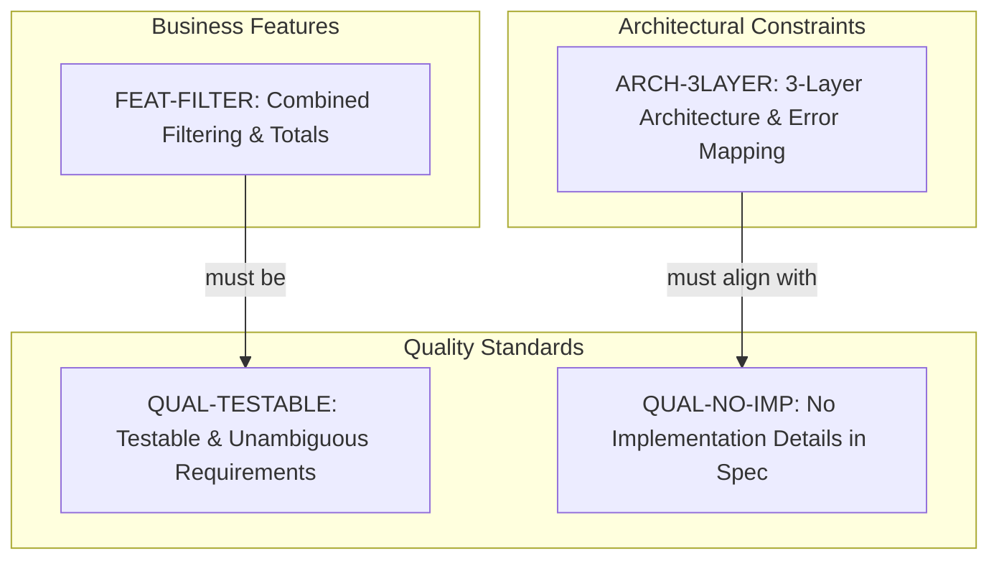
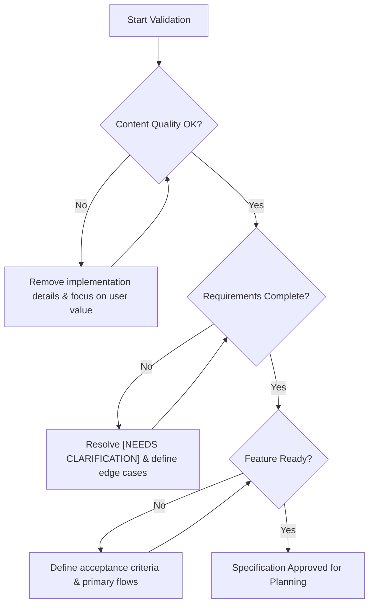

# Enhanced Expense Tracker - Technical Specification & Architecture Document

## 1. Executive Summary & Architecture Overview

### 1.1 Executive Brief
The Enhanced Expense Tracker is a financial tracking system focused on combined filtering and total calculations. The project mandates a strict 3-layer architectural pattern with a specialized error mapping layer to ensure separation of concerns. Currently, the project is in a pre-planning validation phase, emphasizing high-quality, testable requirements and a technology-agnostic specification process.

### 1.2 Maturity Assessment
The project is currently in a state of **REFINEMENT**. While the quality checklist is marked as complete, the underlying structural integrity is compromised by a total absence of core business objectives, detailed functional requirements, and defined project boundaries. The discrepancy between the validation checklist and the missing foundational sections indicates that the actual specification exists externally (`spec.md`) and has not yet been integrated into the current graph.

### 1.3 Technical Stack
*   **Languages & Frameworks**: Not specified (Strictly excluded from functional specification per `QUAL-NO-IMP`).

### 1.4 Architectural Constraints
*   Strict adherence to a 3-layer architecture (`ARCH-3LAYER`).
*   Implementation of a specific error mapping mechanism.
*   Requirements must be strictly testable and unambiguous (`QUAL-TESTABLE`).
*   Total exclusion of implementation details (languages, frameworks, APIs) within the functional specification (`QUAL-NO-IMP`).

### 1.5 Critical Dependencies
*   Combined filtering logic must satisfy the testability criteria defined in `QUAL-TESTABLE`.
*   Referential dependency on the external `spec.md` file for all business goals and functional scopes.
*   Consistency between the 3-layer architecture and the non-implementation constraint (`QUAL-NO-IMP`).

## 2. Architecture Workflows & Visual Diagrams

### 2.1 Specification Quality & Requirement Traceability
This diagram maps the relationship between functional features, architectural constraints, and the quality standards they must adhere to based on the validation checklist.

### 2.2 Specification Validation Workflow
This diagram models the logic of the quality checklist process to ensure a specification is ready for planning.

## 3. Detailed Technical Specifications & Business Rules

### 3.1 Requirements Traceability
| ID | Type | Description | Source Section | Status/Category |
| :--- | :--- | :--- | :--- | :--- |
| `QUAL-NO-IMP` | Non-Functional | La spécification ne doit contenir aucun détail d'implémentation (langages, frameworks, APIs). | Content Quality | Quality Assurance |
| `QUAL-TESTABLE` | Non-Functional | Les exigences doivent être testables et non ambiguës. | Requirement Completeness | Quality Assurance |
| `FEAT-FILTER` | Functional | Le système doit permettre le filtrage combiné et le calcul des totaux. | Notes | updated |
| `ARCH-3LAYER` | Constraint | L'implémentation doit respecter une architecture à 3 couches avec un mapping d'erreurs spécifique. | Notes | architectural |

### 3.2 Security Rules
*   No specific security rules defined in the current source data.

### 3.3 Data Models
*   No specific data models defined in the current source data.

## 4. Project Governance & Structural Gaps

### 4.1 Structural Gaps
| Missing Section | Priority | Remediation Advice |
| :--- | :--- | :--- |
| Goals & Objectives | HIGH | Le document est une checklist ; les objectifs métier globaux doivent être extraits du document spec.md référencé. |
| Functional Requirements | HIGH | Seules des mentions de mises à jour apparaissent dans les notes. Les exigences fonctionnelles détaillées sont absentes. |
| Scope & Out-of-Scope | MEDIUM | Définir les limites du projet pour valider le point 'Scope is clearly bounded' de la checklist. |
| Open Questions & Uncertainties | LOW | Lister les zones d'ombre restantes malgré la validation de la checklist. |

### 4.2 Remediation & Workflow
The primary remediation path is the ingestion and parsing of the `spec.md` file. The current document serves as a quality gate; once the core specifications are integrated, the `QUAL-TESTABLE` and `QUAL-NO-IMP` constraints must be applied to all newly imported requirements.

## 5. Technical & Domain Glossary (Terminology Reference)

| Term | Category | Context Anchor | Project Definition |
| :--- | :--- | :--- | :--- |
| Feature | BUSINESS_DOMAIN | Feature Readiness | A specific piece of deliverable functionality that must satisfy measurable outcomes and possess unambiguous acceptance criteria. |