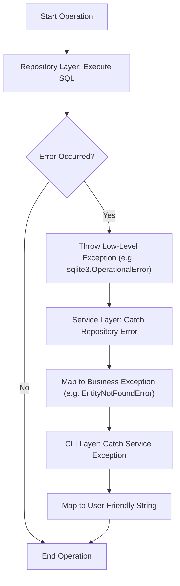
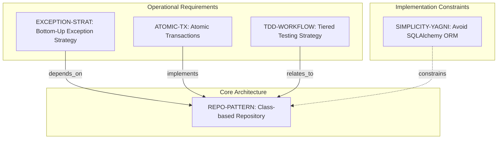
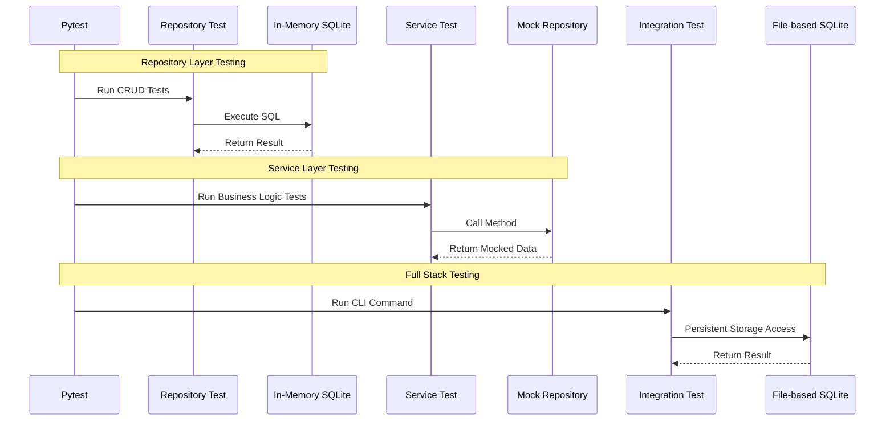

# Enhanced Expense Tracker - Technical Specification & Architecture Document

## 1. Executive Summary & Architecture Overview

### 1.1 Executive Brief
The Enhanced Expense Tracker is a CLI-based financial tool utilizing a 3-layer architecture (CLI, Service, Repository) to ensure strict separation of concerns. It implements a Class-based Repository pattern using raw SQLite for high-performance transaction control and data integrity, avoiding ORM overhead to adhere to YAGNI principles. The system employs a bottom-up exception mapping strategy to isolate implementation details from the end-user interface.

### 1.2 Maturity Assessment
The project is currently in a state of **REFINEMENT**. While the technical design for the data layer and error handling is robust and detailed, there are significant structural gaps regarding the high-level business purpose (Goals & Objectives) and a lack of defined feature boundaries (Scope), which prevents a full transition to a production-ready specification.

### 1.3 Technical Stack
* **Languages & Frameworks**: Python
* **Database**: sqlite3
* **Testing**: Pytest

### 1.4 Architectural Constraints
* **ORM Prohibition**: Strict prohibition of SQLAlchemy ORM to maintain minimal overhead and adhere to Simplicity/YAGNI principles.
* **Exception Flow**: Mandatory Bottom-Up Exception flow: Repository (low-level) $\rightarrow$ Service (business) $\rightarrow$ CLI (user-facing).
* **Transaction Management**: Mandatory atomic transactions via Python context managers or explicit commit/rollback blocks.
* **Testing Tiering**: Strict TDD tiering: in-memory SQLite for repositories, Mocks for services, and file-based SQLite for integration tests.

### 1.5 Critical Dependencies
* `sqlite3.Connection` object lifecycle management within the Repository class.
* Referential integrity between the Repository layer and the Service layer for exception translation.
* Pytest execution environment for tiered test validation.
* File-system access for file-based SQLite integration testing.

## 2. Architecture Workflows & Visual Diagrams

### 2.1 3-Layer Architecture Exception Flow
Models the 'Bottom-Up Exception' strategy where errors propagate from the Repository through the Service to the CLI.

### 2.2 Technical Requirements Traceability
Maps the relationships between the Repository Pattern and the associated functional/non-functional requirements.

### 2.3 TDD Testing Strategy Sequence
Illustrates the tiered testing approach for Repositories, Services, and Integration.

## 3. Detailed Technical Specifications & Business Rules

### 3.1 Requirements Traceability
| Identifier | Type | Requirement Description | Source Section |
| :--- | :--- | :--- | :--- |
| **REPO-PATTERN** | Functional | Implementation of a Class-based Repository managing a sqlite3.Connection to separate SQL dialect from business logic. | 1. Repository Pattern with SQLite in Python |
| **SIMPLICITY-YAGNI** | Constraint | Avoid SQLAlchemy ORM to adhere to Simplicity/YAGNI principles and maintain control over transactions. | 1. Repository Pattern with SQLite in Python |
| **EXCEPTION-STRAT** | Functional | Bottom-Up Exception strategy: Repository (low-level) $\rightarrow$ Service (business) $\rightarrow$ CLI (user-friendly strings). | 2. 3-Layer Architecture Communication |
| **ATOMIC-TX** | Non-Functional | Ensure data integrity through atomic transactions using Python's context manager or explicit commit/rollback blocks. | 3. Atomic Transactions |
| **TDD-WORKFLOW** | Non-Functional | Implementation of a tiered testing strategy: in-memory SQLite for Repositories, Mocks for Services, and file-based SQLite for Integration tests. | 4. TDD Workflow with Pytest |

### 3.2 Security Rules
* **Data Integrity**: Enforced via atomic transactions (`ATOMIC-TX`) to prevent partial state writes during multi-step operations.
* **Abstraction**: Implementation details (SQL errors) are strictly prohibited from reaching the UI layer via the `EXCEPTION-STRAT` mapping.

### 3.3 Data Models
* **Persistence**: Raw SQLite storage.
* **Access Pattern**: Class-based Repository managing `sqlite3.Connection`.

## 4. Project Governance & Structural Gaps

### 4.1 Structural Gaps
| Missing Section | Priority | Remediation Advice |
| :--- | :--- | :--- |
| Goals & Objectives | HIGH | Define the business purpose and high-level goals of the Enhanced Expense Tracker. |
| Scope & Out-of-Scope | MEDIUM | Explicitly state which features are included in the enhancement and which are intentionally excluded. |
| Open Questions & Uncertainties | LOW | List any unresolved technical doubts regarding the SQLite implementation or CLI interface. |

### 4.2 Remediation & Workflow
The project must transition from the current "Refinement" phase to "Implementation" by addressing the high-priority gaps in business goals and scope definition.

## 5. Technical & Domain Glossary (Terminology Reference)

| Term | Category | Context Anchor | Project Definition |
| :--- | :--- | :--- | :--- |
| Alternatives considered | TECHNICAL_STACK | REPO-PATTERN | The set of rejected architectural paths, such as direct dialect usage in business logic or heavyweight object-relational mapping, used to justify the final selection. |
| CRUD | TECHNICAL_STACK | TDD-WORKFLOW | The four foundational persistent storage mutation primitives validated via in-memory storage. |
| DatabaseLockedError | TECHNICAL_STACK | EXCEPTION-STRAT | A high-level wrapper for low-level concurrency failures originating from the storage engine. |
| Decision | TECHNICAL_STACK | REPO-PATTERN | The definitive architectural choice made to resolve a design trade-off. |
| EntityNotFoundError | TECHNICAL_STACK | EXCEPTION-STRAT | A business-level exception thrown when a requested record is missing from the persistence layer. |
| Integration Tests | TECHNICAL_STACK | TDD-WORKFLOW | Full-stack verification executing command-line interfaces against temporary file-based storage. |
| ORM | TECHNICAL_STACK | SIMPLICITY-YAGNI | An abstraction layer for mapping objects to tables, explicitly rejected to maintain minimal overhead. |
| OperationalError | TECHNICAL_STACK | EXCEPTION-STRAT | The raw engine-specific failure signal that must be caught and transformed by the data access layer. |
| Rationale | TECHNICAL_STACK | REPO-PATTERN | The logical justification supporting a specific design choice based on modularity or performance. |
| Repository | TECHNICAL_STACK | REPO-PATTERN | A class-based abstraction managing a database connection to isolate the query dialect from the core logic. |
| Repository Tests | TECHNICAL_STACK | TDD-WORKFLOW | Isolated unit validations using non-persistent memory for rapid execution. |
| SQL | TECHNICAL_STACK | REPO-PATTERN | The raw structured query language used for fine-grained transaction control. |
| Service | TECHNICAL_STACK | EXCEPTION-STRAT | The middle layer responsible for orchestration, business validation, and translating storage errors into domain exceptions. |
| Service Tests | TECHNICAL_STACK | TDD-WORKFLOW | Logic validations using simulated data access layers to eliminate disk dependencies. |
| TDD | TECHNICAL_STACK | TDD-WORKFLOW | A development cycle focusing on creating tests before functional implementation to ensure a tight feedback loop. |
| UI | TECHNICAL_STACK | EXCEPTION-STRAT | The presentation layer, specifically the command-line interface, which transforms exceptions into human-readable messages. |
| ValidationError | TECHNICAL_STACK | EXCEPTION-STRAT | A business-layer failure indicating that the input data violates system constraints. |
| YAGNI | TECHNICAL_STACK | SIMPLICITY-YAGNI | The engineering principle of avoiding the implementation of features until they are strictly necessary to maintain simplicity. |