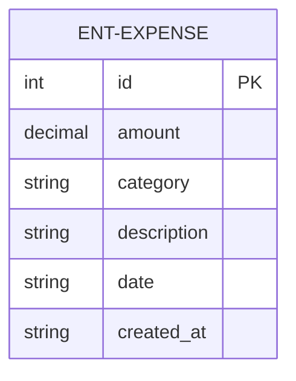
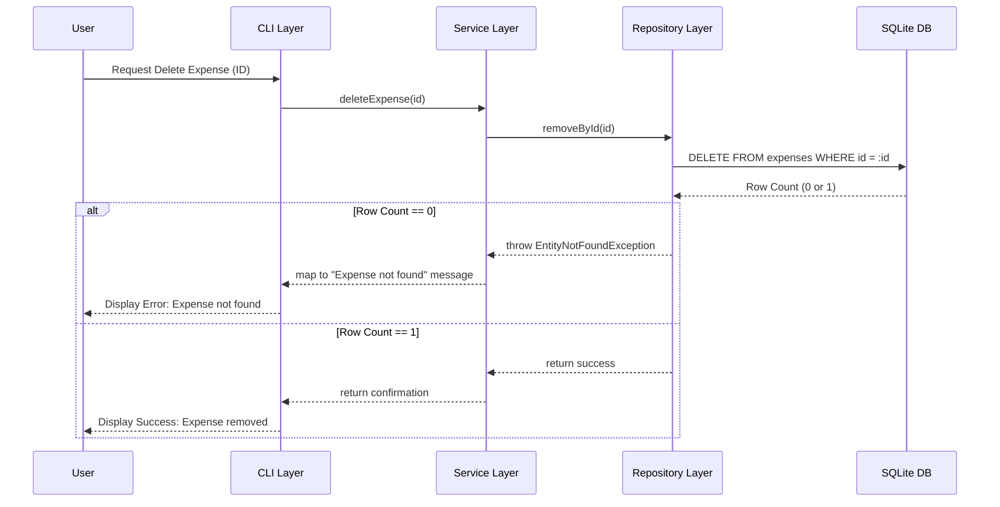
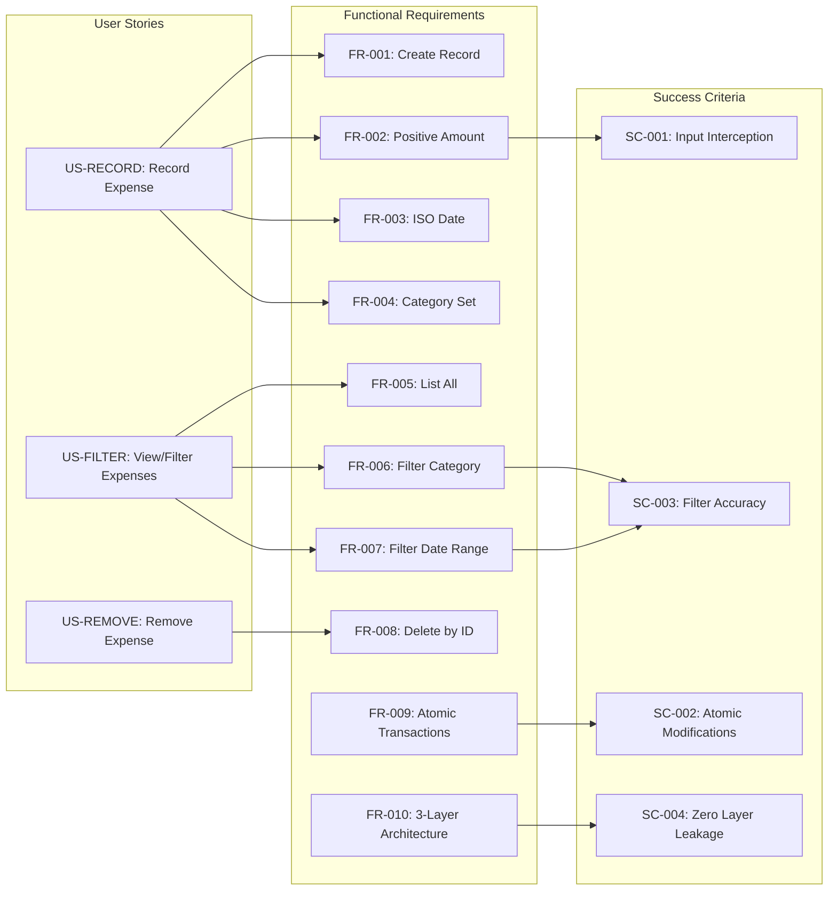

# Enhanced Expense Tracker - Technical Specification & Architecture Document

## 1. Executive Summary & Architecture Overview

### 1.1 Executive Brief
The Enhanced Expense Tracker is a standalone CLI application designed for personal finance management. It utilizes a strict 3-tier architecture (CLI, Service, Repository) to decouple user interaction, business validation, and SQLite persistence. The system enforces rigorous data integrity through atomic transactions and ISO-compliant data patterns.

### 1.2 Maturity Assessment
The project specifications are exceptionally robust, demonstrating high structural integrity with all core functional requirements and success criteria clearly mapped. While a minor gap exists regarding a dedicated 'Open Questions' section, this is negligible given the exhaustive detail of the edge cases and architectural constraints. The project is READY for execution.

### 1.3 Technical Stack
* **Language**: Python 3.10+
* **Database**: SQLite
* **Testing Framework**: pytest

### 1.4 Architectural Constraints
* **Strict 3-layer isolation**: CLI $\rightarrow$ Service Layer $\rightarrow$ Repository Pattern.
* **Zero implementation leakage**: No SQL in CLI/Service layers; no CLI logic in Repository/Service layers.
* **Database transactions**: Mandatory atomic commit/rollback for all write operations.
* **TDD requirement**: Exhaustive pytest suites for all Repository and Service CRUD methods must be defined prior to implementation.
* **Validation Gates**: 100% interception of invalid inputs by the Service Layer before reaching the Repository.

### 1.5 Critical Dependencies
* SQLite engine for local data persistence.
* Pytest framework for mandatory TDD gating.
* ISO 8601 date parsing logic.
* Strict foreign key-like integrity for Expense ID (integer PK) during deletion.

## 2. Architecture Workflows & Visual Diagrams

### 2.1 Expense Tracker Data Model


### 2.2 Expense Recording Workflow
```mermaid
flowchart TD
    START[Start: Record Expense] --> INPUT["CLI: Collect Amount, Category, Date, Description"]
    INPUT --> VAL_AMT{"Is Amount > 0?"}
    
    VAL_AMT -- No --> ERR_AMT["Error: Amount must be strictly positive"]
    ERR_AMT --> INPUT
    
    VAL_AMT -- Yes --> VAL_DATE{"Is Date ISO YYYY-MM-DD?"}
    
    VAL_DATE -- No --> ERR_DATE["Error: Date must be in ISO format"]
    ERR_DATE --> INPUT
    
    VAL_DATE -- Yes --> VAL_CAT{"Is Category Valid?"}
    
    VAL_CAT -- No --> ERR_CAT["Error: Invalid Category. Use Food, Transport, Bills, or Utilities"]
    ERR_CAT --> INPUT
    
    VAL_CAT -- Yes --> TX_START[ "Repository: Start Atomic Transaction" ]
    TX_START --> DB_WRITE{"SQLite Write Success?"}
    
    DB_WRITE -- No --> TX_ROLLBACK["Action: Rollback Transaction"]
    TX_ROLLBACK --> ERR_DB["Error: Database Locked or Write Failed"]
    ERR_DB --> END[End]
    
    DB_WRITE -- Yes --> TX_COMMIT["Action: Commit Transaction"]
    TX_COMMIT --> SUCCESS["CLI: Display Confirmation Message"]
    SUCCESS --> END
```

### 2.3 3-Tier Architecture Sequence


### 2.4 Requirements Traceability Matrix


## 3. Detailed Technical Specifications & Business Rules

### 3.1 Requirements Traceability
| ID | Type | Description | Source / Relation |
| :--- | :--- | :--- | :--- |
| US-RECORD | User Story | Record a new expense with amount, category, description, and date. | P1 |
| US-FILTER | User Story | List expenses and filter by category or date range. | P1 |
| US-REMOVE | User Story | Delete an expense by its ID. | P2 |
| FR-001 | Requirement | System MUST allow users to create an expense record. | US-RECORD $\rightarrow$ ENT-EXPENSE |
| FR-002 | Requirement | System MUST validate that the amount is strictly positive (amount > 0). | US-RECORD $\rightarrow$ SC-001 |
| FR-003 | Requirement | System MUST validate that the date strictly follows ISO 8601 (YYYY-MM-DD). | US-RECORD |
| FR-004 | Requirement | System MUST restrict categories to {"Food", "Transport", "Bills", "Utilities"}. | US-RECORD |
| FR-005 | Requirement | System MUST allow users to retrieve a complete list of all stored expenses. | US-FILTER |
| FR-006 | Requirement | System MUST allow filtering expenses by a single category. | US-FILTER $\rightarrow$ SC-003 |
| FR-007 | Requirement | System MUST allow filtering expenses by a date range (inclusive). | US-FILTER $\rightarrow$ SC-003 |
| FR-008 | Requirement | System MUST allow users to delete an expense record by its unique integer ID. | US-REMOVE |
| FR-009 | Requirement | System MUST perform all database write operations within atomic transactions. | SC-002 |
| FR-010 | Requirement | System MUST implement a strict 3-level layered architecture (CLI $\rightarrow$ Service $\rightarrow$ Repo). | SC-004 $\rightarrow$ CONST-SQLITE |
| FR-011 | Requirement | System MUST handle "Entity Not Found" exceptions in Service and map to CLI. | Service Layer |
| FR-012 | Requirement | System MUST handle "Database Locked" (SQLite locked) exceptions gracefully. | Repository Layer |
| FR-013 | Requirement | System MUST adhere to TDD principles with exhaustive pytest suites. | TDD Gating |
| ENT-EXPENSE | Entity | Expense: id (INT PK), amount (DECIMAL > 0), category (TEXT), description (TEXT), date (TEXT ISO), created_at (TEXT Timestamp). | Data Model |
| SC-001 | Success Crit. | 100% of invalid inputs are intercepted by the Service Layer validator. | FR-002 |
| SC-002 | Success Crit. | 100% of data modifications are atomic (no partial records after crash). | FR-009 |
| SC-003 | Success Crit. | Filtering by category and date range returns 100% accurate results. | FR-006, FR-007 |
| SC-004 | Success Crit. | Zero leakage of implementation details between layers. | FR-010 |
| CONST-PY310 | Constraint | Language: Python 3.10+. | Technical Stack |
| CONST-SQLITE | Constraint | Database: SQLite used for all persistence. | Technical Stack |
| ASS-CLI | Assumption | The application is a standalone CLI tool. | Scope |

### 3.2 Security Rules
* **Input Validation**: All inputs are validated in the Service Layer before reaching the Repository to prevent SQL injection and data corruption.
* **Atomic Integrity**: Mandatory use of `commit` and `rollback` to ensure the database never enters an inconsistent state.

### 3.3 Data Models
**Entity: Expense (ENT-EXPENSE)**
* `id`: INTEGER PRIMARY KEY AUTOINCREMENT
* `amount`: DECIMAL / REAL (Constraint: `> 0`)
* `category`: TEXT (Enum: "Food", "Transport", "Bills", "Utilities")
* `description`: TEXT (Optional)
* `date`: TEXT (Format: ISO 8601 `YYYY-MM-DD`)
* `created_at`: TEXT (Timestamp)

## 4. Project Governance & Structural Gaps

### 4.1 Structural Gaps
| Gap | Priority | Remediation Advice |
| :--- | :--- | :--- |
| Open Questions & Uncertainties | LOW | No open questions were identified in the source. Consider adding a section for future enhancements (e.g., multi-currency support). |

### 4.2 Remediation & Workflow
The project is currently in a "Ready for Execution" state. The workflow will follow a strict TDD approach:
1. Define `pytest` suites for Repository CRUD.
2. Implement Repository Layer.
3. Define `pytest` suites for Service Layer validation.
4. Implement Service Layer.
5. Implement CLI Layer.

## 5. Technical & Domain Glossary (Terminology Reference)

| Term | Category | Context Anchor | Project Definition |
| :--- | :--- | :--- | :--- |
| Architecture | TECHNICAL_STACK | FR-010 | A strict 3-level layered structural pattern separating user interface, business logic, and data persistence. |
| CLI Layer | TECHNICAL_STACK | FR-010 | The outermost boundary responsible exclusively for handling user input and output. |
| CRUD | TECHNICAL_STACK | FR-013 | The four foundational persistent storage mutation primitives. |
| DD | TECHNICAL_STACK | FR-003 | The day component of the ISO 8601 temporal representation. |
| Data Integrity | TECHNICAL_STACK | Technical Constraints | The mandatory enforcement of atomic transactions for all write operations. |
| Database | TECHNICAL_STACK | CONST-SQLITE | The SQLite engine utilized for all local state persistence. |
| Empty Description | BUSINESS_DOMAIN | Edge Cases | A permissible state for the textual memo field of a financial record. |
| Expense | BUSINESS_DOMAIN | ENT-EXPENSE | A financial record of a cost incurred, comprising a positive value, a specific classification, a memo, and a timestamp. |
| Fixed-Point Numeric Constraint | TECHNICAL_STACK | FR-002 | A rule ensuring the monetary value is strictly greater than zero. |
| ID | TECHNICAL_STACK | ENT-EXPENSE | A unique integer primary key that automatically increments for each record. |
| Invalid Category | BUSINESS_DOMAIN | Edge Cases | Any classification input not matching the allowed set of Food, Transport, Bills, or Utilities. |
| KEY | TECHNICAL_STACK | ENT-EXPENSE | The unique identifier constraint ensuring no two records share the same primary index. |
| Language | TECHNICAL_STACK | CONST-PY310 | The Python 3.10+ runtime environment used for implementation. |
| MM | TECHNICAL_STACK | FR-003 | The month component of the ISO 8601 temporal representation. |
| Non-Numeric Amount | BUSINESS_DOMAIN | Edge Cases | User input containing characters that cannot be parsed as a floating-point number. |
| PK | TECHNICAL_STACK | ENT-EXPENSE | The primary unique identifier constraint for the data entity. |
| Python 3.10 | TECHNICAL_STACK | CONST-PY310 | The specific software version requirement for the execution environment. |
| REAL | TECHNICAL_STACK | ENT-EXPENSE | The floating-point numeric storage type for monetary values. |
| Repository Layer | TECHNICAL_STACK | FR-010 | The innermost layer handling raw SQLite interactions and persistence logic. |
| SQL | TECHNICAL_STACK | CONST-SQLITE | The structured query language used by the persistence engine. |
| SQLite Locked | TECHNICAL_STACK | FR-012 | A specific concurrency exception occurring when another process holds an exclusive lock on the data file. |
| Service Layer | TECHNICAL_STACK | FR-010 | The middle tier responsible for business rules, input validation, and mapping exceptions to the user interface. |
| TDD | TECHNICAL_STACK | FR-013 | A development methodology where pytest suites are defined before implementation. |
| TEXT | TECHNICAL_STACK | ENT-EXPENSE | The string-based storage type for categories, descriptions, and ISO dates. |
| Testing | TECHNICAL_STACK | Technical Constraints | The process of verifying correctness using the mandatory pytest framework. |
| YYYY | TECHNICAL_STACK | FR-003 | The four-digit year component of the ISO 8601 temporal representation. |