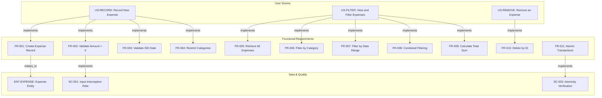
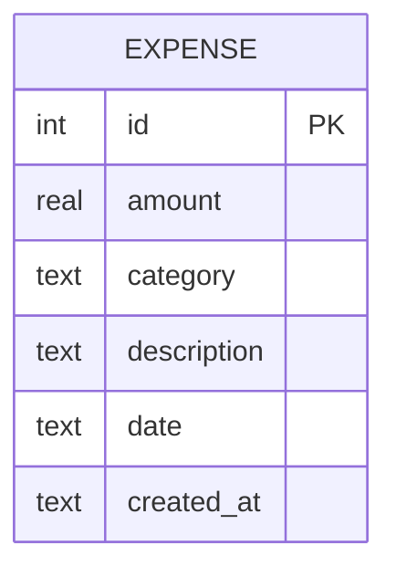
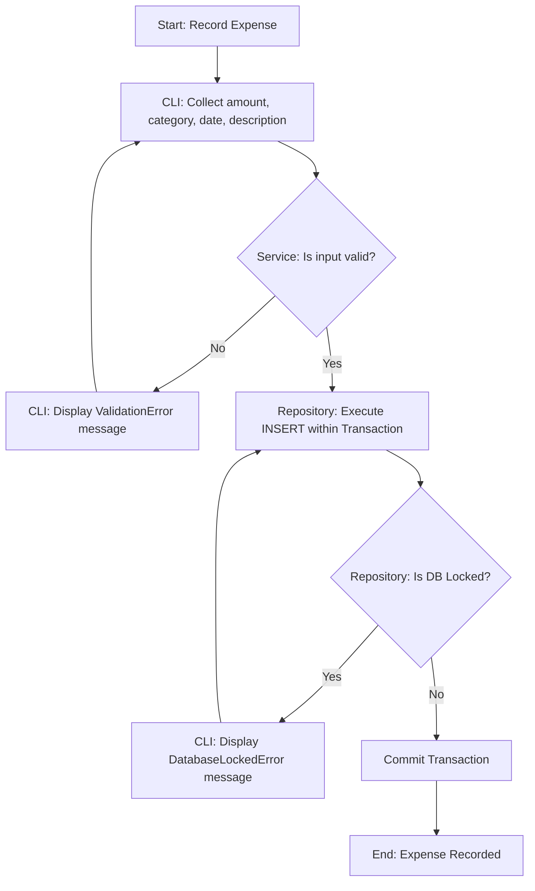
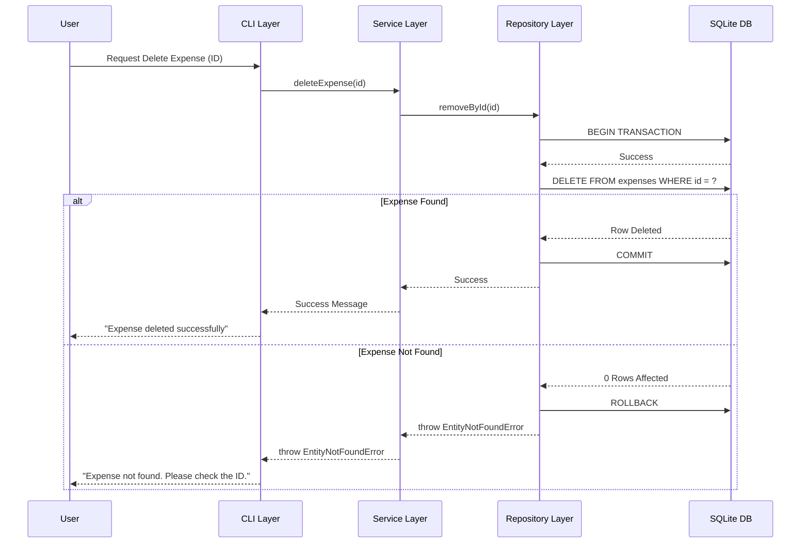

# Enhanced Expense Tracker - Technical Specification & Architecture Document

## 1. Executive Summary & Architecture Overview

### 1.1 Executive Brief
The Enhanced Expense Tracker is a CLI-based financial application utilizing a strict 3-tier architecture (CLI -> Service -> Repository) with SQLite persistence. It provides core CRUD capabilities for expense tracking, emphasizing rigorous input validation, atomic transactions, and a Test-Driven Development (TDD) approach to ensure data integrity and structural isolation.

### 1.2 Maturity Assessment
The specifications exhibit a high level of technical rigor and structural completeness. The definition of explicit error mappings and measurable success criteria ensures an objective implementation path. While there is a minor gap regarding the formal documentation of unresolved uncertainties concerning SQLite concurrency, the provided edge cases address most common failures. Status: READY.

### 1.3 Technical Stack
* **Language**: Python 3.10+
* **Database**: SQLite
* **Testing Framework**: pytest

### 1.4 Architectural Constraints
* **Layered Isolation**: Strict 3-layer separation: CLI (I/O), Service (Business Logic/Validation), Repository (Data Access).
* **Zero Leakage**: No SQL in CLI/Service layers; no CLI logic in Repository/Service layers.
* **Input Validation**: Amount must be strictly positive (amount > 0); Date must follow ISO 8601 format (YYYY-MM-DD); Categories restricted to {"Food", "Transport", "Bills", "Utilities"}.
* **Transaction Integrity**: Mandatory atomic commit/rollback for all write operations (Create, Delete).
* **Performance**: Listing/filtering < 1,000 records must execute in < 1 second.
* **QA Gates**: 100% of invalid inputs must be intercepted by the Service Layer before reaching the Repository; 100% of data modifications must be atomic.

### 1.5 Critical Dependencies
* **SQLite engine**: Required for local persistence.
* **Python 3.10+ runtime**: Required environment for application logic.
* **Pytest framework**: Mandatory for TDD execution.
* **Entity Integrity**: Expense entity strictly dependent on unique integer ID for deletion operations.
* **Exception Mapping**: Mandatory mapping of Service-level exceptions (`EntityNotFoundError`, `ValidationError`) and Repository-level exceptions (`DatabaseLockedError`) to CLI user messages.

## 2. Architecture Workflows & Visual Diagrams

### 2.1 Requirements Traceability Matrix

### 2.2 Expense Data Model

### 2.3 Expense Recording Workflow

### 2.4 System Interaction Sequence

## 3. Detailed Technical Specifications & Business Rules

### 3.1 Requirements Traceability
| ID | Type | Description | Source / Relation |
| :--- | :--- | :--- | :--- |
| **US-RECORD** | User Story | Record a new expense (amount, category, description, date) | P1 |
| **US-FILTER** | User Story | List and filter expenses by category, date range, or both | P1 |
| **US-REMOVE** | User Story | Delete an expense by its ID | P2 |
| **FR-001** | Requirement | Allow creation of expense record (amount, category, description, date) | US-RECORD $\rightarrow$ ENT-EXPENSE |
| **FR-002** | Requirement | Validate that amount is strictly positive (amount > 0) | US-RECORD $\rightarrow$ SC-001 |
| **FR-003** | Requirement | Validate date strictly follows ISO 8601 (YYYY-MM-DD) | US-RECORD |
| **FR-004** | Requirement | Restrict categories to: Food, Transport, Bills, Utilities | US-RECORD |
| **FR-005** | Requirement | Allow retrieval of complete list of all stored expenses | US-FILTER |
| **FR-006** | Requirement | Allow filtering expenses by a single category | US-FILTER |
| **FR-007** | Requirement | Allow filtering expenses by a date range (inclusive) | US-FILTER |
| **FR-008** | Requirement | Allow combined filtering by category and date range | US-FILTER |
| **FR-009** | Requirement | Calculate and display total sum for any requested view | US-FILTER |
| **FR-010** | Requirement | Allow deletion of expense record by unique integer ID | US-REMOVE |
| **FR-011** | Requirement | Perform write operations within atomic transactions (commit/rollback) | CONST-DB $\rightarrow$ SC-002 |
| **FR-012** | Requirement | Implement 3-level architecture: CLI $\rightarrow$ Service $\rightarrow$ Repository | SC-004 |
| **FR-013** | Requirement | Handle error mappings: EntityNotFoundError, DatabaseLockedError, ValidationError | CLI Mapping |
| **FR-014** | Requirement | Adhere to TDD principles using pytest for Repo and Service layers | SC-001 |
| **ENT-EXPENSE** | Entity | Expense: id (INT PK), amount (REAL), category (TEXT), description (TEXT), date (TEXT ISO), created_at (TEXT) | Data Model |
| **SC-001** | Criterion | 100% of invalid inputs are intercepted by the Service Layer validator | Validation Gate |
| **SC-002** | Criterion | 100% of data modifications are atomic | Integrity Gate |
| **SC-003** | Criterion | Filtering by category and date range returns 100% accurate results | Accuracy Gate |
| **SC-004** | Criterion | Zero leakage of implementation details between layers | Architecture Gate |
| **SC-005** | Criterion | Total calculations for any view are mathematically correct | Calculation Gate |
| **SC-006** | Criterion | Listing/filtering < 1,000 records takes less than 1 second | Performance Gate |
| **CONST-DB** | Constraint | SQLite used for all persistence | Technical Constraint |
| **CONST-LANG** | Constraint | Python 3.10+ | Technical Constraint |

### 3.2 Security Rules
* **Data Integrity**: All write operations must be wrapped in transactions to prevent partial data corruption.
* **Input Sanitization**: The Service Layer must act as a strict validator to prevent invalid data from reaching the Repository.
* **Error Masking**: Internal database errors (e.g., `DatabaseLockedError`) must be mapped to user-friendly messages in the CLI layer to avoid leaking system internals.

### 3.3 Data Models
**Entity: Expense (ENT-EXPENSE)**
* `id`: INTEGER PRIMARY KEY AUTOINCREMENT
* `amount`: REAL (Constraint: > 0)
* `category`: TEXT (Enum: "Food", "Transport", "Bills", "Utilities")
* `description`: TEXT
* `date`: TEXT (Format: ISO 8601 YYYY-MM-DD)
* `created_at`: TEXT (Database-managed timestamp)

## 4. Project Governance & Structural Gaps

### 4.1 Structural Gaps
| Gap ID | Missing Section | Priority | Remediation Advice |
| :--- | :--- | :--- | :--- |
| GAP-01 | Open Questions & Uncertainties | LOW | The specification is very detailed; however, no open questions were listed. Confirm if all technical uncertainties regarding SQLite concurrency are resolved. |

### 4.2 Remediation & Workflow
1. **Concurrency Review**: Conduct a brief technical spike on SQLite `BEGIN IMMEDIATE` transactions to handle `DatabaseLockedError` scenarios.
2. **TDD Cycle**: Implement `pytest` suites for the Repository layer first, followed by the Service layer, before developing the CLI.

## 5. Technical & Domain Glossary (Terminology Reference)

| Term | Category | Context Anchor | Project Definition |
| :--- | :--- | :--- | :--- |
| Architecture | TECHNICAL_STACK | Technical Constraints | A 3-tier structural organization comprising a user interface, a business logic handler, and a data access pattern. |
| CLI Layer | TECHNICAL_STACK | FR-012 | The entry point responsible for capturing user input, outputting results, and translating internal exceptions into human-readable alerts. |
| CRUD | TECHNICAL_STACK | FR-014 | The four foundational persistent storage mutation primitives. |
| CSV | TECHNICAL_STACK | Assumptions | A comma-separated value format explicitly excluded from the current export scope. |
| Concurrent Access | BUSINESS_DOMAIN | Edge Cases | A state where multiple processes attempt to modify the persistence file simultaneously. |
| DD | TECHNICAL_STACK | FR-003 | The numeric day component of the ISO 8601 calendar standard. |
| Data Integrity | TECHNICAL_STACK | Technical Constraints | The guarantee that write operations are atomic and consistent via mandatory transactional blocks. |
| Database | TECHNICAL_STACK | Technical Constraints | The local SQLite persistence engine used for storing all financial records. |
| DatabaseLockedError | TECHNICAL_STACK | FR-013 | An exception raised by the repository when the storage file is inaccessible due to another active process. |
| Empty Description | BUSINESS_DOMAIN | Edge Cases | A boundary condition where the textual narrative for a cost record is omitted. |
| EntityNotFoundError | TECHNICAL_STACK | FR-013 | A business logic exception triggered when a requested unique identifier does not exist in the system. |
| Expense | BUSINESS_DOMAIN | ENT-EXPENSE | A financial record containing a positive value, a category, a narrative, and a specific date. |
| Fixed-Point Numeric Constraint | TECHNICAL_STACK | FR-002 | The requirement that monetary values must be represented as strictly positive numbers. |
| GUI | TECHNICAL_STACK | Assumptions | A graphical user interface explicitly defined as out of scope for this version. |
| ID | TECHNICAL_STACK | ENT-EXPENSE | A unique integer primary key used for individual record identification. |
| Invalid Category | BUSINESS_DOMAIN | Edge Cases | A scenario where a provided label does not match the allowed set of Food, Transport, Bills, or Utilities. |
| KEY | TECHNICAL_STACK | ENT-EXPENSE | The unique constraint identifying a specific row within the relational table. |
| Language | TECHNICAL_STACK | Technical Constraints | The programming environment specified as version 3.10 or higher of the Python interpreter. |
| MM | TECHNICAL_STACK | FR-003 | The numeric month component of the ISO 8601 calendar standard. |
| NOT | TECHNICAL_STACK | FR-012 | The logical negation used to enforce the separation of concerns between layers. |
| Non-Numeric Amount | BUSINESS_DOMAIN | Edge Cases | A boundary condition where the provided value for a cost is not a valid number. |
| PK | TECHNICAL_STACK | ENT-EXPENSE | The unique identifier column that ensures no two records share the same identity. |
| Python 3.10 | TECHNICAL_STACK | CONST-LANG | The minimum required runtime version for the application logic. |
| REAL | TECHNICAL_STACK | ENT-EXPENSE | The SQLite data type used for storing floating-point monetary values. |
| Repository Layer | TECHNICAL_STACK | FR-012 | The lowest level handling raw SQL execution and the management of database transactions. |
| SQL | TECHNICAL_STACK | FR-012 | The structured query language used by the repository for data persistence. |
| SQLite Locked | TECHNICAL_STACK | Edge Cases | A state where the database engine prevents writes due to another active transaction. |
| Service Layer | TECHNICAL_STACK | FR-012 | The middle tier responsible for business logic, input validation, and orchestrating data flow. |
| TDD | TECHNICAL_STACK | FR-014 | A development methodology where pytest suites are written before the actual implementation. |
| TEXT | TECHNICAL_STACK | ENT-EXPENSE | The SQLite data type used for storing strings, such as dates and descriptions. |
| Testing | TECHNICAL_STACK | Technical Constraints | The process of verifying logic using the pytest framework. |
| Updated | BUSINESS_DOMAIN | Feature Specification: Enhanced Expense Tracker | The timestamp indicating the last modification of the specification document. |
| ValidationError | TECHNICAL_STACK | FR-013 | An exception raised when input fails to meet the specified business rules or formats. |
| YYYY | TECHNICAL_STACK | FR-003 | The four-digit year component of the ISO 8601 calendar standard. |