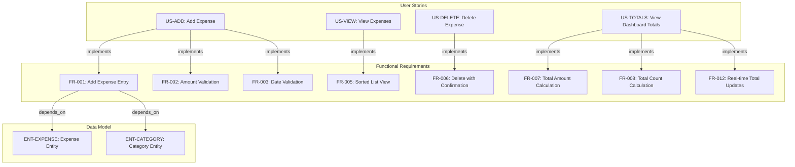
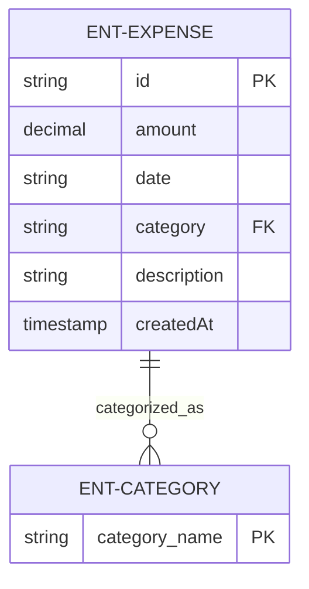
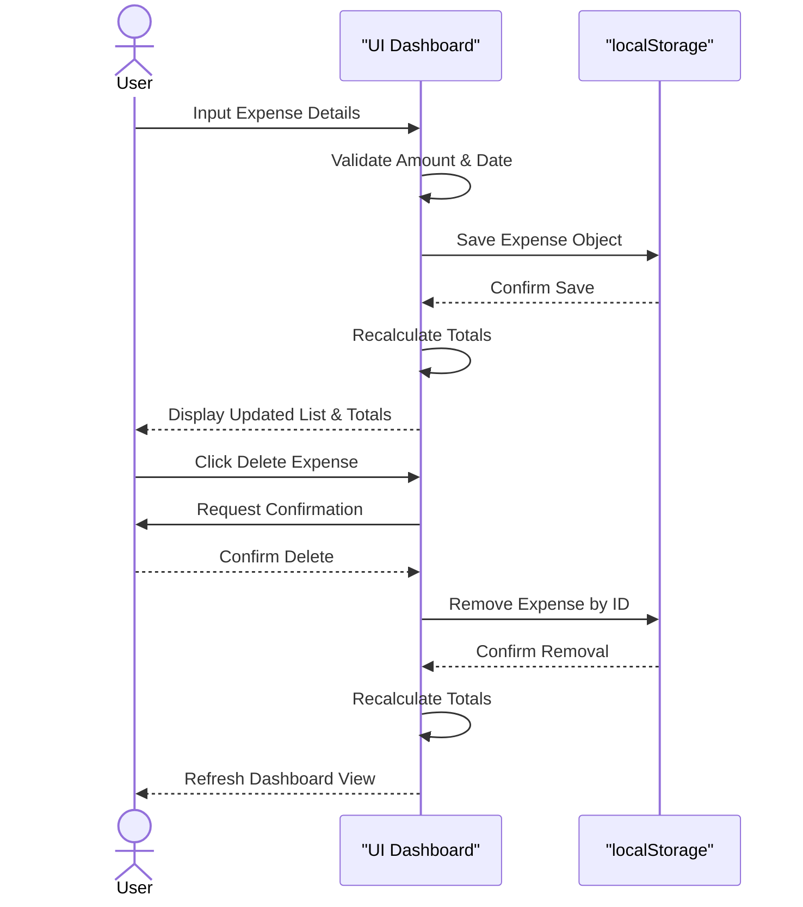

# Expense Tracker - Technical Specification & Architecture Document

## 1. Executive Summary & Architecture Overview

### 1.1 Executive Brief
A lightweight personal expense tracking application designed for single-user local use. The system enables the creation, listing, and deletion of expenses with a focus on immediate data persistence via browser localStorage. It features a summary dashboard providing real-time aggregate totals and spending history without the overhead of user authentication or a backend infrastructure.

### 1.2 Maturity Assessment
The specification is highly stable and structurally sound, with a near-perfect health index. While a formal 'Scope & Out-of-Scope' section is missing, the boundaries are clearly defined within the functional requirements. The project is READY for execution.

### 1.3 Technical Stack
* **Storage**: localStorage API
* **Data Format**: JSON (via localStorage)
* **Date Standard**: ISO 8601

### 1.4 Architectural Constraints
* Amount must be a positive number strictly greater than zero.
* Expenses must be sorted by date in descending order (newest first).
* Dashboard default view limit: exactly 50 most recent expenses.
* Future dates are permissible but must trigger a system warning.
* User authentication and multi-user support are strictly forbidden (Out of Scope).
* Editing or updating existing expenses is strictly forbidden in v1.
* Performance target: expense addition must be completed in under 30 seconds.

### 1.5 Critical Dependencies
* Browser localStorage API for data persistence and retrieval.
* Referential dependency between Expense entity and the predefined Category list.
* Real-time synchronization between the Expense data store and Dashboard aggregate totals.
* Strict data integrity: Expense amount must be decimal and date must follow ISO format.

## 2. Architecture Workflows & Visual Diagrams

### 2.1 Requirements Traceability Matrix


### 2.2 Expense Data Model


### 2.3 Add Expense Workflow
```mermaid
flowchart TD
    START[Start: Add Expense]
    INPUT[User enters amount, date, category, description]
    VAL_AMT{ "Amount > 0?" }
    VAL_DATE{ "Date in future?" }
    WARN[Display Future Date Warning]
    SAVE[Save to localStorage]
    UPDATE[Update Dashboard Totals]
    END[End: Expense Added]

    START --> INPUT
    INPUT --> VAL_AMT
    VAL_AMT -- "No" --> INPUT
    VAL_AMT -- "Yes" --> VAL_DATE
    VAL_DATE -- "Yes" --> WARN
    VAL_DATE -- "No" --> SAVE
    WARN --> SAVE
    SAVE --> UPDATE
    UPDATE --> END
```

### 2.4 Expense Management Sequence


## 3. Detailed Technical Specifications & Business Rules

### 3.1 Requirements Traceability
| ID | Type | Description | Source / Relation |
| :--- | :--- | :--- | :--- |
| **US-ADD** | User Story | Add a new expense with amount, date, category, and description. | P1 |
| **US-VIEW** | User Story | View a list of recent expenses to see spending history. | P1 |
| **US-DELETE** | User Story | Delete an expense to correct mistakes or remove entries. | P1 |
| **US-TOTALS** | User Story | See basic totals (total spent, count of expenses) on dashboard. | P2 |
| **FR-001** | Functional | System MUST allow users to add a new expense (amount, date, category, description). | Implements US-ADD |
| **FR-002** | Functional | System MUST validate that amount is a positive number greater than zero. | Implements US-ADD |
| **FR-003** | Functional | System MUST validate date; future dates trigger warning but allow saving. | Implements US-ADD |
| **FR-004** | Functional | System MUST provide a predefined list of categories (Food, Transport, etc.). | Depends on ENT-CATEGORY |
| **FR-005** | Functional | System MUST display expenses sorted by date descending. | Implements US-VIEW |
| **FR-006** | Functional | System MUST allow users to delete an expense with confirmation. | Implements US-DELETE |
| **FR-007** | Functional | System MUST display total amount spent across all expenses. | Implements US-TOTALS |
| **FR-008** | Functional | System MUST display count of total expenses. | Implements US-TOTALS |
| **FR-009** | Functional | System MUST persist expenses to localStorage. | Depends on ASS-STORAGE |
| **FR-010** | Functional | System MUST load expenses from localStorage on application start. | - |
| **FR-011** | Functional | System MUST show an empty state when no expenses exist. | - |
| **FR-012** | Functional | System MUST update totals in real-time when expenses are added or deleted. | Implements US-TOTALS |
| **FR-013** | Constraint | System MUST NOT allow editing/updating existing expenses in v1. | Out of Scope |
| **FR-014** | Functional | System MUST display most recent 50 expenses by default with 'Load more'. | - |
| **ENT-EXPENSE** | Entity | Expense: id, amount, date, category, description, createdAt. | - |
| **ENT-CATEGORY** | Entity | Category: Predefined list (Food, Transport, Entertainment, etc.). | - |
| **SC-001** | Success | Users can add an expense in under 30 seconds from dashboard load. | - |
| **SC-004** | Success | Dashboard totals are always accurate and match the sum of expenses. | - |
| **SC-005** | Success | Data persists across browser sessions. | Relates to FR-009 |
| **ASS-AUTH** | Assumption | Single-user personal tracker - no authentication, no multi-user support. | - |
| **ASS-STORAGE** | Assumption | Data stored locally in browser localStorage - no backend, no cloud sync. | - |

### 3.2 Security Rules
* **Data Isolation**: No server-side storage; data is isolated to the user's local browser profile.
* **Input Validation**: Strict positive-number validation for monetary amounts to prevent negative balance injection.

### 3.3 Data Models
* **Expense (ENT-EXPENSE)**:
    * `id`: Unique String (Primary Key)
    * `amount`: Decimal
    * `date`: ISO String
    * `category`: String (Foreign Key to ENT-CATEGORY)
    * `description`: String (Optional)
    * `createdAt`: Timestamp
* **Category (ENT-CATEGORY)**:
    * `category_name`: String (Unique identifier)

## 4. Project Governance & Structural Gaps

### 4.1 Structural Gaps
| Gap | Priority | Remediation Advice |
| :--- | :--- | :--- |
| Scope & Out-of-Scope | MEDIUM | Create a dedicated section for Scope. Although FR-013 mentions out-of-scope items, a formal boundary list is needed. |

### 4.2 Remediation & Workflow
The identified gap regarding the "Scope" section should be addressed by consolidating all "MUST NOT" requirements (like FR-013) and assumptions (ASS-AUTH, ASS-STORAGE) into a single boundary document to prevent scope creep in future versions.

## 5. Technical & Domain Glossary (Terminology Reference)

| Term | Category | Context Anchor | Project Definition |
| :--- | :--- | :--- | :--- |
| Category | BUSINESS_DOMAIN | ENT-CATEGORY | A predefined set of labels including Food, Transport, Entertainment, Shopping, Utilities, and Other used to classify spending. |
| Expense | BUSINESS_DOMAIN | ENT-EXPENSE | A financial record comprising a unique identifier, decimal value, ISO date, classification label, optional text, and a creation timestamp. |
| Fixed-Point Numeric Constraint | TECHNICAL_STACK | FR-002 | A validation rule ensuring the monetary value is a positive number strictly greater than zero. |
| LocalStorage | TECHNICAL_STACK | FR-009 | The browser-based key-value storage mechanism used for persisting data across sessions without a backend. |
| NOT | TECHNICAL_STACK | FR-013 | A logical negation used to explicitly define out-of-scope operations, specifically forbidding the modification of existing records in the initial version. |