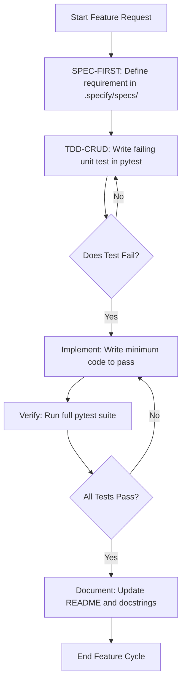
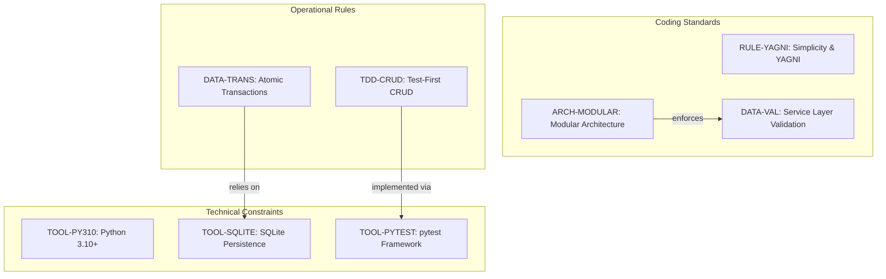
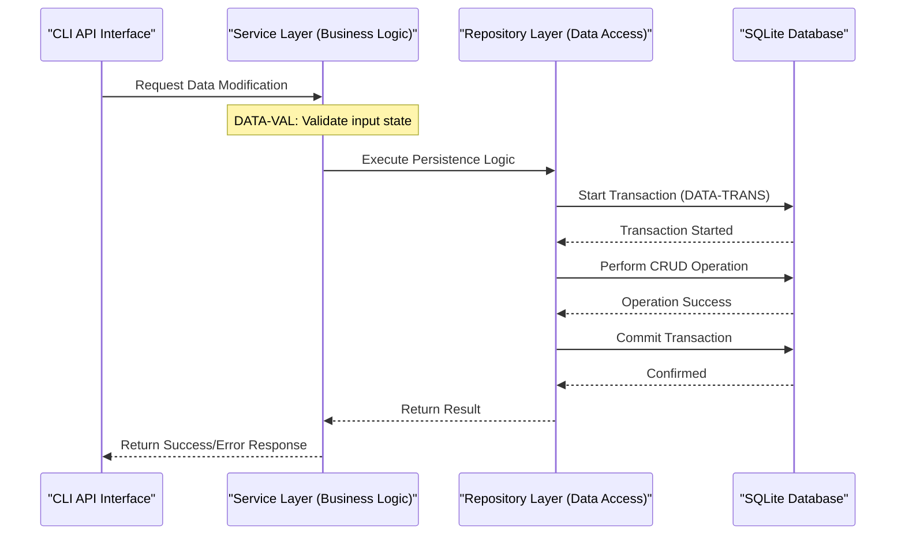

# Expense Tracker - Technical Specification & Architecture Document

## 1. Executive Summary & Architecture Overview

### 1.1 Executive Brief
Expense Tracker is a Python-based local application utilizing a Modular Architecture to isolate data access (Repository pattern), business logic (Services), and a CLI interface. The project enforces a strict TDD-driven development lifecycle, ensuring data atomicity via SQLite transactions and mandatory service-layer validation.

### 1.2 Maturity Assessment
The specifications are highly stable and structurally sound, with a health index of 100.0. While there is a low-severity gap regarding a dedicated section for open questions and uncertainties, the core architectural and workflow directives are fully defined. The project is READY for execution.

### 1.3 Technical Stack
* **Language**: Python 3.10+
* **Storage**: SQLite
* **Testing**: pytest
* **Interface**: Command Line Interface (CLI)

### 1.4 Architectural Constraints
* **Layer Isolation**: Strict separation of Repository, Service, and UI layers; no UI code permitted in data or service layers.
* **Data Atomicity**: Mandatory use of transactions for all data modifications to ensure atomicity.
* **Input Validation**: Service-layer validation is required to prevent invalid data states.
* **TDD Mandate**: Unit tests for all CRUD operations must be written before implementation.
* **Development Sequence**: Strict workflow: `.specify/specs/` definition $\rightarrow$ Failing test $\rightarrow$ Implementation $\rightarrow$ Verification $\rightarrow$ Documentation.
* **Design Philosophy**: YAGNI principle; no abstract base classes or complex patterns without a direct, proven requirement.

### 1.5 Critical Dependencies
* Local SQLite instance for structured data persistence.
* `pytest` framework for execution of TDD gates.
* Requirement for pre-existing documentation in `.specify/specs/` before any code implementation.
* Strict dependency between the TDD workflow and the presence of failing unit tests prior to the 'Implement' phase.

## 2. Architecture Workflows & Visual Diagrams

### 2.1 TDD Development Workflow
Visual representation of the mandatory Spec-First and Test-Driven Development cycle for the Expense Tracker project.

### 2.2 Architectural Constraints Traceability
Mapping of coding standards and technical constraints to their governing rules.

### 2.3 System Layer Interaction
Sequence of operations following the Modular Architecture (Repository Pattern) and Data Integrity rules.

## 3. Detailed Technical Specifications & Business Rules

### 3.1 Requirements Traceability

| Identifier | Type | Requirement / Rule Description | Source Section |
| :--- | :--- | :--- | :--- |
| **RULE-YAGNI** | Coding Standard | Features MUST be implemented only when there is a direct requirement; avoid unnecessary abstraction. | Simplicity and YAGNI |
| **DATA-TRANS** | Rule | All data modifications MUST be performed using transactions to ensure atomicity. | Data Integrity and Persistence |
| **DATA-VAL** | Rule | Invalid data state MUST be prevented via validation at the service layer. | Data Integrity and Persistence |
| **ARCH-MODULAR** | Coding Standard | Separation of Repository pattern, Services, and UI (CLI/API). No UI code in data/service layers. | Modular Architecture |
| **TDD-CRUD** | Testing Gate | Every CRUD operation must have a unit test written before the implementation code. | TDD for CRUD Operations |
| **SPEC-FIRST** | Requirement | Every feature MUST be documented in `.specify/specs/` before implementation. | Exhaustive Specification |
| **TOOL-PY310** | Tool Config | Language: Python 3.10+ | Technical Constraints |
| **TOOL-SQLITE** | Tool Config | Storage: SQLite for local persistence. | Technical Constraints |
| **TOOL-PYTEST** | Tool Config | Testing framework: pytest. | Technical Constraints |
| **WF-TDD-CYCLE** | Workflow | Workflow sequence: Spec $\rightarrow$ Test (Failing) $\rightarrow$ Implement $\rightarrow$ Verify $\rightarrow$ Document. | Development Workflow |

### 3.2 Security Rules
* **Data Integrity**: All state mutations are wrapped in transactions (`DATA-TRANS`) to prevent partial updates and corruption.
* **Input Validation**: The Service Layer acts as the primary security gate (`DATA-VAL`) to ensure only valid data reaches the persistence layer.

### 3.3 Data Models
* **Persistence**: Structured relational storage using SQLite (`TOOL-SQLITE`).
* **Access Pattern**: Repository Pattern is mandatory to decouple business logic from the underlying database schema.

## 4. Project Governance & Structural Gaps

### 4.1 Structural Gaps
| Gap | Priority | Remediation Advice |
| :--- | :--- | :--- |
| Missing "Open Questions & Uncertainties" section | LOW | Create a section to track pending technical decisions or architectural doubts. |

### 4.2 Remediation & Workflow
The project follows a "Constitution-first" approach. This document is the Single Source of Truth. Any modification to these principles requires:
1. A version bump.
2. Documentation of the changes.
3. Validation by the project lead.

## 5. Technical & Domain Glossary (Terminology Reference)

| Term | Category | Context Anchor | Project Definition |
| :--- | :--- | :--- | :--- |
| API | TECHNICAL_STACK | ARCH-MODULAR | One of the permitted presentation layers for external interaction, isolated from business and data logic. |
| CRUD | TECHNICAL_STACK | TDD-CRUD | The four foundational persistent storage mutation primitives requiring mandatory pre-implementation unit tests. |
| Document | TECHNICAL_STACK | WF-TDD-CYCLE | Final stage of the delivery cycle involving updates to the root instructional file and function-level strings. |
| Implement | TECHNICAL_STACK | WF-TDD-CYCLE | The act of writing the absolute minimum source code required to transition a failing test to a passing state. |
| Interface | TECHNICAL_STACK | Technical Constraints | The interaction layer, specifically constrained to a Command Line environment. |
| Language | TECHNICAL_STACK | TOOL-PY310 | The primary syntax and runtime environment specified for the codebase. |
| Python 3.10 | TECHNICAL_STACK | TOOL-PY310 | The minimum version of the high-level programming environment required for development. |
| README | TECHNICAL_STACK | WF-TDD-CYCLE | The primary project entry point file requiring updates upon feature completion. |
| Spec First | TECHNICAL_STACK | SPEC-FIRST | The requirement to formalize functional and technical designs in the designated folder before any coding begins. |
| Storage | TECHNICAL_STACK | TOOL-SQLITE | The local persistence mechanism used to maintain state via a structured relational format. |
| TDD | TECHNICAL_STACK | TDD-CRUD | A development discipline where failing unit tests must precede the actual functional code. |
| Test First | TECHNICAL_STACK | WF-TDD-CYCLE | The specific workflow step of creating a failing validation case for a operation before coding. |
| Testing | TECHNICAL_STACK | TOOL-PYTEST | The process of executing the pytest suite to ensure logic correctness and regression prevention. |
| UI | TECHNICAL_STACK | ARCH-MODULAR | The presentation layer that must be strictly isolated from the service and repository tiers. |
| Verify | TECHNICAL_STACK | WF-TDD-CYCLE | The execution of all existing suites to confirm that new changes introduce no regressions. |
| YAGNI | TECHNICAL_STACK | RULE-YAGNI | A design principle prohibiting the creation of features or abstractions without an immediate, proven requirement. |