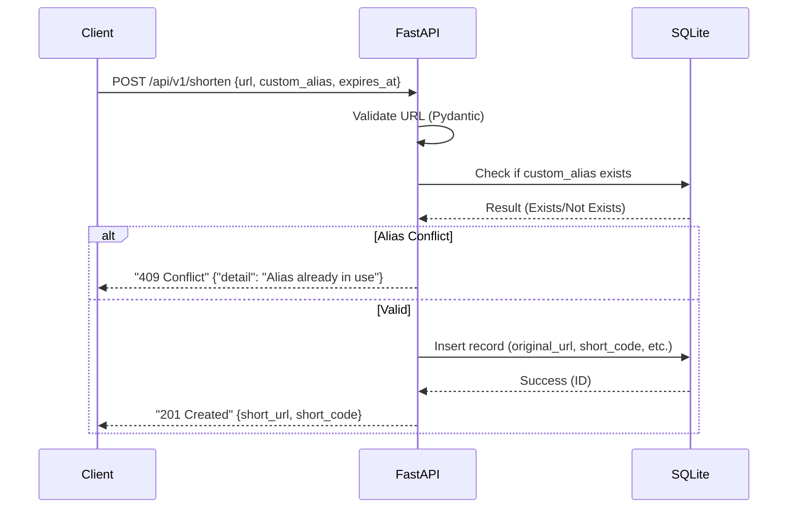
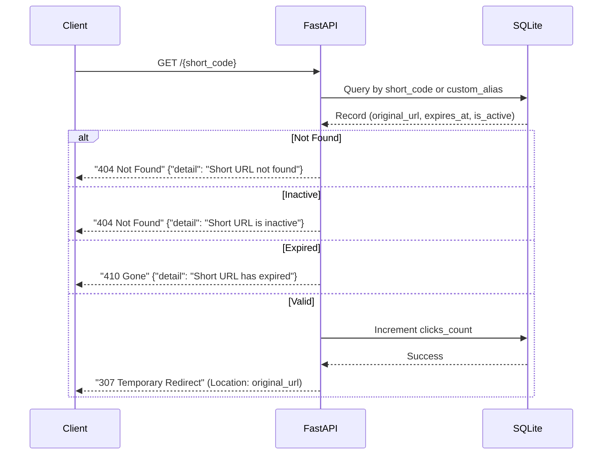

# Feature Specification: URL Shortener API

**Feature Branch**: `001-url-shortener-api`

**Created**: 2026-07-26

**Status**: Draft

**Input**: User description: "Update specification for URL Shortener API with detailed SQLite data model (id, original_url, short_code, custom_alias, clicks_count, created_at, expires_at, is_active), API contracts (POST /api/v1/shorten, GET /{short_code}, GET /api/v1/stats/{short_code}, DELETE /api/v1/urls/{short_code}), strict URL validation via Pydantic (http/https), structured JSON errors ({"detail": "..."}) for 400, 404, 409, 422, and expiration handling (404 or 410). Include sequence diagrams for redirection and creation flows with Mermaid response convention."

## User Scenarios & Testing *(mandatory)*

### User Story 1 - Create Short URL (Priority: P1)

As a user, I want to provide a long URL and optionally a custom alias and expiration date, so that I can receive a shortened version for easy sharing.

**Why this priority**: Core value proposition of the service.

**Independent Test**: Submit a long URL with optional custom alias and expiration to the creation endpoint and verify the returned short code or alias.

**Acceptance Scenarios**:

1. **Given** a valid long URL, **When** the user submits it for shortening, **Then** the system returns a unique short identifier.
2. **Given** a valid long URL and a unique custom alias, **When** the user submits both, **Then** the system uses the custom alias as the short identifier.
3. **Given** a valid long URL and a custom alias that is already taken, **When** the user submits it, **Then** the system returns a "409 Conflict" error.
4. **Given** a valid long URL and an expiration date, **When** the user submits it, **Then** the system creates the link and ensures it becomes inactive after the specified date.
5. **Given** an invalid URL format (e.g., missing http/https), **When** the user submits it, **Then** the system returns a "422 Unprocessable Entity" error.

---

### User Story 2 - Redirect to Long URL (Priority: P1)

As a user, I want to visit a shortened URL and be automatically redirected to the original long URL, provided the link is active and not expired.

**Why this priority**: Essential for the short link to be useful.

**Independent Test**: Visit a known active and non-expired short URL and verify the browser lands on the original destination.

**Acceptance Scenarios**:

1. **Given** a valid existing and active short identifier, **When** the user visits the corresponding short URL, **Then** the system redirects the user via "307 Temporary Redirect" to the original long URL and increments the click count.
2. **Given** a short identifier that exists but has expired, **When** the user visits the URL, **Then** the system returns a "410 Gone" or "404 Not Found" response.
3. **Given** a short identifier that exists but is marked as inactive, **When** the user visits the URL, **Then** the system returns a "404 Not Found" response.

---

### User Story 3 - Handle Non-Existent URL (Priority: P2)

As a user, I want to see a clear error message when I visit a short URL that does not exist.

**Why this priority**: Ensures a good user experience and prevents confusing "empty" pages.

**Independent Test**: Visit a short URL with a random/non-existent identifier.

**Acceptance Scenarios**:

1. **Given** a short identifier that has never been created, **When** the user visits the corresponding short URL, **Then** the system returns a "404 Not Found" response.

---

### User Story 4 - View Link Statistics (Priority: P2)

As a user, I want to retrieve the number of clicks for a specific short URL to monitor its usage.

**Why this priority**: Provides value to creators for tracking engagement.

**Independent Test**: Request stats for a known short identifier and verify the click count matches the actual number of redirections.

**Acceptance Scenarios**:

1. **Given** a valid short identifier, **When** the user requests stats via the API, **Then** the system returns a JSON object containing the `clicks_count`.

---

### User Story 5 - Delete/Disable Short Link (Priority: P3)

As a user, I want to deactivate or delete a short URL so that it can no longer be used for redirection.

**Why this priority**: Allows users to manage their links and revoke access if necessary.

**Independent Test**: Delete a known short link and then attempt to visit it to verify it now returns a "404 Not Found" response.

**Acceptance Scenarios**:

1. **Given** a valid short identifier, **When** the user sends a deletion request, **Then** the system marks the link as inactive or removes it and returns a success response.

---

### Edge Cases

- **Duplicate Long URLs**: When the same long URL is shortened multiple times, the system generates a new unique short code for each request unless a custom alias is provided.
- **Extreme URL Length**: The system supports URLs up to the maximum size allowed by the SQLite TEXT field without crashing.
- **Race Conditions on Clicks**: Clicks are incremented atomically to ensure accuracy under high concurrency.
- **Invalid Expiration Dates**: Dates in the past are rejected during creation with a "400 Bad Request" error.

## Technical Flows

### Short URL Creation Flow

### Redirection Flow

## Requirements *(mandatory)*

### Functional Requirements

- **FR-001**: System MUST generate a unique short identifier for a provided long URL.
- **FR-002**: System MUST support an optional `custom_alias` for the short identifier, ensuring it is unique.
- **FR-003**: System MUST support an optional `expires_at` date and time for links.
- **FR-004**: System MUST perform a "307 Temporary Redirect" to the original long URL for active, non-expired links.
- **FR-005**: System MUST atomically increment the `clicks_count` each time a successful redirection occurs.
- **FR-006**: System MUST provide a stats endpoint `GET /api/v1/stats/{short_code}` returning the usage metrics.
- **FR-007**: System MUST allow deactivating or deleting a short link via `DELETE /api/v1/urls/{short_code}`.
- **FR-008**: System MUST strictly validate that input URLs use the `http` or `https` schema via Pydantic.
- **FR-009**: System MUST return structured JSON errors in the format `{"detail": "..."}` for HTTP codes 400, 404, 409, and 422.
- **FR-010**: System MUST return a "410 Gone" or "404 Not Found" response if a link's `expires_at` date has passed.

### Key Entities *(include if feature involves data)*

- **URLRecord**: Represents a shortened URL mapping in the SQLite database.
    - **id**: Unique identifier (Integer/UUID).
    - **original_url**: The target long URL (TEXT).
    - **short_code**: The system-generated short identifier (VARCHAR, Unique).
    - **custom_alias**: The user-provided short identifier (VARCHAR, Unique, Optional).
    - **clicks_count**: Total number of successful redirections (INTEGER, default 0).
    - **created_at**: Timestamp of creation (DATETIME).
    - **expires_at**: Timestamp after which the link is invalid (DATETIME, Optional).
    - **is_active**: Boolean flag indicating if the link is currently active (BOOLEAN).

## Success Criteria *(mandatory)*

### Measurable Outcomes

- **SC-001**: Short URL generation (including database write) completes in under 1 second.
- **SC-002**: Redirection logic (DB lookup + redirect response) occurs with under 500ms overhead.
- **SC-003**: 100% of active, non-expired short links correctly redirect to their intended destination.
- **SC-004**: 100% of invalid/expired/conflicting requests return the correct structured JSON error response.

## Assumptions

- The system is implemented using **FastAPI** for the API layer and **SQLite** for persistence.
- **Pydantic** is used for input validation and schema enforcement.
- All errors are returned as JSON with a `detail` field.
- The `short_code` is generated using a secure, collision-resistant algorithm (e.g., Base62 encoding of a random number).
- Input URLs must be absolute and include the protocol (http/https).
